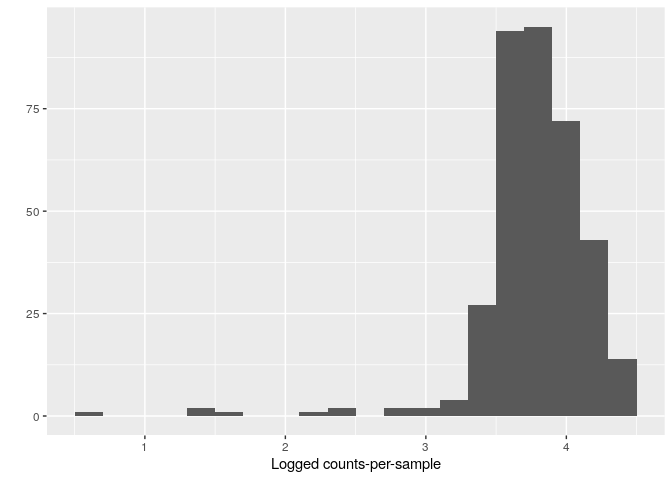

Tutoriel Dada2
================

# Tutoriel pour l’analyse des données du microbiome : des lectures brutes aux analyses de la communauté.

## Package nécessaires

``` r
library("knitr")
library("BiocStyle")
.cran_packages <- c("ggplot2", "gridExtra", "devtools")
install.packages(.cran_packages) 
```

    ## Installing packages into '/usr/local/lib/R/site-library'
    ## (as 'lib' is unspecified)

``` r
.bioc_packages <- c("dada2", "phyloseq", "DECIPHER", "phangorn")
BiocManager::install(.bioc_packages)
```

    ## 'getOption("repos")' replaces Bioconductor standard repositories, see
    ## '?repositories' for details
    ## 
    ## replacement repositories:
    ##     CRAN: https://packagemanager.rstudio.com/all/__linux__/focal/latest

    ## Bioconductor version 3.14 (BiocManager 1.30.16), R 4.1.2 (2021-11-01)

    ## Warning: package(s) not installed when version(s) same as current; use `force = TRUE` to
    ##   re-install: 'dada2' 'phyloseq' 'DECIPHER' 'phangorn'

    ## Old packages: 'brio', 'cpp11', 'digest', 'dtplyr', 'fs', 'glue', 'littler',
    ##   'pkgbuild', 'pkgload', 'readr', 'remotes', 'RPostgres', 'RSQLite',
    ##   'sessioninfo', 'testthat', 'vroom', 'withr', 'xml2'

``` r
# Load packages into session, and print package version
sapply(c(.cran_packages, .bioc_packages),require, character.only = TRUE)
```

    ## Loading required package: ggplot2

    ## Loading required package: gridExtra

    ## Loading required package: devtools

    ## Loading required package: usethis

    ## Loading required package: dada2

    ## Loading required package: Rcpp

    ## Loading required package: phyloseq

    ## Loading required package: DECIPHER

    ## Loading required package: Biostrings

    ## Loading required package: BiocGenerics

    ## 
    ## Attaching package: 'BiocGenerics'

    ## The following object is masked from 'package:gridExtra':
    ## 
    ##     combine

    ## The following objects are masked from 'package:stats':
    ## 
    ##     IQR, mad, sd, var, xtabs

    ## The following objects are masked from 'package:base':
    ## 
    ##     anyDuplicated, append, as.data.frame, basename, cbind, colnames,
    ##     dirname, do.call, duplicated, eval, evalq, Filter, Find, get, grep,
    ##     grepl, intersect, is.unsorted, lapply, Map, mapply, match, mget,
    ##     order, paste, pmax, pmax.int, pmin, pmin.int, Position, rank,
    ##     rbind, Reduce, rownames, sapply, setdiff, sort, table, tapply,
    ##     union, unique, unsplit, which.max, which.min

    ## Loading required package: S4Vectors

    ## Loading required package: stats4

    ## 
    ## Attaching package: 'S4Vectors'

    ## The following objects are masked from 'package:base':
    ## 
    ##     expand.grid, I, unname

    ## Loading required package: IRanges

    ## 
    ## Attaching package: 'IRanges'

    ## The following object is masked from 'package:phyloseq':
    ## 
    ##     distance

    ## Loading required package: XVector

    ## Loading required package: GenomeInfoDb

    ## 
    ## Attaching package: 'Biostrings'

    ## The following object is masked from 'package:base':
    ## 
    ##     strsplit

    ## Loading required package: RSQLite

    ## Loading required package: parallel

    ## Loading required package: phangorn

    ## Loading required package: ape

    ## 
    ## Attaching package: 'ape'

    ## The following object is masked from 'package:Biostrings':
    ## 
    ##     complement

    ##   ggplot2 gridExtra  devtools     dada2  phyloseq  DECIPHER  phangorn 
    ##      TRUE      TRUE      TRUE      TRUE      TRUE      TRUE      TRUE

## Récupération des amplicons

``` r
set.seed(100)
miseq_path <- "/home/rstudio/MiSeq_SOP"
list.files(miseq_path)
```

    ##  [1] "F3D0_S188_L001_R1_001.fastq"   "F3D0_S188_L001_R2_001.fastq"  
    ##  [3] "F3D1_S189_L001_R1_001.fastq"   "F3D1_S189_L001_R2_001.fastq"  
    ##  [5] "F3D141_S207_L001_R1_001.fastq" "F3D141_S207_L001_R2_001.fastq"
    ##  [7] "F3D142_S208_L001_R1_001.fastq" "F3D142_S208_L001_R2_001.fastq"
    ##  [9] "F3D143_S209_L001_R1_001.fastq" "F3D143_S209_L001_R2_001.fastq"
    ## [11] "F3D144_S210_L001_R1_001.fastq" "F3D144_S210_L001_R2_001.fastq"
    ## [13] "F3D145_S211_L001_R1_001.fastq" "F3D145_S211_L001_R2_001.fastq"
    ## [15] "F3D146_S212_L001_R1_001.fastq" "F3D146_S212_L001_R2_001.fastq"
    ## [17] "F3D147_S213_L001_R1_001.fastq" "F3D147_S213_L001_R2_001.fastq"
    ## [19] "F3D148_S214_L001_R1_001.fastq" "F3D148_S214_L001_R2_001.fastq"
    ## [21] "F3D149_S215_L001_R1_001.fastq" "F3D149_S215_L001_R2_001.fastq"
    ## [23] "F3D150_S216_L001_R1_001.fastq" "F3D150_S216_L001_R2_001.fastq"
    ## [25] "F3D2_S190_L001_R1_001.fastq"   "F3D2_S190_L001_R2_001.fastq"  
    ## [27] "F3D3_S191_L001_R1_001.fastq"   "F3D3_S191_L001_R2_001.fastq"  
    ## [29] "F3D5_S193_L001_R1_001.fastq"   "F3D5_S193_L001_R2_001.fastq"  
    ## [31] "F3D6_S194_L001_R1_001.fastq"   "F3D6_S194_L001_R2_001.fastq"  
    ## [33] "F3D7_S195_L001_R1_001.fastq"   "F3D7_S195_L001_R2_001.fastq"  
    ## [35] "F3D8_S196_L001_R1_001.fastq"   "F3D8_S196_L001_R2_001.fastq"  
    ## [37] "F3D9_S197_L001_R1_001.fastq"   "F3D9_S197_L001_R2_001.fastq"  
    ## [39] "filtered"                      "HMP_MOCK.v35.fasta"           
    ## [41] "Mock_S280_L001_R1_001.fastq"   "Mock_S280_L001_R2_001.fastq"  
    ## [43] "mouse.dpw.metadata"            "mouse.time.design"            
    ## [45] "stability.batch"               "stability.files"

``` r
fnFs <- sort(list.files(miseq_path, pattern="_R1_001.fastq"))
fnRs <- sort(list.files(miseq_path, pattern="_R2_001.fastq"))
```

## Filtrer et rogner

``` r
fnFs <- sort(list.files(miseq_path, pattern="_R1_001.fastq"))
fnRs <- sort(list.files(miseq_path, pattern="_R2_001.fastq"))
sampleNames <- sapply(strsplit(fnFs, "_"), `[`, 1)
fnFs <- file.path(miseq_path, fnFs)
fnRs <- file.path(miseq_path, fnRs)
fnFs[1:3]
```

    ## [1] "/home/rstudio/MiSeq_SOP/F3D0_S188_L001_R1_001.fastq"  
    ## [2] "/home/rstudio/MiSeq_SOP/F3D1_S189_L001_R1_001.fastq"  
    ## [3] "/home/rstudio/MiSeq_SOP/F3D141_S207_L001_R1_001.fastq"

``` r
fnRs[1:3]
```

    ## [1] "/home/rstudio/MiSeq_SOP/F3D0_S188_L001_R2_001.fastq"  
    ## [2] "/home/rstudio/MiSeq_SOP/F3D1_S189_L001_R2_001.fastq"  
    ## [3] "/home/rstudio/MiSeq_SOP/F3D141_S207_L001_R2_001.fastq"

``` r
plotQualityProfile(fnFs[1:2])
```

    ## Warning: `guides(<scale> = FALSE)` is deprecated. Please use `guides(<scale> =
    ## "none")` instead.

<!-- -->

``` r
plotQualityProfile(fnRs[1:2])
```

    ## Warning: `guides(<scale> = FALSE)` is deprecated. Please use `guides(<scale> =
    ## "none")` instead.

<!-- -->

``` r
filt_path <- file.path(miseq_path, "filtered")
if(!file_test("-d", filt_path)) dir.create(filt_path)
filtFs <- file.path(filt_path, paste0(sampleNames, "_F_filt.fastq.gz"))
filtRs <- file.path(filt_path, paste0(sampleNames, "_R_filt.fastq.gz"))
```

``` r
out <- filterAndTrim(fnFs, filtFs, fnRs, filtRs, truncLen=c(240,160),
              maxN=0, maxEE=c(2,2), truncQ=2, rm.phix=TRUE,
              compress=TRUE, multithread=TRUE) 
head(out)
```

    ##                               reads.in reads.out
    ## F3D0_S188_L001_R1_001.fastq       7793      7113
    ## F3D1_S189_L001_R1_001.fastq       5869      5299
    ## F3D141_S207_L001_R1_001.fastq     5958      5463
    ## F3D142_S208_L001_R1_001.fastq     3183      2914
    ## F3D143_S209_L001_R1_001.fastq     3178      2941
    ## F3D144_S210_L001_R1_001.fastq     4827      4312

## Déduire des variantes de séquence

``` r
derepFs <- derepFastq(filtFs, verbose=TRUE)
```

    ## Dereplicating sequence entries in Fastq file: /home/rstudio/MiSeq_SOP/filtered/F3D0_F_filt.fastq.gz

    ## Encountered 1979 unique sequences from 7113 total sequences read.

    ## Dereplicating sequence entries in Fastq file: /home/rstudio/MiSeq_SOP/filtered/F3D1_F_filt.fastq.gz

    ## Encountered 1639 unique sequences from 5299 total sequences read.

    ## Dereplicating sequence entries in Fastq file: /home/rstudio/MiSeq_SOP/filtered/F3D141_F_filt.fastq.gz

    ## Encountered 1477 unique sequences from 5463 total sequences read.

    ## Dereplicating sequence entries in Fastq file: /home/rstudio/MiSeq_SOP/filtered/F3D142_F_filt.fastq.gz

    ## Encountered 904 unique sequences from 2914 total sequences read.

    ## Dereplicating sequence entries in Fastq file: /home/rstudio/MiSeq_SOP/filtered/F3D143_F_filt.fastq.gz

    ## Encountered 939 unique sequences from 2941 total sequences read.

    ## Dereplicating sequence entries in Fastq file: /home/rstudio/MiSeq_SOP/filtered/F3D144_F_filt.fastq.gz

    ## Encountered 1267 unique sequences from 4312 total sequences read.

    ## Dereplicating sequence entries in Fastq file: /home/rstudio/MiSeq_SOP/filtered/F3D145_F_filt.fastq.gz

    ## Encountered 1756 unique sequences from 6741 total sequences read.

    ## Dereplicating sequence entries in Fastq file: /home/rstudio/MiSeq_SOP/filtered/F3D146_F_filt.fastq.gz

    ## Encountered 1438 unique sequences from 4560 total sequences read.

    ## Dereplicating sequence entries in Fastq file: /home/rstudio/MiSeq_SOP/filtered/F3D147_F_filt.fastq.gz

    ## Encountered 3590 unique sequences from 15637 total sequences read.

    ## Dereplicating sequence entries in Fastq file: /home/rstudio/MiSeq_SOP/filtered/F3D148_F_filt.fastq.gz

    ## Encountered 2762 unique sequences from 11413 total sequences read.

    ## Dereplicating sequence entries in Fastq file: /home/rstudio/MiSeq_SOP/filtered/F3D149_F_filt.fastq.gz

    ## Encountered 3021 unique sequences from 12017 total sequences read.

    ## Dereplicating sequence entries in Fastq file: /home/rstudio/MiSeq_SOP/filtered/F3D150_F_filt.fastq.gz

    ## Encountered 1566 unique sequences from 5032 total sequences read.

    ## Dereplicating sequence entries in Fastq file: /home/rstudio/MiSeq_SOP/filtered/F3D2_F_filt.fastq.gz

    ## Encountered 3707 unique sequences from 18075 total sequences read.

    ## Dereplicating sequence entries in Fastq file: /home/rstudio/MiSeq_SOP/filtered/F3D3_F_filt.fastq.gz

    ## Encountered 1479 unique sequences from 6250 total sequences read.

    ## Dereplicating sequence entries in Fastq file: /home/rstudio/MiSeq_SOP/filtered/F3D5_F_filt.fastq.gz

    ## Encountered 1195 unique sequences from 4052 total sequences read.

    ## Dereplicating sequence entries in Fastq file: /home/rstudio/MiSeq_SOP/filtered/F3D6_F_filt.fastq.gz

    ## Encountered 1832 unique sequences from 7369 total sequences read.

    ## Dereplicating sequence entries in Fastq file: /home/rstudio/MiSeq_SOP/filtered/F3D7_F_filt.fastq.gz

    ## Encountered 1183 unique sequences from 4765 total sequences read.

    ## Dereplicating sequence entries in Fastq file: /home/rstudio/MiSeq_SOP/filtered/F3D8_F_filt.fastq.gz

    ## Encountered 1382 unique sequences from 4871 total sequences read.

    ## Dereplicating sequence entries in Fastq file: /home/rstudio/MiSeq_SOP/filtered/F3D9_F_filt.fastq.gz

    ## Encountered 1709 unique sequences from 6504 total sequences read.

    ## Dereplicating sequence entries in Fastq file: /home/rstudio/MiSeq_SOP/filtered/Mock_F_filt.fastq.gz

    ## Encountered 897 unique sequences from 4314 total sequences read.

``` r
derepRs <- derepFastq(filtRs, verbose=TRUE)
```

    ## Dereplicating sequence entries in Fastq file: /home/rstudio/MiSeq_SOP/filtered/F3D0_R_filt.fastq.gz

    ## Encountered 1660 unique sequences from 7113 total sequences read.

    ## Dereplicating sequence entries in Fastq file: /home/rstudio/MiSeq_SOP/filtered/F3D1_R_filt.fastq.gz

    ## Encountered 1349 unique sequences from 5299 total sequences read.

    ## Dereplicating sequence entries in Fastq file: /home/rstudio/MiSeq_SOP/filtered/F3D141_R_filt.fastq.gz

    ## Encountered 1335 unique sequences from 5463 total sequences read.

    ## Dereplicating sequence entries in Fastq file: /home/rstudio/MiSeq_SOP/filtered/F3D142_R_filt.fastq.gz

    ## Encountered 853 unique sequences from 2914 total sequences read.

    ## Dereplicating sequence entries in Fastq file: /home/rstudio/MiSeq_SOP/filtered/F3D143_R_filt.fastq.gz

    ## Encountered 880 unique sequences from 2941 total sequences read.

    ## Dereplicating sequence entries in Fastq file: /home/rstudio/MiSeq_SOP/filtered/F3D144_R_filt.fastq.gz

    ## Encountered 1286 unique sequences from 4312 total sequences read.

    ## Dereplicating sequence entries in Fastq file: /home/rstudio/MiSeq_SOP/filtered/F3D145_R_filt.fastq.gz

    ## Encountered 1803 unique sequences from 6741 total sequences read.

    ## Dereplicating sequence entries in Fastq file: /home/rstudio/MiSeq_SOP/filtered/F3D146_R_filt.fastq.gz

    ## Encountered 1265 unique sequences from 4560 total sequences read.

    ## Dereplicating sequence entries in Fastq file: /home/rstudio/MiSeq_SOP/filtered/F3D147_R_filt.fastq.gz

    ## Encountered 3414 unique sequences from 15637 total sequences read.

    ## Dereplicating sequence entries in Fastq file: /home/rstudio/MiSeq_SOP/filtered/F3D148_R_filt.fastq.gz

    ## Encountered 2522 unique sequences from 11413 total sequences read.

    ## Dereplicating sequence entries in Fastq file: /home/rstudio/MiSeq_SOP/filtered/F3D149_R_filt.fastq.gz

    ## Encountered 2771 unique sequences from 12017 total sequences read.

    ## Dereplicating sequence entries in Fastq file: /home/rstudio/MiSeq_SOP/filtered/F3D150_R_filt.fastq.gz

    ## Encountered 1415 unique sequences from 5032 total sequences read.

    ## Dereplicating sequence entries in Fastq file: /home/rstudio/MiSeq_SOP/filtered/F3D2_R_filt.fastq.gz

    ## Encountered 3290 unique sequences from 18075 total sequences read.

    ## Dereplicating sequence entries in Fastq file: /home/rstudio/MiSeq_SOP/filtered/F3D3_R_filt.fastq.gz

    ## Encountered 1390 unique sequences from 6250 total sequences read.

    ## Dereplicating sequence entries in Fastq file: /home/rstudio/MiSeq_SOP/filtered/F3D5_R_filt.fastq.gz

    ## Encountered 1134 unique sequences from 4052 total sequences read.

    ## Dereplicating sequence entries in Fastq file: /home/rstudio/MiSeq_SOP/filtered/F3D6_R_filt.fastq.gz

    ## Encountered 1635 unique sequences from 7369 total sequences read.

    ## Dereplicating sequence entries in Fastq file: /home/rstudio/MiSeq_SOP/filtered/F3D7_R_filt.fastq.gz

    ## Encountered 1084 unique sequences from 4765 total sequences read.

    ## Dereplicating sequence entries in Fastq file: /home/rstudio/MiSeq_SOP/filtered/F3D8_R_filt.fastq.gz

    ## Encountered 1161 unique sequences from 4871 total sequences read.

    ## Dereplicating sequence entries in Fastq file: /home/rstudio/MiSeq_SOP/filtered/F3D9_R_filt.fastq.gz

    ## Encountered 1502 unique sequences from 6504 total sequences read.

    ## Dereplicating sequence entries in Fastq file: /home/rstudio/MiSeq_SOP/filtered/Mock_R_filt.fastq.gz

    ## Encountered 732 unique sequences from 4314 total sequences read.

``` r
names(derepFs) <- sampleNames
names(derepRs) <- sampleNames
```

``` r
errF <- learnErrors(filtFs, multithread=TRUE)
```

    ## 33514080 total bases in 139642 reads from 20 samples will be used for learning the error rates.

``` r
errR <- learnErrors(filtRs, multithread=TRUE, verbose = TRUE)
```

    ## 22342720 total bases in 139642 reads from 20 samples will be used for learning the error rates.
    ## Initializing error rates to maximum possible estimate.
    ## selfConsist step 1 ....................
    ##    selfConsist step 2
    ##    selfConsist step 3
    ##    selfConsist step 4
    ##    selfConsist step 5
    ##    selfConsist step 6
    ## Convergence after  6  rounds.

``` r
plotErrors(errF)
```

    ## Warning: Transformation introduced infinite values in continuous y-axis

<!-- -->

``` r
plotErrors(errR)
```

    ## Warning: Transformation introduced infinite values in continuous y-axis

<!-- -->

``` r
dadaFs <- dada(derepFs, err=errF, multithread=TRUE)
```

    ## Sample 1 - 7113 reads in 1979 unique sequences.
    ## Sample 2 - 5299 reads in 1639 unique sequences.
    ## Sample 3 - 5463 reads in 1477 unique sequences.
    ## Sample 4 - 2914 reads in 904 unique sequences.
    ## Sample 5 - 2941 reads in 939 unique sequences.
    ## Sample 6 - 4312 reads in 1267 unique sequences.
    ## Sample 7 - 6741 reads in 1756 unique sequences.
    ## Sample 8 - 4560 reads in 1438 unique sequences.
    ## Sample 9 - 15637 reads in 3590 unique sequences.
    ## Sample 10 - 11413 reads in 2762 unique sequences.
    ## Sample 11 - 12017 reads in 3021 unique sequences.
    ## Sample 12 - 5032 reads in 1566 unique sequences.
    ## Sample 13 - 18075 reads in 3707 unique sequences.
    ## Sample 14 - 6250 reads in 1479 unique sequences.
    ## Sample 15 - 4052 reads in 1195 unique sequences.
    ## Sample 16 - 7369 reads in 1832 unique sequences.
    ## Sample 17 - 4765 reads in 1183 unique sequences.
    ## Sample 18 - 4871 reads in 1382 unique sequences.
    ## Sample 19 - 6504 reads in 1709 unique sequences.
    ## Sample 20 - 4314 reads in 897 unique sequences.

``` r
dadaRs <- dada(derepRs, err=errR, multithread=TRUE)
```

    ## Sample 1 - 7113 reads in 1660 unique sequences.
    ## Sample 2 - 5299 reads in 1349 unique sequences.
    ## Sample 3 - 5463 reads in 1335 unique sequences.
    ## Sample 4 - 2914 reads in 853 unique sequences.
    ## Sample 5 - 2941 reads in 880 unique sequences.
    ## Sample 6 - 4312 reads in 1286 unique sequences.
    ## Sample 7 - 6741 reads in 1803 unique sequences.
    ## Sample 8 - 4560 reads in 1265 unique sequences.
    ## Sample 9 - 15637 reads in 3414 unique sequences.
    ## Sample 10 - 11413 reads in 2522 unique sequences.
    ## Sample 11 - 12017 reads in 2771 unique sequences.
    ## Sample 12 - 5032 reads in 1415 unique sequences.
    ## Sample 13 - 18075 reads in 3290 unique sequences.
    ## Sample 14 - 6250 reads in 1390 unique sequences.
    ## Sample 15 - 4052 reads in 1134 unique sequences.
    ## Sample 16 - 7369 reads in 1635 unique sequences.
    ## Sample 17 - 4765 reads in 1084 unique sequences.
    ## Sample 18 - 4871 reads in 1161 unique sequences.
    ## Sample 19 - 6504 reads in 1502 unique sequences.
    ## Sample 20 - 4314 reads in 732 unique sequences.

``` r
dadaFs[[1]]
```

    ## dada-class: object describing DADA2 denoising results
    ## 128 sequence variants were inferred from 1979 input unique sequences.
    ## Key parameters: OMEGA_A = 1e-40, OMEGA_C = 1e-40, BAND_SIZE = 16

## Construire une table de séquence et supprimer les chimères

``` r
mergers <- mergePairs(dadaFs, derepFs, dadaRs, derepRs)
```

``` r
seqtabAll <- makeSequenceTable(mergers[!grepl("Mock", names(mergers))])
table(nchar(getSequences(seqtabAll)))
```

    ## 
    ## 251 252 253 254 255 
    ##   1  85 186   5   2

``` r
seqtabNoC<-removeBimeraDenovo(seqtabAll)
```

## Attribuer une taxonomie

``` bash
cd ~
wget  https://zenodo.org/record/4587955/files/silva_nr99_v138.1_train_set.fa.gz
```

    ## --2021-12-09 17:11:32--  https://zenodo.org/record/4587955/files/silva_nr99_v138.1_train_set.fa.gz
    ## Resolving zenodo.org (zenodo.org)... 137.138.76.77
    ## Connecting to zenodo.org (zenodo.org)|137.138.76.77|:443... connected.
    ## HTTP request sent, awaiting response... 200 OK
    ## Length: 137283333 (131M) [application/octet-stream]
    ## Saving to: ‘silva_nr99_v138.1_train_set.fa.gz.2’
    ## 
    ##      0K .......... .......... .......... .......... ..........  0% 10.1M 13s
    ##     50K .......... .......... .......... .......... ..........  0% 7.84M 15s
    ##    100K .......... .......... .......... .......... ..........  0% 10.4M 14s
    ##    150K .......... .......... .......... .......... ..........  0% 9.60M 14s
    ##    200K .......... .......... .......... .......... ..........  0% 97.9M 11s
    ##    250K .......... .......... .......... .......... ..........  0% 98.6M 10s
    ##    300K .......... .......... .......... .......... ..........  0% 98.9M 9s
    ##    350K .......... .......... .......... .......... ..........  0% 12.5M 9s
    ##    400K .......... .......... .......... .......... ..........  0% 26.6M 8s
    ##    450K .......... .......... .......... .......... ..........  0% 93.2M 8s
    ##    500K .......... .......... .......... .......... ..........  0% 99.9M 7s
    ##    550K .......... .......... .......... .......... ..........  0% 82.8M 7s
    ##    600K .......... .......... .......... .......... ..........  0%  103M 6s
    ##    650K .......... .......... .......... .......... ..........  0% 75.3M 6s
    ##    700K .......... .......... .......... .......... ..........  0% 45.9M 6s
    ##    750K .......... .......... .......... .......... ..........  0% 25.1M 6s
    ##    800K .......... .......... .......... .......... ..........  0% 64.4M 5s
    ##    850K .......... .......... .......... .......... ..........  0% 72.0M 5s
    ##    900K .......... .......... .......... .......... ..........  0% 49.3M 5s
    ##    950K .......... .......... .......... .......... ..........  0% 60.1M 5s
    ##   1000K .......... .......... .......... .......... ..........  0% 8.34M 5s
    ##   1050K .......... .......... .......... .......... ..........  0%  111M 5s
    ##   1100K .......... .......... .......... .......... ..........  0%  129M 5s
    ##   1150K .......... .......... .......... .......... ..........  0% 96.7M 5s
    ##   1200K .......... .......... .......... .......... ..........  0%  121M 5s
    ##   1250K .......... .......... .......... .......... ..........  0% 52.1M 5s
    ##   1300K .......... .......... .......... .......... ..........  1%  121M 5s
    ##   1350K .......... .......... .......... .......... ..........  1%  111M 4s
    ##   1400K .......... .......... .......... .......... ..........  1%  127M 4s
    ##   1450K .......... .......... .......... .......... ..........  1%  132M 4s
    ##   1500K .......... .......... .......... .......... ..........  1%  130M 4s
    ##   1550K .......... .......... .......... .......... ..........  1% 92.0M 4s
    ##   1600K .......... .......... .......... .......... ..........  1%  113M 4s
    ##   1650K .......... .......... .......... .......... ..........  1%  122M 4s
    ##   1700K .......... .......... .......... .......... ..........  1% 96.2M 4s
    ##   1750K .......... .......... .......... .......... ..........  1%  102M 4s
    ##   1800K .......... .......... .......... .......... ..........  1%  133M 4s
    ##   1850K .......... .......... .......... .......... ..........  1%  133M 4s
    ##   1900K .......... .......... .......... .......... ..........  1%  134M 3s
    ##   1950K .......... .......... .......... .......... ..........  1%  111M 3s
    ##   2000K .......... .......... .......... .......... ..........  1%  117M 3s
    ##   2050K .......... .......... .......... .......... ..........  1% 35.7M 3s
    ##   2100K .......... .......... .......... .......... ..........  1% 27.5M 3s
    ##   2150K .......... .......... .......... .......... ..........  1% 24.0M 3s
    ##   2200K .......... .......... .......... .......... ..........  1% 29.2M 3s
    ##   2250K .......... .......... .......... .......... ..........  1% 28.6M 3s
    ##   2300K .......... .......... .......... .......... ..........  1% 25.7M 3s
    ##   2350K .......... .......... .......... .......... ..........  1% 23.1M 4s
    ##   2400K .......... .......... .......... .......... ..........  1% 26.7M 4s
    ##   2450K .......... .......... .......... .......... ..........  1% 25.9M 4s
    ##   2500K .......... .......... .......... .......... ..........  1% 28.5M 4s
    ##   2550K .......... .......... .......... .......... ..........  1% 23.9M 4s
    ##   2600K .......... .......... .......... .......... ..........  1% 27.3M 4s
    ##   2650K .......... .......... .......... .......... ..........  2% 27.7M 4s
    ##   2700K .......... .......... .......... .......... ..........  2% 29.0M 4s
    ##   2750K .......... .......... .......... .......... ..........  2% 26.9M 4s
    ##   2800K .......... .......... .......... .......... ..........  2% 28.6M 4s
    ##   2850K .......... .......... .......... .......... ..........  2% 32.6M 4s
    ##   2900K .......... .......... .......... .......... ..........  2% 32.2M 4s
    ##   2950K .......... .......... .......... .......... ..........  2% 27.4M 4s
    ##   3000K .......... .......... .......... .......... ..........  2% 24.4M 4s
    ##   3050K .......... .......... .......... .......... ..........  2% 31.6M 4s
    ##   3100K .......... .......... .......... .......... ..........  2% 33.3M 4s
    ##   3150K .......... .......... .......... .......... ..........  2% 29.5M 4s
    ##   3200K .......... .......... .......... .......... ..........  2% 30.9M 4s
    ##   3250K .......... .......... .......... .......... ..........  2% 34.7M 4s
    ##   3300K .......... .......... .......... .......... ..........  2% 32.7M 4s
    ##   3350K .......... .......... .......... .......... ..........  2% 28.4M 4s
    ##   3400K .......... .......... .......... .......... ..........  2% 31.9M 4s
    ##   3450K .......... .......... .......... .......... ..........  2% 33.0M 4s
    ##   3500K .......... .......... .......... .......... ..........  2% 33.5M 4s
    ##   3550K .......... .......... .......... .......... ..........  2% 27.9M 4s
    ##   3600K .......... .......... .......... .......... ..........  2% 33.0M 4s
    ##   3650K .......... .......... .......... .......... ..........  2% 31.3M 4s
    ##   3700K .......... .......... .......... .......... ..........  2% 31.8M 4s
    ##   3750K .......... .......... .......... .......... ..........  2% 29.9M 4s
    ##   3800K .......... .......... .......... .......... ..........  2% 33.8M 4s
    ##   3850K .......... .......... .......... .......... ..........  2% 34.6M 4s
    ##   3900K .......... .......... .......... .......... ..........  2% 34.8M 4s
    ##   3950K .......... .......... .......... .......... ..........  2% 26.9M 4s
    ##   4000K .......... .......... .......... .......... ..........  3% 32.4M 4s
    ##   4050K .......... .......... .......... .......... ..........  3% 36.3M 4s
    ##   4100K .......... .......... .......... .......... ..........  3% 34.2M 4s
    ##   4150K .......... .......... .......... .......... ..........  3% 31.3M 4s
    ##   4200K .......... .......... .......... .......... ..........  3% 35.1M 4s
    ##   4250K .......... .......... .......... .......... ..........  3% 35.0M 4s
    ##   4300K .......... .......... .......... .......... ..........  3% 35.0M 4s
    ##   4350K .......... .......... .......... .......... ..........  3% 32.0M 4s
    ##   4400K .......... .......... .......... .......... ..........  3% 39.1M 4s
    ##   4450K .......... .......... .......... .......... ..........  3% 39.3M 4s
    ##   4500K .......... .......... .......... .......... ..........  3% 37.8M 4s
    ##   4550K .......... .......... .......... .......... ..........  3% 33.8M 4s
    ##   4600K .......... .......... .......... .......... ..........  3% 39.3M 4s
    ##   4650K .......... .......... .......... .......... ..........  3% 37.3M 4s
    ##   4700K .......... .......... .......... .......... ..........  3% 37.7M 4s
    ##   4750K .......... .......... .......... .......... ..........  3% 33.0M 4s
    ##   4800K .......... .......... .......... .......... ..........  3% 35.0M 4s
    ##   4850K .......... .......... .......... .......... ..........  3% 40.7M 4s
    ##   4900K .......... .......... .......... .......... ..........  3% 35.8M 4s
    ##   4950K .......... .......... .......... .......... ..........  3% 31.1M 4s
    ##   5000K .......... .......... .......... .......... ..........  3% 37.5M 4s
    ##   5050K .......... .......... .......... .......... ..........  3% 38.3M 4s
    ##   5100K .......... .......... .......... .......... ..........  3% 37.2M 4s
    ##   5150K .......... .......... .......... .......... ..........  3% 35.6M 4s
    ##   5200K .......... .......... .......... .......... ..........  3% 40.8M 4s
    ##   5250K .......... .......... .......... .......... ..........  3% 39.0M 4s
    ##   5300K .......... .......... .......... .......... ..........  3% 40.4M 4s
    ##   5350K .......... .......... .......... .......... ..........  4% 36.1M 4s
    ##   5400K .......... .......... .......... .......... ..........  4% 40.0M 4s
    ##   5450K .......... .......... .......... .......... ..........  4% 40.6M 4s
    ##   5500K .......... .......... .......... .......... ..........  4% 38.1M 4s
    ##   5550K .......... .......... .......... .......... ..........  4% 35.5M 4s
    ##   5600K .......... .......... .......... .......... ..........  4% 40.0M 4s
    ##   5650K .......... .......... .......... .......... ..........  4% 40.8M 4s
    ##   5700K .......... .......... .......... .......... ..........  4% 40.6M 4s
    ##   5750K .......... .......... .......... .......... ..........  4% 34.5M 4s
    ##   5800K .......... .......... .......... .......... ..........  4% 40.5M 4s
    ##   5850K .......... .......... .......... .......... ..........  4% 39.1M 4s
    ##   5900K .......... .......... .......... .......... ..........  4% 36.9M 4s
    ##   5950K .......... .......... .......... .......... ..........  4% 35.7M 4s
    ##   6000K .......... .......... .......... .......... ..........  4% 39.8M 4s
    ##   6050K .......... .......... .......... .......... ..........  4% 39.4M 4s
    ##   6100K .......... .......... .......... .......... ..........  4% 41.5M 4s
    ##   6150K .......... .......... .......... .......... ..........  4% 36.3M 4s
    ##   6200K .......... .......... .......... .......... ..........  4% 41.0M 4s
    ##   6250K .......... .......... .......... .......... ..........  4% 40.5M 4s
    ##   6300K .......... .......... .......... .......... ..........  4% 41.1M 4s
    ##   6350K .......... .......... .......... .......... ..........  4% 36.1M 4s
    ##   6400K .......... .......... .......... .......... ..........  4% 40.5M 4s
    ##   6450K .......... .......... .......... .......... ..........  4% 40.3M 4s
    ##   6500K .......... .......... .......... .......... ..........  4% 39.9M 4s
    ##   6550K .......... .......... .......... .......... ..........  4% 35.8M 4s
    ##   6600K .......... .......... .......... .......... ..........  4% 39.3M 4s
    ##   6650K .......... .......... .......... .......... ..........  4% 38.3M 4s
    ##   6700K .......... .......... .......... .......... ..........  5% 40.6M 4s
    ##   6750K .......... .......... .......... .......... ..........  5% 35.1M 4s
    ##   6800K .......... .......... .......... .......... ..........  5% 35.9M 4s
    ##   6850K .......... .......... .......... .......... ..........  5% 39.9M 4s
    ##   6900K .......... .......... .......... .......... ..........  5% 35.6M 4s
    ##   6950K .......... .......... .......... .......... ..........  5% 31.6M 4s
    ##   7000K .......... .......... .......... .......... ..........  5% 39.0M 4s
    ##   7050K .......... .......... .......... .......... ..........  5% 41.4M 4s
    ##   7100K .......... .......... .......... .......... ..........  5% 41.6M 4s
    ##   7150K .......... .......... .......... .......... ..........  5% 34.6M 4s
    ##   7200K .......... .......... .......... .......... ..........  5% 41.3M 4s
    ##   7250K .......... .......... .......... .......... ..........  5% 41.2M 4s
    ##   7300K .......... .......... .......... .......... ..........  5% 40.3M 4s
    ##   7350K .......... .......... .......... .......... ..........  5% 35.6M 4s
    ##   7400K .......... .......... .......... .......... ..........  5% 39.7M 4s
    ##   7450K .......... .......... .......... .......... ..........  5% 36.8M 4s
    ##   7500K .......... .......... .......... .......... ..........  5% 36.5M 4s
    ##   7550K .......... .......... .......... .......... ..........  5% 32.4M 4s
    ##   7600K .......... .......... .......... .......... ..........  5% 39.0M 4s
    ##   7650K .......... .......... .......... .......... ..........  5% 37.1M 4s
    ##   7700K .......... .......... .......... .......... ..........  5% 36.6M 4s
    ##   7750K .......... .......... .......... .......... ..........  5% 35.7M 3s
    ##   7800K .......... .......... .......... .......... ..........  5% 38.9M 3s
    ##   7850K .......... .......... .......... .......... ..........  5% 38.4M 3s
    ##   7900K .......... .......... .......... .......... ..........  5% 41.2M 3s
    ##   7950K .......... .......... .......... .......... ..........  5% 33.2M 3s
    ##   8000K .......... .......... .......... .......... ..........  6% 37.2M 3s
    ##   8050K .......... .......... .......... .......... ..........  6% 36.1M 3s
    ##   8100K .......... .......... .......... .......... ..........  6% 37.3M 3s
    ##   8150K .......... .......... .......... .......... ..........  6% 35.0M 3s
    ##   8200K .......... .......... .......... .......... ..........  6% 41.3M 3s
    ##   8250K .......... .......... .......... .......... ..........  6% 40.1M 3s
    ##   8300K .......... .......... .......... .......... ..........  6% 37.7M 3s
    ##   8350K .......... .......... .......... .......... ..........  6% 32.6M 3s
    ##   8400K .......... .......... .......... .......... ..........  6% 40.3M 3s
    ##   8450K .......... .......... .......... .......... ..........  6% 39.2M 3s
    ##   8500K .......... .......... .......... .......... ..........  6% 37.4M 3s
    ##   8550K .......... .......... .......... .......... ..........  6% 34.4M 3s
    ##   8600K .......... .......... .......... .......... ..........  6% 40.7M 3s
    ##   8650K .......... .......... .......... .......... ..........  6% 41.2M 3s
    ##   8700K .......... .......... .......... .......... ..........  6% 39.1M 3s
    ##   8750K .......... .......... .......... .......... ..........  6% 34.7M 3s
    ##   8800K .......... .......... .......... .......... ..........  6% 36.7M 3s
    ##   8850K .......... .......... .......... .......... ..........  6% 40.0M 3s
    ##   8900K .......... .......... .......... .......... ..........  6% 38.0M 3s
    ##   8950K .......... .......... .......... .......... ..........  6% 34.5M 3s
    ##   9000K .......... .......... .......... .......... ..........  6% 39.7M 3s
    ##   9050K .......... .......... .......... .......... ..........  6% 41.8M 3s
    ##   9100K .......... .......... .......... .......... ..........  6% 41.4M 3s
    ##   9150K .......... .......... .......... .......... ..........  6% 34.7M 3s
    ##   9200K .......... .......... .......... .......... ..........  6% 40.3M 3s
    ##   9250K .......... .......... .......... .......... ..........  6% 41.1M 3s
    ##   9300K .......... .......... .......... .......... ..........  6% 40.7M 3s
    ##   9350K .......... .......... .......... .......... ..........  7% 35.8M 3s
    ##   9400K .......... .......... .......... .......... ..........  7% 39.6M 3s
    ##   9450K .......... .......... .......... .......... ..........  7% 37.9M 3s
    ##   9500K .......... .......... .......... .......... ..........  7% 37.2M 3s
    ##   9550K .......... .......... .......... .......... ..........  7% 32.4M 3s
    ##   9600K .......... .......... .......... .......... ..........  7% 41.2M 3s
    ##   9650K .......... .......... .......... .......... ..........  7% 39.8M 3s
    ##   9700K .......... .......... .......... .......... ..........  7% 40.2M 3s
    ##   9750K .......... .......... .......... .......... ..........  7% 36.3M 3s
    ##   9800K .......... .......... .......... .......... ..........  7% 40.2M 3s
    ##   9850K .......... .......... .......... .......... ..........  7% 40.8M 3s
    ##   9900K .......... .......... .......... .......... ..........  7% 39.0M 3s
    ##   9950K .......... .......... .......... .......... ..........  7% 35.0M 3s
    ##  10000K .......... .......... .......... .......... ..........  7% 39.5M 3s
    ##  10050K .......... .......... .......... .......... ..........  7% 40.6M 3s
    ##  10100K .......... .......... .......... .......... ..........  7% 39.3M 3s
    ##  10150K .......... .......... .......... .......... ..........  7% 36.1M 3s
    ##  10200K .......... .......... .......... .......... ..........  7% 41.1M 3s
    ##  10250K .......... .......... .......... .......... ..........  7% 39.0M 3s
    ##  10300K .......... .......... .......... .......... ..........  7% 40.4M 3s
    ##  10350K .......... .......... .......... .......... ..........  7% 35.7M 3s
    ##  10400K .......... .......... .......... .......... ..........  7% 41.4M 3s
    ##  10450K .......... .......... .......... .......... ..........  7% 36.7M 3s
    ##  10500K .......... .......... .......... .......... ..........  7% 40.9M 3s
    ##  10550K .......... .......... .......... .......... ..........  7% 36.6M 3s
    ##  10600K .......... .......... .......... .......... ..........  7% 6.21M 3s
    ##  10650K .......... .......... .......... .......... ..........  7%  151M 3s
    ##  10700K .......... .......... .......... .......... ..........  8%  170M 3s
    ##  10750K .......... .......... .......... .......... ..........  8%  147M 3s
    ##  10800K .......... .......... .......... .......... ..........  8%  181M 3s
    ##  10850K .......... .......... .......... .......... ..........  8%  178M 3s
    ##  10900K .......... .......... .......... .......... ..........  8%  167M 3s
    ##  10950K .......... .......... .......... .......... ..........  8%  157M 3s
    ##  11000K .......... .......... .......... .......... ..........  8%  179M 3s
    ##  11050K .......... .......... .......... .......... ..........  8%  172M 3s
    ##  11100K .......... .......... .......... .......... ..........  8%  170M 3s
    ##  11150K .......... .......... .......... .......... ..........  8%  153M 3s
    ##  11200K .......... .......... .......... .......... ..........  8%  177M 3s
    ##  11250K .......... .......... .......... .......... ..........  8%  169M 3s
    ##  11300K .......... .......... .......... .......... ..........  8%  177M 3s
    ##  11350K .......... .......... .......... .......... ..........  8%  146M 3s
    ##  11400K .......... .......... .......... .......... ..........  8%  167M 3s
    ##  11450K .......... .......... .......... .......... ..........  8%  129M 3s
    ##  11500K .......... .......... .......... .......... ..........  8%  174M 3s
    ##  11550K .......... .......... .......... .......... ..........  8%  142M 3s
    ##  11600K .......... .......... .......... .......... ..........  8%  177M 3s
    ##  11650K .......... .......... .......... .......... ..........  8%  180M 3s
    ##  11700K .......... .......... .......... .......... ..........  8%  176M 3s
    ##  11750K .......... .......... .......... .......... ..........  8%  152M 3s
    ##  11800K .......... .......... .......... .......... ..........  8%  179M 3s
    ##  11850K .......... .......... .......... .......... ..........  8%  163M 3s
    ##  11900K .......... .......... .......... .......... ..........  8%  170M 3s
    ##  11950K .......... .......... .......... .......... ..........  8%  150M 3s
    ##  12000K .......... .......... .......... .......... ..........  8%  164M 3s
    ##  12050K .......... .......... .......... .......... ..........  9%  171M 3s
    ##  12100K .......... .......... .......... .......... ..........  9%  179M 3s
    ##  12150K .......... .......... .......... .......... ..........  9%  155M 3s
    ##  12200K .......... .......... .......... .......... ..........  9%  178M 3s
    ##  12250K .......... .......... .......... .......... ..........  9%  171M 3s
    ##  12300K .......... .......... .......... .......... ..........  9%  180M 3s
    ##  12350K .......... .......... .......... .......... ..........  9%  148M 3s
    ##  12400K .......... .......... .......... .......... ..........  9%  169M 3s
    ##  12450K .......... .......... .......... .......... ..........  9%  180M 3s
    ##  12500K .......... .......... .......... .......... ..........  9%  176M 3s
    ##  12550K .......... .......... .......... .......... ..........  9%  159M 3s
    ##  12600K .......... .......... .......... .......... ..........  9%  171M 3s
    ##  12650K .......... .......... .......... .......... ..........  9%  178M 3s
    ##  12700K .......... .......... .......... .......... ..........  9%  167M 3s
    ##  12750K .......... .......... .......... .......... ..........  9%  145M 3s
    ##  12800K .......... .......... .......... .......... ..........  9%  166M 3s
    ##  12850K .......... .......... .......... .......... ..........  9%  176M 3s
    ##  12900K .......... .......... .......... .......... ..........  9%  180M 3s
    ##  12950K .......... .......... .......... .......... ..........  9%  151M 3s
    ##  13000K .......... .......... .......... .......... ..........  9%  172M 3s
    ##  13050K .......... .......... .......... .......... ..........  9%  177M 3s
    ##  13100K .......... .......... .......... .......... ..........  9%  167M 3s
    ##  13150K .......... .......... .......... .......... ..........  9%  151M 3s
    ##  13200K .......... .......... .......... .......... ..........  9%  176M 3s
    ##  13250K .......... .......... .......... .......... ..........  9%  166M 3s
    ##  13300K .......... .......... .......... .......... ..........  9%  176M 3s
    ##  13350K .......... .......... .......... .......... ..........  9%  158M 3s
    ##  13400K .......... .......... .......... .......... .......... 10%  159M 3s
    ##  13450K .......... .......... .......... .......... .......... 10%  167M 3s
    ##  13500K .......... .......... .......... .......... .......... 10%  180M 3s
    ##  13550K .......... .......... .......... .......... .......... 10%  146M 3s
    ##  13600K .......... .......... .......... .......... .......... 10%  173M 3s
    ##  13650K .......... .......... .......... .......... .......... 10%  151M 3s
    ##  13700K .......... .......... .......... .......... .......... 10%  174M 3s
    ##  13750K .......... .......... .......... .......... .......... 10%  150M 3s
    ##  13800K .......... .......... .......... .......... .......... 10%  176M 3s
    ##  13850K .......... .......... .......... .......... .......... 10%  178M 3s
    ##  13900K .......... .......... .......... .......... .......... 10%  172M 3s
    ##  13950K .......... .......... .......... .......... .......... 10%  145M 3s
    ##  14000K .......... .......... .......... .......... .......... 10%  180M 3s
    ##  14050K .......... .......... .......... .......... .......... 10%  165M 3s
    ##  14100K .......... .......... .......... .......... .......... 10%  170M 3s
    ##  14150K .......... .......... .......... .......... .......... 10%  160M 3s
    ##  14200K .......... .......... .......... .......... .......... 10%  175M 3s
    ##  14250K .......... .......... .......... .......... .......... 10%  168M 3s
    ##  14300K .......... .......... .......... .......... .......... 10%  139M 3s
    ##  14350K .......... .......... .......... .......... .......... 10%  123M 3s
    ##  14400K .......... .......... .......... .......... .......... 10%  168M 3s
    ##  14450K .......... .......... .......... .......... .......... 10%  172M 3s
    ##  14500K .......... .......... .......... .......... .......... 10%  182M 3s
    ##  14550K .......... .......... .......... .......... .......... 10%  156M 3s
    ##  14600K .......... .......... .......... .......... .......... 10%  173M 3s
    ##  14650K .......... .......... .......... .......... .......... 10%  177M 3s
    ##  14700K .......... .......... .......... .......... .......... 11% 7.64M 3s
    ##  14750K .......... .......... .......... .......... .......... 11%  141M 3s
    ##  14800K .......... .......... .......... .......... .......... 11% 27.9M 3s
    ##  14850K .......... .......... .......... .......... .......... 11%  160M 3s
    ##  14900K .......... .......... .......... .......... .......... 11% 46.6M 3s
    ##  14950K .......... .......... .......... .......... .......... 11%  147M 3s
    ##  15000K .......... .......... .......... .......... .......... 11% 36.9M 3s
    ##  15050K .......... .......... .......... .......... .......... 11%  108M 3s
    ##  15100K .......... .......... .......... .......... .......... 11%  172M 3s
    ##  15150K .......... .......... .......... .......... .......... 11%  130M 3s
    ##  15200K .......... .......... .......... .......... .......... 11%  174M 3s
    ##  15250K .......... .......... .......... .......... .......... 11%  179M 3s
    ##  15300K .......... .......... .......... .......... .......... 11% 3.18M 3s
    ##  15350K .......... .......... .......... .......... .......... 11%  134M 3s
    ##  15400K .......... .......... .......... .......... .......... 11%  170M 3s
    ##  15450K .......... .......... .......... .......... .......... 11% 3.45M 3s
    ##  15500K .......... .......... .......... .......... .......... 11% 1.04M 3s
    ##  15550K .......... .......... .......... .......... .......... 11% 79.9M 3s
    ##  15600K .......... .......... .......... .......... .......... 11%  101M 3s
    ##  15650K .......... .......... .......... .......... .......... 11% 41.8M 3s
    ##  15700K .......... .......... .......... .......... .......... 11% 47.4M 3s
    ##  15750K .......... .......... .......... .......... .......... 11% 35.9M 3s
    ##  15800K .......... .......... .......... .......... .......... 11% 33.1M 3s
    ##  15850K .......... .......... .......... .......... .......... 11% 90.7M 3s
    ##  15900K .......... .......... .......... .......... .......... 11%  103M 3s
    ##  15950K .......... .......... .......... .......... .......... 11% 85.0M 3s
    ##  16000K .......... .......... .......... .......... .......... 11%  104M 3s
    ##  16050K .......... .......... .......... .......... .......... 12% 97.7M 3s
    ##  16100K .......... .......... .......... .......... .......... 12%  100M 3s
    ##  16150K .......... .......... .......... .......... .......... 12% 90.3M 3s
    ##  16200K .......... .......... .......... .......... .......... 12% 14.4M 3s
    ##  16250K .......... .......... .......... .......... .......... 12%  636K 4s
    ##  16300K .......... .......... .......... .......... .......... 12% 84.8M 4s
    ##  16350K .......... .......... .......... .......... .......... 12% 27.8M 4s
    ##  16400K .......... .......... .......... .......... .......... 12%  126M 4s
    ##  16450K .......... .......... .......... .......... .......... 12%  144M 4s
    ##  16500K .......... .......... .......... .......... .......... 12%  147M 4s
    ##  16550K .......... .......... .......... .......... .......... 12%  122M 4s
    ##  16600K .......... .......... .......... .......... .......... 12%  148M 4s
    ##  16650K .......... .......... .......... .......... .......... 12%  148M 4s
    ##  16700K .......... .......... .......... .......... .......... 12%  138M 4s
    ##  16750K .......... .......... .......... .......... .......... 12%  124M 4s
    ##  16800K .......... .......... .......... .......... .......... 12%  127M 4s
    ##  16850K .......... .......... .......... .......... .......... 12%  130M 4s
    ##  16900K .......... .......... .......... .......... .......... 12%  144M 4s
    ##  16950K .......... .......... .......... .......... .......... 12%  116M 4s
    ##  17000K .......... .......... .......... .......... .......... 12%  177K 5s
    ##  17050K .......... .......... .......... .......... .......... 12% 11.5M 5s
    ##  17100K .......... .......... .......... .......... .......... 12%  125M 5s
    ##  17150K .......... .......... .......... .......... .......... 12%  112M 5s
    ##  17200K .......... .......... .......... .......... .......... 12%  145M 5s
    ##  17250K .......... .......... .......... .......... .......... 12% 6.03M 5s
    ##  17300K .......... .......... .......... .......... .......... 12%  134M 5s
    ##  17350K .......... .......... .......... .......... .......... 12% 13.9M 5s
    ##  17400K .......... .......... .......... .......... .......... 13%  136M 5s
    ##  17450K .......... .......... .......... .......... .......... 13% 61.6M 5s
    ##  17500K .......... .......... .......... .......... .......... 13%  117M 5s
    ##  17550K .......... .......... .......... .......... .......... 13% 75.1M 5s
    ##  17600K .......... .......... .......... .......... .......... 13% 77.4M 5s
    ##  17650K .......... .......... .......... .......... .......... 13%  125M 5s
    ##  17700K .......... .......... .......... .......... .......... 13%  143M 5s
    ##  17750K .......... .......... .......... .......... .......... 13%  134M 5s
    ##  17800K .......... .......... .......... .......... .......... 13% 16.5M 5s
    ##  17850K .......... .......... .......... .......... .......... 13%  134M 5s
    ##  17900K .......... .......... .......... .......... .......... 13% 8.99M 5s
    ##  17950K .......... .......... .......... .......... .......... 13% 53.0M 5s
    ##  18000K .......... .......... .......... .......... .......... 13% 67.5M 5s
    ##  18050K .......... .......... .......... .......... .......... 13% 79.4M 5s
    ##  18100K .......... .......... .......... .......... .......... 13%  129M 5s
    ##  18150K .......... .......... .......... .......... .......... 13%  127M 5s
    ##  18200K .......... .......... .......... .......... .......... 13% 5.00M 5s
    ##  18250K .......... .......... .......... .......... .......... 13%  142M 5s
    ##  18300K .......... .......... .......... .......... .......... 13%  146M 5s
    ##  18350K .......... .......... .......... .......... .......... 13% 37.3M 5s
    ##  18400K .......... .......... .......... .......... .......... 13% 17.8M 5s
    ##  18450K .......... .......... .......... .......... .......... 13% 94.3M 5s
    ##  18500K .......... .......... .......... .......... .......... 13% 51.2M 5s
    ##  18550K .......... .......... .......... .......... .......... 13% 45.8M 5s
    ##  18600K .......... .......... .......... .......... .......... 13% 79.4M 5s
    ##  18650K .......... .......... .......... .......... .......... 13%  140M 5s
    ##  18700K .......... .......... .......... .......... .......... 13%  151M 5s
    ##  18750K .......... .......... .......... .......... .......... 14% 1.47M 5s
    ##  18800K .......... .......... .......... .......... .......... 14% 96.9M 5s
    ##  18850K .......... .......... .......... .......... .......... 14%  148M 5s
    ##  18900K .......... .......... .......... .......... .......... 14% 71.4M 5s
    ##  18950K .......... .......... .......... .......... .......... 14% 89.6M 5s
    ##  19000K .......... .......... .......... .......... .......... 14% 93.4M 5s
    ##  19050K .......... .......... .......... .......... .......... 14% 48.7M 5s
    ##  19100K .......... .......... .......... .......... .......... 14%  111M 5s
    ##  19150K .......... .......... .......... .......... .......... 14%  119M 5s
    ##  19200K .......... .......... .......... .......... .......... 14% 37.7M 5s
    ##  19250K .......... .......... .......... .......... .......... 14% 28.0M 5s
    ##  19300K .......... .......... .......... .......... .......... 14% 3.43M 5s
    ##  19350K .......... .......... .......... .......... .......... 14% 92.8M 5s
    ##  19400K .......... .......... .......... .......... .......... 14%  148M 5s
    ##  19450K .......... .......... .......... .......... .......... 14%  150M 5s
    ##  19500K .......... .......... .......... .......... .......... 14% 68.0M 5s
    ##  19550K .......... .......... .......... .......... .......... 14% 53.6M 5s
    ##  19600K .......... .......... .......... .......... .......... 14%  146M 5s
    ##  19650K .......... .......... .......... .......... .......... 14% 30.4M 5s
    ##  19700K .......... .......... .......... .......... .......... 14% 64.7M 5s
    ##  19750K .......... .......... .......... .......... .......... 14%  129M 5s
    ##  19800K .......... .......... .......... .......... .......... 14% 3.71M 5s
    ##  19850K .......... .......... .......... .......... .......... 14% 86.9M 5s
    ##  19900K .......... .......... .......... .......... .......... 14% 88.2M 5s
    ##  19950K .......... .......... .......... .......... .......... 14% 5.59M 5s
    ##  20000K .......... .......... .......... .......... .......... 14% 49.8M 5s
    ##  20050K .......... .......... .......... .......... .......... 14% 3.30M 5s
    ##  20100K .......... .......... .......... .......... .......... 15% 44.0M 5s
    ##  20150K .......... .......... .......... .......... .......... 15% 4.89M 5s
    ##  20200K .......... .......... .......... .......... .......... 15% 75.2M 5s
    ##  20250K .......... .......... .......... .......... .......... 15%  143M 5s
    ##  20300K .......... .......... .......... .......... .......... 15% 1.45M 6s
    ##  20350K .......... .......... .......... .......... .......... 15% 10.6M 6s
    ##  20400K .......... .......... .......... .......... .......... 15% 41.1M 6s
    ##  20450K .......... .......... .......... .......... .......... 15% 79.1M 6s
    ##  20500K .......... .......... .......... .......... .......... 15% 6.91M 6s
    ##  20550K .......... .......... .......... .......... .......... 15% 18.9M 6s
    ##  20600K .......... .......... .......... .......... .......... 15% 87.8M 6s
    ##  20650K .......... .......... .......... .......... .......... 15% 24.8M 6s
    ##  20700K .......... .......... .......... .......... .......... 15% 86.1M 6s
    ##  20750K .......... .......... .......... .......... .......... 15% 58.2M 5s
    ##  20800K .......... .......... .......... .......... .......... 15% 58.4M 5s
    ##  20850K .......... .......... .......... .......... .......... 15% 38.9M 5s
    ##  20900K .......... .......... .......... .......... .......... 15% 89.4M 5s
    ##  20950K .......... .......... .......... .......... .......... 15% 44.4M 5s
    ##  21000K .......... .......... .......... .......... .......... 15% 91.5M 5s
    ##  21050K .......... .......... .......... .......... .......... 15% 27.6M 5s
    ##  21100K .......... .......... .......... .......... .......... 15%  110M 5s
    ##  21150K .......... .......... .......... .......... .......... 15% 39.0M 5s
    ##  21200K .......... .......... .......... .......... .......... 15% 85.6M 5s
    ##  21250K .......... .......... .......... .......... .......... 15% 67.6M 5s
    ##  21300K .......... .......... .......... .......... .......... 15% 51.4M 5s
    ##  21350K .......... .......... .......... .......... .......... 15% 41.4M 5s
    ##  21400K .......... .......... .......... .......... .......... 15% 47.0M 5s
    ##  21450K .......... .......... .......... .......... .......... 16%  134M 5s
    ##  21500K .......... .......... .......... .......... .......... 16% 68.7M 5s
    ##  21550K .......... .......... .......... .......... .......... 16% 66.9M 5s
    ##  21600K .......... .......... .......... .......... .......... 16% 55.3M 5s
    ##  21650K .......... .......... .......... .......... .......... 16% 86.9M 5s
    ##  21700K .......... .......... .......... .......... .......... 16%  122M 5s
    ##  21750K .......... .......... .......... .......... .......... 16%  116M 5s
    ##  21800K .......... .......... .......... .......... .......... 16%  138M 5s
    ##  21850K .......... .......... .......... .......... .......... 16% 2.58M 5s
    ##  21900K .......... .......... .......... .......... .......... 16%  110M 5s
    ##  21950K .......... .......... .......... .......... .......... 16% 48.1M 5s
    ##  22000K .......... .......... .......... .......... .......... 16%  131M 5s
    ##  22050K .......... .......... .......... .......... .......... 16% 9.82M 5s
    ##  22100K .......... .......... .......... .......... .......... 16% 32.4M 5s
    ##  22150K .......... .......... .......... .......... .......... 16% 57.6M 5s
    ##  22200K .......... .......... .......... .......... .......... 16%  103M 5s
    ##  22250K .......... .......... .......... .......... .......... 16% 13.4M 5s
    ##  22300K .......... .......... .......... .......... .......... 16% 35.6M 5s
    ##  22350K .......... .......... .......... .......... .......... 16% 3.50M 5s
    ##  22400K .......... .......... .......... .......... .......... 16% 93.6M 5s
    ##  22450K .......... .......... .......... .......... .......... 16% 72.2M 5s
    ##  22500K .......... .......... .......... .......... .......... 16% 3.05M 5s
    ##  22550K .......... .......... .......... .......... .......... 16%  106M 5s
    ##  22600K .......... .......... .......... .......... .......... 16% 5.05M 5s
    ##  22650K .......... .......... .......... .......... .......... 16% 62.4M 5s
    ##  22700K .......... .......... .......... .......... .......... 16%  137M 5s
    ##  22750K .......... .......... .......... .......... .......... 17% 2.97M 5s
    ##  22800K .......... .......... .......... .......... .......... 17% 55.2M 5s
    ##  22850K .......... .......... .......... .......... .......... 17%  134M 5s
    ##  22900K .......... .......... .......... .......... .......... 17%  142M 5s
    ##  22950K .......... .......... .......... .......... .......... 17% 21.2M 5s
    ##  23000K .......... .......... .......... .......... .......... 17% 3.06M 5s
    ##  23050K .......... .......... .......... .......... .......... 17% 44.6M 5s
    ##  23100K .......... .......... .......... .......... .......... 17%  109M 5s
    ##  23150K .......... .......... .......... .......... .......... 17% 36.6M 5s
    ##  23200K .......... .......... .......... .......... .......... 17%  108M 5s
    ##  23250K .......... .......... .......... .......... .......... 17% 14.8M 5s
    ##  23300K .......... .......... .......... .......... .......... 17% 25.4M 5s
    ##  23350K .......... .......... .......... .......... .......... 17% 33.8M 5s
    ##  23400K .......... .......... .......... .......... .......... 17%  114M 5s
    ##  23450K .......... .......... .......... .......... .......... 17% 16.6M 5s
    ##  23500K .......... .......... .......... .......... .......... 17% 16.8M 5s
    ##  23550K .......... .......... .......... .......... .......... 17% 15.2M 5s
    ##  23600K .......... .......... .......... .......... .......... 17%  123M 5s
    ##  23650K .......... .......... .......... .......... .......... 17%  125M 5s
    ##  23700K .......... .......... .......... .......... .......... 17% 42.5M 5s
    ##  23750K .......... .......... .......... .......... .......... 17% 88.9M 5s
    ##  23800K .......... .......... .......... .......... .......... 17% 3.28M 5s
    ##  23850K .......... .......... .......... .......... .......... 17%  105M 5s
    ##  23900K .......... .......... .......... .......... .......... 17%  125M 5s
    ##  23950K .......... .......... .......... .......... .......... 17% 81.7M 5s
    ##  24000K .......... .......... .......... .......... .......... 17%  124M 5s
    ##  24050K .......... .......... .......... .......... .......... 17% 8.31M 5s
    ##  24100K .......... .......... .......... .......... .......... 18% 12.1M 5s
    ##  24150K .......... .......... .......... .......... .......... 18% 40.8M 5s
    ##  24200K .......... .......... .......... .......... .......... 18%  111M 5s
    ##  24250K .......... .......... .......... .......... .......... 18% 8.12M 5s
    ##  24300K .......... .......... .......... .......... .......... 18%  104M 5s
    ##  24350K .......... .......... .......... .......... .......... 18% 15.3M 5s
    ##  24400K .......... .......... .......... .......... .......... 18% 39.4M 5s
    ##  24450K .......... .......... .......... .......... .......... 18%  122M 5s
    ##  24500K .......... .......... .......... .......... .......... 18%  123M 5s
    ##  24550K .......... .......... .......... .......... .......... 18% 8.44M 5s
    ##  24600K .......... .......... .......... .......... .......... 18% 63.1M 5s
    ##  24650K .......... .......... .......... .......... .......... 18% 35.9M 5s
    ##  24700K .......... .......... .......... .......... .......... 18%  101M 5s
    ##  24750K .......... .......... .......... .......... .......... 18%  100M 5s
    ##  24800K .......... .......... .......... .......... .......... 18% 3.25M 5s
    ##  24850K .......... .......... .......... .......... .......... 18% 88.8M 5s
    ##  24900K .......... .......... .......... .......... .......... 18% 48.4M 5s
    ##  24950K .......... .......... .......... .......... .......... 18% 73.8M 5s
    ##  25000K .......... .......... .......... .......... .......... 18%  124M 5s
    ##  25050K .......... .......... .......... .......... .......... 18%  125M 5s
    ##  25100K .......... .......... .......... .......... .......... 18% 1.66M 5s
    ##  25150K .......... .......... .......... .......... .......... 18% 18.9M 5s
    ##  25200K .......... .......... .......... .......... .......... 18% 22.1M 5s
    ##  25250K .......... .......... .......... .......... .......... 18% 23.0M 5s
    ##  25300K .......... .......... .......... .......... .......... 18% 22.3M 5s
    ##  25350K .......... .......... .......... .......... .......... 18% 12.9M 5s
    ##  25400K .......... .......... .......... .......... .......... 18% 2.19M 6s
    ##  25450K .......... .......... .......... .......... .......... 19% 23.8M 6s
    ##  25500K .......... .......... .......... .......... .......... 19% 24.5M 5s
    ##  25550K .......... .......... .......... .......... .......... 19% 20.4M 5s
    ##  25600K .......... .......... .......... .......... .......... 19% 24.6M 5s
    ##  25650K .......... .......... .......... .......... .......... 19% 2.19M 6s
    ##  25700K .......... .......... .......... .......... .......... 19% 22.8M 6s
    ##  25750K .......... .......... .......... .......... .......... 19% 19.1M 6s
    ##  25800K .......... .......... .......... .......... .......... 19% 23.9M 6s
    ##  25850K .......... .......... .......... .......... .......... 19% 24.3M 6s
    ##  25900K .......... .......... .......... .......... .......... 19% 5.42M 6s
    ##  25950K .......... .......... .......... .......... .......... 19% 2.18M 6s
    ##  26000K .......... .......... .......... .......... .......... 19% 3.81M 6s
    ##  26050K .......... .......... .......... .......... .......... 19% 23.1M 6s
    ##  26100K .......... .......... .......... .......... .......... 19% 23.7M 6s
    ##  26150K .......... .......... .......... .......... .......... 19% 21.1M 6s
    ##  26200K .......... .......... .......... .......... .......... 19% 2.32M 6s
    ##  26250K .......... .......... .......... .......... .......... 19% 23.1M 6s
    ##  26300K .......... .......... .......... .......... .......... 19% 9.06M 6s
    ##  26350K .......... .......... .......... .......... .......... 19% 20.7M 6s
    ##  26400K .......... .......... .......... .......... .......... 19% 26.9M 6s
    ##  26450K .......... .......... .......... .......... .......... 19% 28.1M 6s
    ##  26500K .......... .......... .......... .......... .......... 19% 5.13M 6s
    ##  26550K .......... .......... .......... .......... .......... 19% 25.1M 6s
    ##  26600K .......... .......... .......... .......... .......... 19% 27.0M 6s
    ##  26650K .......... .......... .......... .......... .......... 19% 28.9M 6s
    ##  26700K .......... .......... .......... .......... .......... 19% 29.2M 6s
    ##  26750K .......... .......... .......... .......... .......... 19% 12.6M 6s
    ##  26800K .......... .......... .......... .......... .......... 20% 26.5M 6s
    ##  26850K .......... .......... .......... .......... .......... 20% 30.4M 6s
    ##  26900K .......... .......... .......... .......... .......... 20% 29.8M 6s
    ##  26950K .......... .......... .......... .......... .......... 20% 6.99M 6s
    ##  27000K .......... .......... .......... .......... .......... 20% 30.1M 6s
    ##  27050K .......... .......... .......... .......... .......... 20% 33.0M 6s
    ##  27100K .......... .......... .......... .......... .......... 20% 11.9M 6s
    ##  27150K .......... .......... .......... .......... .......... 20% 6.26M 6s
    ##  27200K .......... .......... .......... .......... .......... 20% 31.5M 6s
    ##  27250K .......... .......... .......... .......... .......... 20% 33.5M 6s
    ##  27300K .......... .......... .......... .......... .......... 20% 33.1M 6s
    ##  27350K .......... .......... .......... .......... .......... 20% 28.9M 6s
    ##  27400K .......... .......... .......... .......... .......... 20% 33.8M 6s
    ##  27450K .......... .......... .......... .......... .......... 20% 34.8M 6s
    ##  27500K .......... .......... .......... .......... .......... 20% 32.4M 6s
    ##  27550K .......... .......... .......... .......... .......... 20% 27.1M 6s
    ##  27600K .......... .......... .......... .......... .......... 20% 34.6M 6s
    ##  27650K .......... .......... .......... .......... .......... 20% 36.7M 6s
    ##  27700K .......... .......... .......... .......... .......... 20% 36.5M 6s
    ##  27750K .......... .......... .......... .......... .......... 20% 30.5M 6s
    ##  27800K .......... .......... .......... .......... .......... 20% 36.7M 6s
    ##  27850K .......... .......... .......... .......... .......... 20% 32.8M 6s
    ##  27900K .......... .......... .......... .......... .......... 20% 10.2M 6s
    ##  27950K .......... .......... .......... .......... .......... 20% 5.63M 6s
    ##  28000K .......... .......... .......... .......... .......... 20% 35.2M 6s
    ##  28050K .......... .......... .......... .......... .......... 20% 38.4M 6s
    ##  28100K .......... .......... .......... .......... .......... 20% 38.1M 6s
    ##  28150K .......... .......... .......... .......... .......... 21% 17.5M 6s
    ##  28200K .......... .......... .......... .......... .......... 21% 21.0M 6s
    ##  28250K .......... .......... .......... .......... .......... 21% 20.6M 6s
    ##  28300K .......... .......... .......... .......... .......... 21% 21.0M 6s
    ##  28350K .......... .......... .......... .......... .......... 21% 18.5M 6s
    ##  28400K .......... .......... .......... .......... .......... 21% 22.5M 6s
    ##  28450K .......... .......... .......... .......... .......... 21% 22.1M 6s
    ##  28500K .......... .......... .......... .......... .......... 21% 25.1M 6s
    ##  28550K .......... .......... .......... .......... .......... 21% 21.1M 6s
    ##  28600K .......... .......... .......... .......... .......... 21% 22.7M 6s
    ##  28650K .......... .......... .......... .......... .......... 21% 23.6M 6s
    ##  28700K .......... .......... .......... .......... .......... 21% 24.2M 6s
    ##  28750K .......... .......... .......... .......... .......... 21% 9.11M 6s
    ##  28800K .......... .......... .......... .......... .......... 21% 20.4M 6s
    ##  28850K .......... .......... .......... .......... .......... 21% 24.6M 6s
    ##  28900K .......... .......... .......... .......... .......... 21% 25.7M 6s
    ##  28950K .......... .......... .......... .......... .......... 21% 22.9M 6s
    ##  29000K .......... .......... .......... .......... .......... 21% 25.8M 6s
    ##  29050K .......... .......... .......... .......... .......... 21% 25.0M 6s
    ##  29100K .......... .......... .......... .......... .......... 21% 27.0M 6s
    ##  29150K .......... .......... .......... .......... .......... 21% 5.33M 6s
    ##  29200K .......... .......... .......... .......... .......... 21% 14.5M 6s
    ##  29250K .......... .......... .......... .......... .......... 21% 28.4M 6s
    ##  29300K .......... .......... .......... .......... .......... 21% 18.8M 6s
    ##  29350K .......... .......... .......... .......... .......... 21% 24.9M 6s
    ##  29400K .......... .......... .......... .......... .......... 21% 19.6M 6s
    ##  29450K .......... .......... .......... .......... .......... 22% 29.6M 6s
    ##  29500K .......... .......... .......... .......... .......... 22% 23.8M 6s
    ##  29550K .......... .......... .......... .......... .......... 22% 9.22M 6s
    ##  29600K .......... .......... .......... .......... .......... 22% 7.23M 6s
    ##  29650K .......... .......... .......... .......... .......... 22% 31.5M 6s
    ##  29700K .......... .......... .......... .......... .......... 22% 4.33M 6s
    ##  29750K .......... .......... .......... .......... .......... 22% 28.4M 6s
    ##  29800K .......... .......... .......... .......... .......... 22% 33.0M 6s
    ##  29850K .......... .......... .......... .......... .......... 22% 33.4M 6s
    ##  29900K .......... .......... .......... .......... .......... 22% 14.8M 6s
    ##  29950K .......... .......... .......... .......... .......... 22% 30.7M 6s
    ##  30000K .......... .......... .......... .......... .......... 22% 18.9M 6s
    ##  30050K .......... .......... .......... .......... .......... 22% 4.88M 6s
    ##  30100K .......... .......... .......... .......... .......... 22% 10.1M 6s
    ##  30150K .......... .......... .......... .......... .......... 22% 29.4M 6s
    ##  30200K .......... .......... .......... .......... .......... 22% 34.9M 6s
    ##  30250K .......... .......... .......... .......... .......... 22% 2.59M 6s
    ##  30300K .......... .......... .......... .......... .......... 22% 3.89M 6s
    ##  30350K .......... .......... .......... .......... .......... 22% 1.45M 6s
    ##  30400K .......... .......... .......... .......... .......... 22% 4.30M 6s
    ##  30450K .......... .......... .......... .......... .......... 22% 30.8M 6s
    ##  30500K .......... .......... .......... .......... .......... 22% 38.6M 6s
    ##  30550K .......... .......... .......... .......... .......... 22% 32.2M 6s
    ##  30600K .......... .......... .......... .......... .......... 22% 6.06M 6s
    ##  30650K .......... .......... .......... .......... .......... 22% 21.9M 6s
    ##  30700K .......... .......... .......... .......... .......... 22% 2.84M 6s
    ##  30750K .......... .......... .......... .......... .......... 22% 4.02M 6s
    ##  30800K .......... .......... .......... .......... .......... 23% 6.45M 6s
    ##  30850K .......... .......... .......... .......... .......... 23% 36.2M 6s
    ##  30900K .......... .......... .......... .......... .......... 23% 38.0M 6s
    ##  30950K .......... .......... .......... .......... .......... 23% 33.5M 6s
    ##  31000K .......... .......... .......... .......... .......... 23% 6.07M 6s
    ##  31050K .......... .......... .......... .......... .......... 23% 7.78M 6s
    ##  31100K .......... .......... .......... .......... .......... 23% 38.7M 6s
    ##  31150K .......... .......... .......... .......... .......... 23% 2.28M 6s
    ##  31200K .......... .......... .......... .......... .......... 23% 9.90M 6s
    ##  31250K .......... .......... .......... .......... .......... 23% 38.8M 6s
    ##  31300K .......... .......... .......... .......... .......... 23% 12.6M 6s
    ##  31350K .......... .......... .......... .......... .......... 23% 22.0M 6s
    ##  31400K .......... .......... .......... .......... .......... 23% 8.11M 6s
    ##  31450K .......... .......... .......... .......... .......... 23% 35.0M 6s
    ##  31500K .......... .......... .......... .......... .......... 23% 36.3M 6s
    ##  31550K .......... .......... .......... .......... .......... 23% 2.37M 6s
    ##  31600K .......... .......... .......... .......... .......... 23% 20.1M 6s
    ##  31650K .......... .......... .......... .......... .......... 23% 24.4M 6s
    ##  31700K .......... .......... .......... .......... .......... 23% 4.59M 6s
    ##  31750K .......... .......... .......... .......... .......... 23% 6.35M 6s
    ##  31800K .......... .......... .......... .......... .......... 23% 11.8M 6s
    ##  31850K .......... .......... .......... .......... .......... 23% 20.4M 6s
    ##  31900K .......... .......... .......... .......... .......... 23% 20.5M 6s
    ##  31950K .......... .......... .......... .......... .......... 23% 1.48M 6s
    ##  32000K .......... .......... .......... .......... .......... 23%  581K 6s
    ##  32050K .......... .......... .......... .......... .......... 23% 20.1M 6s
    ##  32100K .......... .......... .......... .......... .......... 23% 21.0M 6s
    ##  32150K .......... .......... .......... .......... .......... 24% 20.0M 6s
    ##  32200K .......... .......... .......... .......... .......... 24% 23.4M 6s
    ##  32250K .......... .......... .......... .......... .......... 24% 24.4M 6s
    ##  32300K .......... .......... .......... .......... .......... 24% 24.8M 6s
    ##  32350K .......... .......... .......... .......... .......... 24% 11.8M 6s
    ##  32400K .......... .......... .......... .......... .......... 24%  247K 7s
    ##  32450K .......... .......... .......... .......... .......... 24% 20.0M 7s
    ##  32500K .......... .......... .......... .......... .......... 24% 21.7M 7s
    ##  32550K .......... .......... .......... .......... .......... 24% 20.2M 7s
    ##  32600K .......... .......... .......... .......... .......... 24% 22.9M 7s
    ##  32650K .......... .......... .......... .......... .......... 24% 23.6M 7s
    ##  32700K .......... .......... .......... .......... .......... 24% 24.5M 7s
    ##  32750K .......... .......... .......... .......... .......... 24% 21.3M 7s
    ##  32800K .......... .......... .......... .......... .......... 24% 4.65M 7s
    ##  32850K .......... .......... .......... .......... .......... 24% 22.0M 7s
    ##  32900K .......... .......... .......... .......... .......... 24% 22.5M 7s
    ##  32950K .......... .......... .......... .......... .......... 24% 21.2M 7s
    ##  33000K .......... .......... .......... .......... .......... 24% 24.0M 7s
    ##  33050K .......... .......... .......... .......... .......... 24% 25.6M 7s
    ##  33100K .......... .......... .......... .......... .......... 24% 26.7M 7s
    ##  33150K .......... .......... .......... .......... .......... 24% 22.0M 7s
    ##  33200K .......... .......... .......... .......... .......... 24% 8.38M 7s
    ##  33250K .......... .......... .......... .......... .......... 24% 24.7M 7s
    ##  33300K .......... .......... .......... .......... .......... 24% 23.3M 7s
    ##  33350K .......... .......... .......... .......... .......... 24% 24.4M 7s
    ##  33400K .......... .......... .......... .......... .......... 24% 28.5M 7s
    ##  33450K .......... .......... .......... .......... .......... 24% 28.2M 7s
    ##  33500K .......... .......... .......... .......... .......... 25% 29.3M 7s
    ##  33550K .......... .......... .......... .......... .......... 25% 25.6M 7s
    ##  33600K .......... .......... .......... .......... .......... 25% 28.5M 7s
    ##  33650K .......... .......... .......... .......... .......... 25% 3.15M 7s
    ##  33700K .......... .......... .......... .......... .......... 25% 24.4M 7s
    ##  33750K .......... .......... .......... .......... .......... 25% 23.4M 7s
    ##  33800K .......... .......... .......... .......... .......... 25% 28.2M 7s
    ##  33850K .......... .......... .......... .......... .......... 25% 26.6M 7s
    ##  33900K .......... .......... .......... .......... .......... 25% 27.4M 7s
    ##  33950K .......... .......... .......... .......... .......... 25% 23.1M 7s
    ##  34000K .......... .......... .......... .......... .......... 25% 30.3M 7s
    ##  34050K .......... .......... .......... .......... .......... 25% 28.8M 7s
    ##  34100K .......... .......... .......... .......... .......... 25% 4.86M 7s
    ##  34150K .......... .......... .......... .......... .......... 25% 23.6M 7s
    ##  34200K .......... .......... .......... .......... .......... 25% 30.0M 7s
    ##  34250K .......... .......... .......... .......... .......... 25% 28.5M 7s
    ##  34300K .......... .......... .......... .......... .......... 25% 30.5M 7s
    ##  34350K .......... .......... .......... .......... .......... 25% 26.0M 7s
    ##  34400K .......... .......... .......... .......... .......... 25% 31.0M 7s
    ##  34450K .......... .......... .......... .......... .......... 25% 2.62M 7s
    ##  34500K .......... .......... .......... .......... .......... 25% 7.24M 7s
    ##  34550K .......... .......... .......... .......... .......... 25% 25.0M 7s
    ##  34600K .......... .......... .......... .......... .......... 25% 4.82M 7s
    ##  34650K .......... .......... .......... .......... .......... 25% 2.32M 7s
    ##  34700K .......... .......... .......... .......... .......... 25% 2.64M 7s
    ##  34750K .......... .......... .......... .......... .......... 25% 22.2M 7s
    ##  34800K .......... .......... .......... .......... .......... 25% 3.97M 7s
    ##  34850K .......... .......... .......... .......... .......... 26% 27.4M 7s
    ##  34900K .......... .......... .......... .......... .......... 26% 2.78M 7s
    ##  34950K .......... .......... .......... .......... .......... 26% 23.5M 7s
    ##  35000K .......... .......... .......... .......... .......... 26% 4.70M 7s
    ##  35050K .......... .......... .......... .......... .......... 26% 27.6M 7s
    ##  35100K .......... .......... .......... .......... .......... 26% 2.57M 7s
    ##  35150K .......... .......... .......... .......... .......... 26% 7.84M 7s
    ##  35200K .......... .......... .......... .......... .......... 26% 9.06M 7s
    ##  35250K .......... .......... .......... .......... .......... 26% 11.1M 7s
    ##  35300K .......... .......... .......... .......... .......... 26% 6.44M 7s
    ##  35350K .......... .......... .......... .......... .......... 26% 2.91M 7s
    ##  35400K .......... .......... .......... .......... .......... 26% 23.1M 7s
    ##  35450K .......... .......... .......... .......... .......... 26% 5.24M 7s
    ##  35500K .......... .......... .......... .......... .......... 26% 21.7M 7s
    ##  35550K .......... .......... .......... .......... .......... 26% 6.14M 7s
    ##  35600K .......... .......... .......... .......... .......... 26% 21.4M 7s
    ##  35650K .......... .......... .......... .......... .......... 26% 4.43M 7s
    ##  35700K .......... .......... .......... .......... .......... 26% 22.9M 7s
    ##  35750K .......... .......... .......... .......... .......... 26% 21.4M 7s
    ##  35800K .......... .......... .......... .......... .......... 26% 15.5M 7s
    ##  35850K .......... .......... .......... .......... .......... 26% 5.67M 7s
    ##  35900K .......... .......... .......... .......... .......... 26% 13.5M 7s
    ##  35950K .......... .......... .......... .......... .......... 26% 91.9M 7s
    ##  36000K .......... .......... .......... .......... .......... 26% 3.21M 7s
    ##  36050K .......... .......... .......... .......... .......... 26% 19.6M 7s
    ##  36100K .......... .......... .......... .......... .......... 26% 99.5M 7s
    ##  36150K .......... .......... .......... .......... .......... 27% 90.2M 7s
    ##  36200K .......... .......... .......... .......... .......... 27% 3.16M 7s
    ##  36250K .......... .......... .......... .......... .......... 27% 10.7M 7s
    ##  36300K .......... .......... .......... .......... .......... 27% 82.2M 7s
    ##  36350K .......... .......... .......... .......... .......... 27% 6.42M 7s
    ##  36400K .......... .......... .......... .......... .......... 27% 80.2M 7s
    ##  36450K .......... .......... .......... .......... .......... 27% 11.5M 7s
    ##  36500K .......... .......... .......... .......... .......... 27% 61.3M 7s
    ##  36550K .......... .......... .......... .......... .......... 27% 3.89M 7s
    ##  36600K .......... .......... .......... .......... .......... 27% 99.2M 7s
    ##  36650K .......... .......... .......... .......... .......... 27%  110M 7s
    ##  36700K .......... .......... .......... .......... .......... 27% 23.0M 7s
    ##  36750K .......... .......... .......... .......... .......... 27% 4.51M 7s
    ##  36800K .......... .......... .......... .......... .......... 27%  108M 7s
    ##  36850K .......... .......... .......... .......... .......... 27% 5.03M 7s
    ##  36900K .......... .......... .......... .......... .......... 27% 3.57M 7s
    ##  36950K .......... .......... .......... .......... .......... 27% 73.9M 7s
    ##  37000K .......... .......... .......... .......... .......... 27%  102M 7s
    ##  37050K .......... .......... .......... .......... .......... 27% 10.4M 7s
    ##  37100K .......... .......... .......... .......... .......... 27% 2.38M 7s
    ##  37150K .......... .......... .......... .......... .......... 27% 20.1M 7s
    ##  37200K .......... .......... .......... .......... .......... 27% 11.5M 7s
    ##  37250K .......... .......... .......... .......... .......... 27% 7.49M 7s
    ##  37300K .......... .......... .......... .......... .......... 27% 14.5M 7s
    ##  37350K .......... .......... .......... .......... .......... 27% 64.9M 7s
    ##  37400K .......... .......... .......... .......... .......... 27% 78.7M 7s
    ##  37450K .......... .......... .......... .......... .......... 27% 4.35M 7s
    ##  37500K .......... .......... .......... .......... .......... 28% 5.32M 7s
    ##  37550K .......... .......... .......... .......... .......... 28% 88.1M 7s
    ##  37600K .......... .......... .......... .......... .......... 28% 4.82M 7s
    ##  37650K .......... .......... .......... .......... .......... 28% 2.81M 7s
    ##  37700K .......... .......... .......... .......... .......... 28% 4.44M 7s
    ##  37750K .......... .......... .......... .......... .......... 28% 68.6M 7s
    ##  37800K .......... .......... .......... .......... .......... 28%  113M 7s
    ##  37850K .......... .......... .......... .......... .......... 28% 1.50M 7s
    ##  37900K .......... .......... .......... .......... .......... 28%  905K 7s
    ##  37950K .......... .......... .......... .......... .......... 28% 38.5M 7s
    ##  38000K .......... .......... .......... .......... .......... 28%  100M 7s
    ##  38050K .......... .......... .......... .......... .......... 28%  105M 7s
    ##  38100K .......... .......... .......... .......... .......... 28% 99.6M 7s
    ##  38150K .......... .......... .......... .......... .......... 28% 92.8M 7s
    ##  38200K .......... .......... .......... .......... .......... 28% 37.7M 7s
    ##  38250K .......... .......... .......... .......... .......... 28% 1.02M 7s
    ##  38300K .......... .......... .......... .......... .......... 28% 96.7M 7s
    ##  38350K .......... .......... .......... .......... .......... 28% 12.9M 7s
    ##  38400K .......... .......... .......... .......... .......... 28% 17.9M 7s
    ##  38450K .......... .......... .......... .......... .......... 28% 22.6M 7s
    ##  38500K .......... .......... .......... .......... .......... 28%  974K 7s
    ##  38550K .......... .......... .......... .......... .......... 28% 20.2M 7s
    ##  38600K .......... .......... .......... .......... .......... 28% 11.1M 7s
    ##  38650K .......... .......... .......... .......... .......... 28% 1.17M 7s
    ##  38700K .......... .......... .......... .......... .......... 28% 19.0M 7s
    ##  38750K .......... .......... .......... .......... .......... 28% 1.15M 8s
    ##  38800K .......... .......... .......... .......... .......... 28% 12.2M 8s
    ##  38850K .......... .......... .......... .......... .......... 29% 20.8M 8s
    ##  38900K .......... .......... .......... .......... .......... 29% 21.7M 7s
    ##  38950K .......... .......... .......... .......... .......... 29% 19.9M 7s
    ##  39000K .......... .......... .......... .......... .......... 29% 23.2M 7s
    ##  39050K .......... .......... .......... .......... .......... 29% 22.8M 7s
    ##  39100K .......... .......... .......... .......... .......... 29% 23.3M 7s
    ##  39150K .......... .......... .......... .......... .......... 29% 4.40M 7s
    ##  39200K .......... .......... .......... .......... .......... 29% 3.40M 8s
    ##  39250K .......... .......... .......... .......... .......... 29% 24.4M 7s
    ##  39300K .......... .......... .......... .......... .......... 29% 2.43M 8s
    ##  39350K .......... .......... .......... .......... .......... 29% 18.7M 8s
    ##  39400K .......... .......... .......... .......... .......... 29% 1.37M 8s
    ##  39450K .......... .......... .......... .......... .......... 29% 4.66M 8s
    ##  39500K .......... .......... .......... .......... .......... 29% 1.19M 8s
    ##  39550K .......... .......... .......... .......... .......... 29% 8.52M 8s
    ##  39600K .......... .......... .......... .......... .......... 29% 1.21M 8s
    ##  39650K .......... .......... .......... .......... .......... 29% 5.26M 8s
    ##  39700K .......... .......... .......... .......... .......... 29% 2.96M 8s
    ##  39750K .......... .......... .......... .......... .......... 29% 2.19M 8s
    ##  39800K .......... .......... .......... .......... .......... 29% 1.50M 8s
    ##  39850K .......... .......... .......... .......... .......... 29% 2.81M 8s
    ##  39900K .......... .......... .......... .......... .......... 29% 23.2M 8s
    ##  39950K .......... .......... .......... .......... .......... 29% 1.18M 8s
    ##  40000K .......... .......... .......... .......... .......... 29% 3.22M 8s
    ##  40050K .......... .......... .......... .......... .......... 29% 3.70M 8s
    ##  40100K .......... .......... .......... .......... .......... 29% 10.3M 8s
    ##  40150K .......... .......... .......... .......... .......... 29% 3.54M 8s
    ##  40200K .......... .......... .......... .......... .......... 30% 24.2M 8s
    ##  40250K .......... .......... .......... .......... .......... 30% 19.4M 8s
    ##  40300K .......... .......... .......... .......... .......... 30% 1.78M 8s
    ##  40350K .......... .......... .......... .......... .......... 30% 2.35M 8s
    ##  40400K .......... .......... .......... .......... .......... 30% 17.0M 8s
    ##  40450K .......... .......... .......... .......... .......... 30% 20.8M 8s
    ##  40500K .......... .......... .......... .......... .......... 30% 5.58M 8s
    ##  40550K .......... .......... .......... .......... .......... 30% 9.55M 8s
    ##  40600K .......... .......... .......... .......... .......... 30% 1.34M 8s
    ##  40650K .......... .......... .......... .......... .......... 30% 18.8M 8s
    ##  40700K .......... .......... .......... .......... .......... 30% 1.63M 8s
    ##  40750K .......... .......... .......... .......... .......... 30% 18.7M 8s
    ##  40800K .......... .......... .......... .......... .......... 30% 1.25M 8s
    ##  40850K .......... .......... .......... .......... .......... 30% 21.1M 8s
    ##  40900K .......... .......... .......... .......... .......... 30% 2.00M 8s
    ##  40950K .......... .......... .......... .......... .......... 30% 11.3M 8s
    ##  41000K .......... .......... .......... .......... .......... 30% 14.0M 8s
    ##  41050K .......... .......... .......... .......... .......... 30% 2.64M 8s
    ##  41100K .......... .......... .......... .......... .......... 30% 22.6M 8s
    ##  41150K .......... .......... .......... .......... .......... 30% 5.40M 8s
    ##  41200K .......... .......... .......... .......... .......... 30% 22.5M 8s
    ##  41250K .......... .......... .......... .......... .......... 30% 3.10M 8s
    ##  41300K .......... .......... .......... .......... .......... 30% 22.6M 8s
    ##  41350K .......... .......... .......... .......... .......... 30% 5.18M 8s
    ##  41400K .......... .......... .......... .......... .......... 30% 4.90M 8s
    ##  41450K .......... .......... .......... .......... .......... 30% 13.4M 8s
    ##  41500K .......... .......... .......... .......... .......... 30% 1.75M 8s
    ##  41550K .......... .......... .......... .......... .......... 31% 21.6M 8s
    ##  41600K .......... .......... .......... .......... .......... 31% 2.97M 8s
    ##  41650K .......... .......... .......... .......... .......... 31% 24.4M 8s
    ##  41700K .......... .......... .......... .......... .......... 31% 2.09M 8s
    ##  41750K .......... .......... .......... .......... .......... 31% 3.28M 8s
    ##  41800K .......... .......... .......... .......... .......... 31% 26.2M 8s
    ##  41850K .......... .......... .......... .......... .......... 31%  953K 9s
    ##  41900K .......... .......... .......... .......... .......... 31% 19.4M 9s
    ##  41950K .......... .......... .......... .......... .......... 31% 1.50M 9s
    ##  42000K .......... .......... .......... .......... .......... 31% 21.9M 9s
    ##  42050K .......... .......... .......... .......... .......... 31% 10.5M 9s
    ##  42100K .......... .......... .......... .......... .......... 31% 11.1M 9s
    ##  42150K .......... .......... .......... .......... .......... 31% 3.92M 9s
    ##  42200K .......... .......... .......... .......... .......... 31% 26.3M 9s
    ##  42250K .......... .......... .......... .......... .......... 31% 1.79M 9s
    ##  42300K .......... .......... .......... .......... .......... 31% 9.54M 9s
    ##  42350K .......... .......... .......... .......... .......... 31% 1.98M 9s
    ##  42400K .......... .......... .......... .......... .......... 31%  431K 9s
    ##  42450K .......... .......... .......... .......... .......... 31% 14.2M 9s
    ##  42500K .......... .......... .......... .......... .......... 31% 6.35M 9s
    ##  42550K .......... .......... .......... .......... .......... 31% 16.8M 9s
    ##  42600K .......... .......... .......... .......... .......... 31% 24.1M 9s
    ##  42650K .......... .......... .......... .......... .......... 31% 25.0M 9s
    ##  42700K .......... .......... .......... .......... .......... 31% 19.5M 9s
    ##  42750K .......... .......... .......... .......... .......... 31% 19.3M 9s
    ##  42800K .......... .......... .......... .......... .......... 31% 25.8M 9s
    ##  42850K .......... .......... .......... .......... .......... 31% 26.8M 9s
    ##  42900K .......... .......... .......... .......... .......... 32% 26.3M 9s
    ##  42950K .......... .......... .......... .......... .......... 32% 4.80M 9s
    ##  43000K .......... .......... .......... .......... .......... 32% 26.1M 9s
    ##  43050K .......... .......... .......... .......... .......... 32% 5.66M 9s
    ##  43100K .......... .......... .......... .......... .......... 32% 5.06M 9s
    ##  43150K .......... .......... .......... .......... .......... 32% 20.2M 9s
    ##  43200K .......... .......... .......... .......... .......... 32% 9.17M 9s
    ##  43250K .......... .......... .......... .......... .......... 32% 14.7M 9s
    ##  43300K .......... .......... .......... .......... .......... 32% 4.57M 9s
    ##  43350K .......... .......... .......... .......... .......... 32% 10.7M 9s
    ##  43400K .......... .......... .......... .......... .......... 32% 7.20M 9s
    ##  43450K .......... .......... .......... .......... .......... 32% 10.4M 9s
    ##  43500K .......... .......... .......... .......... .......... 32% 9.42M 9s
    ##  43550K .......... .......... .......... .......... .......... 32% 4.75M 9s
    ##  43600K .......... .......... .......... .......... .......... 32% 4.73M 9s
    ##  43650K .......... .......... .......... .......... .......... 32% 6.18M 9s
    ##  43700K .......... .......... .......... .......... .......... 32% 4.76M 9s
    ##  43750K .......... .......... .......... .......... .......... 32% 16.6M 9s
    ##  43800K .......... .......... .......... .......... .......... 32% 10.6M 9s
    ##  43850K .......... .......... .......... .......... .......... 32% 15.8M 9s
    ##  43900K .......... .......... .......... .......... .......... 32% 3.72M 9s
    ##  43950K .......... .......... .......... .......... .......... 32% 6.88M 9s
    ##  44000K .......... .......... .......... .......... .......... 32% 20.9M 9s
    ##  44050K .......... .......... .......... .......... .......... 32% 13.9M 9s
    ##  44100K .......... .......... .......... .......... .......... 32% 7.22M 9s
    ##  44150K .......... .......... .......... .......... .......... 32% 16.8M 9s
    ##  44200K .......... .......... .......... .......... .......... 33% 5.15M 9s
    ##  44250K .......... .......... .......... .......... .......... 33% 20.3M 9s
    ##  44300K .......... .......... .......... .......... .......... 33% 3.63M 9s
    ##  44350K .......... .......... .......... .......... .......... 33% 3.86M 9s
    ##  44400K .......... .......... .......... .......... .......... 33% 1.30M 9s
    ##  44450K .......... .......... .......... .......... .......... 33% 17.4M 9s
    ##  44500K .......... .......... .......... .......... .......... 33%  178K 9s
    ##  44550K .......... .......... .......... .......... .......... 33% 4.95M 9s
    ##  44600K .......... .......... .......... .......... .......... 33% 17.0M 9s
    ##  44650K .......... .......... .......... .......... .......... 33% 22.3M 9s
    ##  44700K .......... .......... .......... .......... .......... 33% 6.44M 9s
    ##  44750K .......... .......... .......... .......... .......... 33% 13.0M 9s
    ##  44800K .......... .......... .......... .......... .......... 33% 19.8M 9s
    ##  44850K .......... .......... .......... .......... .......... 33% 11.6M 9s
    ##  44900K .......... .......... .......... .......... .......... 33% 13.0M 9s
    ##  44950K .......... .......... .......... .......... .......... 33% 4.90M 9s
    ##  45000K .......... .......... .......... .......... .......... 33% 5.19M 9s
    ##  45050K .......... .......... .......... .......... .......... 33% 4.80M 9s
    ##  45100K .......... .......... .......... .......... .......... 33% 5.02M 9s
    ##  45150K .......... .......... .......... .......... .......... 33% 14.2M 9s
    ##  45200K .......... .......... .......... .......... .......... 33% 12.9M 9s
    ##  45250K .......... .......... .......... .......... .......... 33% 21.4M 9s
    ##  45300K .......... .......... .......... .......... .......... 33% 29.9M 9s
    ##  45350K .......... .......... .......... .......... .......... 33% 16.4M 9s
    ##  45400K .......... .......... .......... .......... .......... 33% 26.7M 9s
    ##  45450K .......... .......... .......... .......... .......... 33% 23.7M 9s
    ##  45500K .......... .......... .......... .......... .......... 33% 29.8M 9s
    ##  45550K .......... .......... .......... .......... .......... 34% 4.47M 9s
    ##  45600K .......... .......... .......... .......... .......... 34% 21.1M 9s
    ##  45650K .......... .......... .......... .......... .......... 34% 20.9M 9s
    ##  45700K .......... .......... .......... .......... .......... 34% 3.08M 9s
    ##  45750K .......... .......... .......... .......... .......... 34% 12.2M 9s
    ##  45800K .......... .......... .......... .......... .......... 34% 10.4M 9s
    ##  45850K .......... .......... .......... .......... .......... 34% 5.42M 9s
    ##  45900K .......... .......... .......... .......... .......... 34% 5.65M 9s
    ##  45950K .......... .......... .......... .......... .......... 34% 3.53M 9s
    ##  46000K .......... .......... .......... .......... .......... 34% 4.07M 9s
    ##  46050K .......... .......... .......... .......... .......... 34% 25.4M 9s
    ##  46100K .......... .......... .......... .......... .......... 34% 14.1M 9s
    ##  46150K .......... .......... .......... .......... .......... 34% 20.4M 9s
    ##  46200K .......... .......... .......... .......... .......... 34% 2.50M 9s
    ##  46250K .......... .......... .......... .......... .......... 34% 3.16M 9s
    ##  46300K .......... .......... .......... .......... .......... 34% 24.1M 9s
    ##  46350K .......... .......... .......... .......... .......... 34% 2.17M 9s
    ##  46400K .......... .......... .......... .......... .......... 34% 2.74M 9s
    ##  46450K .......... .......... .......... .......... .......... 34% 7.45M 9s
    ##  46500K .......... .......... .......... .......... .......... 34% 1.73M 9s
    ##  46550K .......... .......... .......... .......... .......... 34% 20.0M 9s
    ##  46600K .......... .......... .......... .......... .......... 34% 2.19M 9s
    ##  46650K .......... .......... .......... .......... .......... 34% 3.24M 9s
    ##  46700K .......... .......... .......... .......... .......... 34% 8.12M 9s
    ##  46750K .......... .......... .......... .......... .......... 34% 1.95M 9s
    ##  46800K .......... .......... .......... .......... .......... 34% 4.61M 9s
    ##  46850K .......... .......... .......... .......... .......... 34% 3.53M 9s
    ##  46900K .......... .......... .......... .......... .......... 35% 6.64M 9s
    ##  46950K .......... .......... .......... .......... .......... 35% 2.22M 9s
    ##  47000K .......... .......... .......... .......... .......... 35% 2.96M 9s
    ##  47050K .......... .......... .......... .......... .......... 35% 6.46M 9s
    ##  47100K .......... .......... .......... .......... .......... 35% 2.40M 9s
    ##  47150K .......... .......... .......... .......... .......... 35% 18.2M 9s
    ##  47200K .......... .......... .......... .......... .......... 35% 2.58M 9s
    ##  47250K .......... .......... .......... .......... .......... 35% 24.7M 9s
    ##  47300K .......... .......... .......... .......... .......... 35% 1.12M 10s
    ##  47350K .......... .......... .......... .......... .......... 35% 8.48M 10s
    ##  47400K .......... .......... .......... .......... .......... 35%  907K 10s
    ##  47450K .......... .......... .......... .......... .......... 35% 2.21M 10s
    ##  47500K .......... .......... .......... .......... .......... 35% 18.3M 10s
    ##  47550K .......... .......... .......... .......... .......... 35% 4.55M 10s
    ##  47600K .......... .......... .......... .......... .......... 35% 25.3M 10s
    ##  47650K .......... .......... .......... .......... .......... 35% 4.75M 10s
    ##  47700K .......... .......... .......... .......... .......... 35% 21.2M 10s
    ##  47750K .......... .......... .......... .......... .......... 35% 3.20M 10s
    ##  47800K .......... .......... .......... .......... .......... 35% 26.9M 10s
    ##  47850K .......... .......... .......... .......... .......... 35% 2.21M 10s
    ##  47900K .......... .......... .......... .......... .......... 35% 26.7M 10s
    ##  47950K .......... .......... .......... .......... .......... 35% 3.73M 10s
    ##  48000K .......... .......... .......... .......... .......... 35% 25.4M 10s
    ##  48050K .......... .......... .......... .......... .......... 35% 6.41M 10s
    ##  48100K .......... .......... .......... .......... .......... 35% 5.20M 10s
    ##  48150K .......... .......... .......... .......... .......... 35% 5.42M 10s
    ##  48200K .......... .......... .......... .......... .......... 35% 6.57M 10s
    ##  48250K .......... .......... .......... .......... .......... 36% 26.9M 10s
    ##  48300K .......... .......... .......... .......... .......... 36% 6.67M 10s
    ##  48350K .......... .......... .......... .......... .......... 36% 21.0M 10s
    ##  48400K .......... .......... .......... .......... .......... 36% 2.91M 10s
    ##  48450K .......... .......... .......... .......... .......... 36% 2.58M 10s
    ##  48500K .......... .......... .......... .......... .......... 36% 16.2M 10s
    ##  48550K .......... .......... .......... .......... .......... 36% 15.7M 10s
    ##  48600K .......... .......... .......... .......... .......... 36% 4.54M 10s
    ##  48650K .......... .......... .......... .......... .......... 36% 26.1M 10s
    ##  48700K .......... .......... .......... .......... .......... 36% 24.2M 10s
    ##  48750K .......... .......... .......... .......... .......... 36% 5.22M 10s
    ##  48800K .......... .......... .......... .......... .......... 36% 1.86M 10s
    ##  48850K .......... .......... .......... .......... .......... 36% 7.87M 10s
    ##  48900K .......... .......... .......... .......... .......... 36% 2.24M 10s
    ##  48950K .......... .......... .......... .......... .......... 36% 2.39M 10s
    ##  49000K .......... .......... .......... .......... .......... 36% 5.75M 10s
    ##  49050K .......... .......... .......... .......... .......... 36% 4.55M 10s
    ##  49100K .......... .......... .......... .......... .......... 36% 13.9M 10s
    ##  49150K .......... .......... .......... .......... .......... 36% 4.45M 10s
    ##  49200K .......... .......... .......... .......... .......... 36% 10.1M 10s
    ##  49250K .......... .......... .......... .......... .......... 36% 6.23M 10s
    ##  49300K .......... .......... .......... .......... .......... 36% 5.82M 10s
    ##  49350K .......... .......... .......... .......... .......... 36% 7.87M 10s
    ##  49400K .......... .......... .......... .......... .......... 36% 21.4M 10s
    ##  49450K .......... .......... .......... .......... .......... 36% 6.98M 10s
    ##  49500K .......... .......... .......... .......... .......... 36% 12.4M 10s
    ##  49550K .......... .......... .......... .......... .......... 36% 12.3M 10s
    ##  49600K .......... .......... .......... .......... .......... 37% 12.4M 10s
    ##  49650K .......... .......... .......... .......... .......... 37% 22.4M 10s
    ##  49700K .......... .......... .......... .......... .......... 37% 4.53M 10s
    ##  49750K .......... .......... .......... .......... .......... 37% 9.41M 10s
    ##  49800K .......... .......... .......... .......... .......... 37% 15.1M 10s
    ##  49850K .......... .......... .......... .......... .......... 37% 5.59M 10s
    ##  49900K .......... .......... .......... .......... .......... 37% 21.7M 10s
    ##  49950K .......... .......... .......... .......... .......... 37% 19.5M 10s
    ##  50000K .......... .......... .......... .......... .......... 37% 25.8M 10s
    ##  50050K .......... .......... .......... .......... .......... 37% 26.5M 10s
    ##  50100K .......... .......... .......... .......... .......... 37% 19.4M 9s
    ##  50150K .......... .......... .......... .......... .......... 37% 21.8M 9s
    ##  50200K .......... .......... .......... .......... .......... 37% 25.7M 9s
    ##  50250K .......... .......... .......... .......... .......... 37% 28.1M 9s
    ##  50300K .......... .......... .......... .......... .......... 37% 27.7M 9s
    ##  50350K .......... .......... .......... .......... .......... 37% 22.5M 9s
    ##  50400K .......... .......... .......... .......... .......... 37% 5.93M 9s
    ##  50450K .......... .......... .......... .......... .......... 37% 22.9M 9s
    ##  50500K .......... .......... .......... .......... .......... 37% 30.6M 9s
    ##  50550K .......... .......... .......... .......... .......... 37% 26.0M 9s
    ##  50600K .......... .......... .......... .......... .......... 37% 26.3M 9s
    ##  50650K .......... .......... .......... .......... .......... 37% 29.1M 9s
    ##  50700K .......... .......... .......... .......... .......... 37% 31.2M 9s
    ##  50750K .......... .......... .......... .......... .......... 37% 6.57M 9s
    ##  50800K .......... .......... .......... .......... .......... 37% 32.7M 9s
    ##  50850K .......... .......... .......... .......... .......... 37% 32.5M 9s
    ##  50900K .......... .......... .......... .......... .......... 38% 31.3M 9s
    ##  50950K .......... .......... .......... .......... .......... 38% 28.3M 9s
    ##  51000K .......... .......... .......... .......... .......... 38% 21.5M 9s
    ##  51050K .......... .......... .......... .......... .......... 38% 33.2M 9s
    ##  51100K .......... .......... .......... .......... .......... 38% 34.2M 9s
    ##  51150K .......... .......... .......... .......... .......... 38% 12.5M 9s
    ##  51200K .......... .......... .......... .......... .......... 38% 11.3M 9s
    ##  51250K .......... .......... .......... .......... .......... 38% 21.0M 9s
    ##  51300K .......... .......... .......... .......... .......... 38% 13.3M 9s
    ##  51350K .......... .......... .......... .......... .......... 38% 4.36M 9s
    ##  51400K .......... .......... .......... .......... .......... 38% 19.3M 9s
    ##  51450K .......... .......... .......... .......... .......... 38% 35.2M 9s
    ##  51500K .......... .......... .......... .......... .......... 38% 33.3M 9s
    ##  51550K .......... .......... .......... .......... .......... 38% 27.6M 9s
    ##  51600K .......... .......... .......... .......... .......... 38% 33.4M 9s
    ##  51650K .......... .......... .......... .......... .......... 38% 3.39M 9s
    ##  51700K .......... .......... .......... .......... .......... 38% 36.5M 9s
    ##  51750K .......... .......... .......... .......... .......... 38% 18.5M 9s
    ##  51800K .......... .......... .......... .......... .......... 38% 21.5M 9s
    ##  51850K .......... .......... .......... .......... .......... 38% 4.76M 9s
    ##  51900K .......... .......... .......... .......... .......... 38% 21.2M 9s
    ##  51950K .......... .......... .......... .......... .......... 38% 1.68M 9s
    ##  52000K .......... .......... .......... .......... .......... 38% 2.89M 9s
    ##  52050K .......... .......... .......... .......... .......... 38% 1.12M 9s
    ##  52100K .......... .......... .......... .......... .......... 38% 3.33M 9s
    ##  52150K .......... .......... .......... .......... .......... 38% 1.66M 9s
    ##  52200K .......... .......... .......... .......... .......... 38% 3.31M 9s
    ##  52250K .......... .......... .......... .......... .......... 39% 18.1M 9s
    ##  52300K .......... .......... .......... .......... .......... 39% 22.0M 9s
    ##  52350K .......... .......... .......... .......... .......... 39% 19.8M 9s
    ##  52400K .......... .......... .......... .......... .......... 39% 5.56M 9s
    ##  52450K .......... .......... .......... .......... .......... 39% 12.9M 9s
    ##  52500K .......... .......... .......... .......... .......... 39% 3.75M 9s
    ##  52550K .......... .......... .......... .......... .......... 39% 16.3M 9s
    ##  52600K .......... .......... .......... .......... .......... 39% 5.23M 9s
    ##  52650K .......... .......... .......... .......... .......... 39% 6.54M 9s
    ##  52700K .......... .......... .......... .......... .......... 39% 9.79M 9s
    ##  52750K .......... .......... .......... .......... .......... 39% 19.6M 9s
    ##  52800K .......... .......... .......... .......... .......... 39% 10.5M 9s
    ##  52850K .......... .......... .......... .......... .......... 39% 13.4M 9s
    ##  52900K .......... .......... .......... .......... .......... 39% 9.35M 9s
    ##  52950K .......... .......... .......... .......... .......... 39% 8.91M 9s
    ##  53000K .......... .......... .......... .......... .......... 39% 6.27M 9s
    ##  53050K .......... .......... .......... .......... .......... 39% 4.73M 9s
    ##  53100K .......... .......... .......... .......... .......... 39% 5.18M 9s
    ##  53150K .......... .......... .......... .......... .......... 39% 2.74M 9s
    ##  53200K .......... .......... .......... .......... .......... 39% 1.61M 9s
    ##  53250K .......... .......... .......... .......... .......... 39% 23.9M 9s
    ##  53300K .......... .......... .......... .......... .......... 39%  852K 9s
    ##  53350K .......... .......... .......... .......... .......... 39% 7.33M 9s
    ##  53400K .......... .......... .......... .......... .......... 39% 7.84M 9s
    ##  53450K .......... .......... .......... .......... .......... 39% 5.12M 9s
    ##  53500K .......... .......... .......... .......... .......... 39% 13.7M 9s
    ##  53550K .......... .......... .......... .......... .......... 39% 17.2M 9s
    ##  53600K .......... .......... .......... .......... .......... 40% 3.21M 9s
    ##  53650K .......... .......... .......... .......... .......... 40% 20.0M 9s
    ##  53700K .......... .......... .......... .......... .......... 40% 20.4M 9s
    ##  53750K .......... .......... .......... .......... .......... 40% 21.7M 9s
    ##  53800K .......... .......... .......... .......... .......... 40% 1017K 9s
    ##  53850K .......... .......... .......... .......... .......... 40% 4.95M 9s
    ##  53900K .......... .......... .......... .......... .......... 40%  143K 10s
    ##  53950K .......... .......... .......... .......... .......... 40% 2.53M 10s
    ##  54000K .......... .......... .......... .......... .......... 40% 19.8M 10s
    ##  54050K .......... .......... .......... .......... .......... 40% 22.5M 10s
    ##  54100K .......... .......... .......... .......... .......... 40% 5.07M 10s
    ##  54150K .......... .......... .......... .......... .......... 40% 19.9M 10s
    ##  54200K .......... .......... .......... .......... .......... 40% 12.9M 10s
    ##  54250K .......... .......... .......... .......... .......... 40% 22.2M 10s
    ##  54300K .......... .......... .......... .......... .......... 40% 3.60M 10s
    ##  54350K .......... .......... .......... .......... .......... 40% 4.95M 10s
    ##  54400K .......... .......... .......... .......... .......... 40% 9.96M 10s
    ##  54450K .......... .......... .......... .......... .......... 40% 5.05M 10s
    ##  54500K .......... .......... .......... .......... .......... 40% 15.6M 10s
    ##  54550K .......... .......... .......... .......... .......... 40% 4.28M 10s
    ##  54600K .......... .......... .......... .......... .......... 40% 6.61M 10s
    ##  54650K .......... .......... .......... .......... .......... 40% 18.8M 10s
    ##  54700K .......... .......... .......... .......... .......... 40% 21.2M 10s
    ##  54750K .......... .......... .......... .......... .......... 40% 15.9M 10s
    ##  54800K .......... .......... .......... .......... .......... 40% 6.32M 10s
    ##  54850K .......... .......... .......... .......... .......... 40% 21.1M 10s
    ##  54900K .......... .......... .......... .......... .......... 40% 17.6M 10s
    ##  54950K .......... .......... .......... .......... .......... 41% 18.8M 10s
    ##  55000K .......... .......... .......... .......... .......... 41% 23.8M 10s
    ##  55050K .......... .......... .......... .......... .......... 41% 24.7M 10s
    ##  55100K .......... .......... .......... .......... .......... 41% 12.5M 10s
    ##  55150K .......... .......... .......... .......... .......... 41% 20.8M 10s
    ##  55200K .......... .......... .......... .......... .......... 41% 13.9M 10s
    ##  55250K .......... .......... .......... .......... .......... 41% 5.89M 10s
    ##  55300K .......... .......... .......... .......... .......... 41% 10.5M 10s
    ##  55350K .......... .......... .......... .......... .......... 41% 1.94M 10s
    ##  55400K .......... .......... .......... .......... .......... 41% 6.17M 10s
    ##  55450K .......... .......... .......... .......... .......... 41% 1.09M 10s
    ##  55500K .......... .......... .......... .......... .......... 41% 24.3M 10s
    ##  55550K .......... .......... .......... .......... .......... 41% 1.58M 10s
    ##  55600K .......... .......... .......... .......... .......... 41% 10.6M 10s
    ##  55650K .......... .......... .......... .......... .......... 41% 2.17M 10s
    ##  55700K .......... .......... .......... .......... .......... 41% 4.54M 10s
    ##  55750K .......... .......... .......... .......... .......... 41% 18.7M 10s
    ##  55800K .......... .......... .......... .......... .......... 41% 6.93M 10s
    ##  55850K .......... .......... .......... .......... .......... 41% 6.87M 10s
    ##  55900K .......... .......... .......... .......... .......... 41% 23.0M 10s
    ##  55950K .......... .......... .......... .......... .......... 41% 2.65M 10s
    ##  56000K .......... .......... .......... .......... .......... 41% 11.6M 10s
    ##  56050K .......... .......... .......... .......... .......... 41% 2.44M 10s
    ##  56100K .......... .......... .......... .......... .......... 41% 5.87M 10s
    ##  56150K .......... .......... .......... .......... .......... 41% 7.05M 10s
    ##  56200K .......... .......... .......... .......... .......... 41% 3.20M 10s
    ##  56250K .......... .......... .......... .......... .......... 41% 15.4M 10s
    ##  56300K .......... .......... .......... .......... .......... 42% 20.8M 10s
    ##  56350K .......... .......... .......... .......... .......... 42% 4.22M 10s
    ##  56400K .......... .......... .......... .......... .......... 42% 18.4M 10s
    ##  56450K .......... .......... .......... .......... .......... 42% 2.81M 10s
    ##  56500K .......... .......... .......... .......... .......... 42% 19.6M 10s
    ##  56550K .......... .......... .......... .......... .......... 42% 22.9M 10s
    ##  56600K .......... .......... .......... .......... .......... 42% 2.65M 10s
    ##  56650K .......... .......... .......... .......... .......... 42% 26.3M 10s
    ##  56700K .......... .......... .......... .......... .......... 42% 26.1M 10s
    ##  56750K .......... .......... .......... .......... .......... 42% 4.93M 10s
    ##  56800K .......... .......... .......... .......... .......... 42% 28.4M 10s
    ##  56850K .......... .......... .......... .......... .......... 42% 2.53M 10s
    ##  56900K .......... .......... .......... .......... .......... 42% 24.3M 10s
    ##  56950K .......... .......... .......... .......... .......... 42% 24.9M 10s
    ##  57000K .......... .......... .......... .......... .......... 42% 14.1M 10s
    ##  57050K .......... .......... .......... .......... .......... 42% 25.3M 10s
    ##  57100K .......... .......... .......... .......... .......... 42% 20.6M 10s
    ##  57150K .......... .......... .......... .......... .......... 42% 19.5M 10s
    ##  57200K .......... .......... .......... .......... .......... 42% 20.5M 10s
    ##  57250K .......... .......... .......... .......... .......... 42% 22.9M 10s
    ##  57300K .......... .......... .......... .......... .......... 42% 26.2M 10s
    ##  57350K .......... .......... .......... .......... .......... 42% 24.2M 10s
    ##  57400K .......... .......... .......... .......... .......... 42% 26.1M 10s
    ##  57450K .......... .......... .......... .......... .......... 42% 27.3M 9s
    ##  57500K .......... .......... .......... .......... .......... 42% 25.3M 9s
    ##  57550K .......... .......... .......... .......... .......... 42% 27.0M 9s
    ##  57600K .......... .......... .......... .......... .......... 43% 30.8M 9s
    ##  57650K .......... .......... .......... .......... .......... 43% 27.4M 9s
    ##  57700K .......... .......... .......... .......... .......... 43% 32.1M 9s
    ##  57750K .......... .......... .......... .......... .......... 43% 28.5M 9s
    ##  57800K .......... .......... .......... .......... .......... 43% 24.5M 9s
    ##  57850K .......... .......... .......... .......... .......... 43% 30.7M 9s
    ##  57900K .......... .......... .......... .......... .......... 43% 33.4M 9s
    ##  57950K .......... .......... .......... .......... .......... 43% 4.79M 9s
    ##  58000K .......... .......... .......... .......... .......... 43% 31.1M 9s
    ##  58050K .......... .......... .......... .......... .......... 43% 33.1M 9s
    ##  58100K .......... .......... .......... .......... .......... 43% 2.22M 9s
    ##  58150K .......... .......... .......... .......... .......... 43% 26.9M 9s
    ##  58200K .......... .......... .......... .......... .......... 43% 2.01M 9s
    ##  58250K .......... .......... .......... .......... .......... 43% 16.1M 9s
    ##  58300K .......... .......... .......... .......... .......... 43% 20.1M 9s
    ##  58350K .......... .......... .......... .......... .......... 43% 2.74M 9s
    ##  58400K .......... .......... .......... .......... .......... 43% 18.1M 9s
    ##  58450K .......... .......... .......... .......... .......... 43% 24.5M 9s
    ##  58500K .......... .......... .......... .......... .......... 43% 2.06M 9s
    ##  58550K .......... .......... .......... .......... .......... 43% 6.35M 9s
    ##  58600K .......... .......... .......... .......... .......... 43% 21.5M 9s
    ##  58650K .......... .......... .......... .......... .......... 43% 3.30M 9s
    ##  58700K .......... .......... .......... .......... .......... 43% 22.8M 9s
    ##  58750K .......... .......... .......... .......... .......... 43% 2.85M 9s
    ##  58800K .......... .......... .......... .......... .......... 43% 15.0M 9s
    ##  58850K .......... .......... .......... .......... .......... 43% 8.68M 9s
    ##  58900K .......... .......... .......... .......... .......... 43% 9.04M 9s
    ##  58950K .......... .......... .......... .......... .......... 44% 9.61M 9s
    ##  59000K .......... .......... .......... .......... .......... 44% 21.7M 9s
    ##  59050K .......... .......... .......... .......... .......... 44% 16.8M 9s
    ##  59100K .......... .......... .......... .......... .......... 44% 20.2M 9s
    ##  59150K .......... .......... .......... .......... .......... 44% 20.4M 9s
    ##  59200K .......... .......... .......... .......... .......... 44% 7.41M 9s
    ##  59250K .......... .......... .......... .......... .......... 44% 22.9M 9s
    ##  59300K .......... .......... .......... .......... .......... 44% 26.2M 9s
    ##  59350K .......... .......... .......... .......... .......... 44% 22.0M 9s
    ##  59400K .......... .......... .......... .......... .......... 44% 5.69M 9s
    ##  59450K .......... .......... .......... .......... .......... 44% 25.8M 9s
    ##  59500K .......... .......... .......... .......... .......... 44% 25.2M 9s
    ##  59550K .......... .......... .......... .......... .......... 44% 20.9M 9s
    ##  59600K .......... .......... .......... .......... .......... 44% 17.3M 9s
    ##  59650K .......... .......... .......... .......... .......... 44% 22.9M 9s
    ##  59700K .......... .......... .......... .......... .......... 44% 23.8M 9s
    ##  59750K .......... .......... .......... .......... .......... 44% 19.5M 9s
    ##  59800K .......... .......... .......... .......... .......... 44% 26.8M 9s
    ##  59850K .......... .......... .......... .......... .......... 44% 27.3M 9s
    ##  59900K .......... .......... .......... .......... .......... 44% 23.3M 9s
    ##  59950K .......... .......... .......... .......... .......... 44% 20.7M 9s
    ##  60000K .......... .......... .......... .......... .......... 44% 25.9M 9s
    ##  60050K .......... .......... .......... .......... .......... 44% 23.3M 9s
    ##  60100K .......... .......... .......... .......... .......... 44% 27.0M 9s
    ##  60150K .......... .......... .......... .......... .......... 44% 22.7M 9s
    ##  60200K .......... .......... .......... .......... .......... 44% 25.8M 9s
    ##  60250K .......... .......... .......... .......... .......... 44% 27.1M 9s
    ##  60300K .......... .......... .......... .......... .......... 45% 30.2M 9s
    ##  60350K .......... .......... .......... .......... .......... 45% 25.6M 9s
    ##  60400K .......... .......... .......... .......... .......... 45% 31.1M 9s
    ##  60450K .......... .......... .......... .......... .......... 45% 32.1M 9s
    ##  60500K .......... .......... .......... .......... .......... 45% 30.2M 9s
    ##  60550K .......... .......... .......... .......... .......... 45% 27.8M 9s
    ##  60600K .......... .......... .......... .......... .......... 45% 16.9M 9s
    ##  60650K .......... .......... .......... .......... .......... 45% 25.5M 9s
    ##  60700K .......... .......... .......... .......... .......... 45% 31.2M 9s
    ##  60750K .......... .......... .......... .......... .......... 45% 26.2M 9s
    ##  60800K .......... .......... .......... .......... .......... 45% 6.78M 9s
    ##  60850K .......... .......... .......... .......... .......... 45% 25.2M 9s
    ##  60900K .......... .......... .......... .......... .......... 45% 29.1M 9s
    ##  60950K .......... .......... .......... .......... .......... 45% 26.0M 9s
    ##  61000K .......... .......... .......... .......... .......... 45% 31.4M 9s
    ##  61050K .......... .......... .......... .......... .......... 45% 31.6M 9s
    ##  61100K .......... .......... .......... .......... .......... 45% 4.95M 9s
    ##  61150K .......... .......... .......... .......... .......... 45% 26.1M 9s
    ##  61200K .......... .......... .......... .......... .......... 45% 32.0M 9s
    ##  61250K .......... .......... .......... .......... .......... 45% 33.8M 9s
    ##  61300K .......... .......... .......... .......... .......... 45% 28.1M 9s
    ##  61350K .......... .......... .......... .......... .......... 45% 20.9M 9s
    ##  61400K .......... .......... .......... .......... .......... 45% 33.0M 9s
    ##  61450K .......... .......... .......... .......... .......... 45% 31.9M 9s
    ##  61500K .......... .......... .......... .......... .......... 45% 29.9M 9s
    ##  61550K .......... .......... .......... .......... .......... 45% 21.3M 9s
    ##  61600K .......... .......... .......... .......... .......... 45% 31.4M 9s
    ##  61650K .......... .......... .......... .......... .......... 46% 34.5M 9s
    ##  61700K .......... .......... .......... .......... .......... 46% 34.7M 9s
    ##  61750K .......... .......... .......... .......... .......... 46% 8.96M 9s
    ##  61800K .......... .......... .......... .......... .......... 46% 6.97M 9s
    ##  61850K .......... .......... .......... .......... .......... 46% 34.8M 9s
    ##  61900K .......... .......... .......... .......... .......... 46% 34.6M 9s
    ##  61950K .......... .......... .......... .......... .......... 46% 2.21M 9s
    ##  62000K .......... .......... .......... .......... .......... 46% 82.8M 9s
    ##  62050K .......... .......... .......... .......... .......... 46% 91.6M 9s
    ##  62100K .......... .......... .......... .......... .......... 46% 84.2M 9s
    ##  62150K .......... .......... .......... .......... .......... 46% 1.70M 9s
    ##  62200K .......... .......... .......... .......... .......... 46% 83.9M 9s
    ##  62250K .......... .......... .......... .......... .......... 46% 97.3M 9s
    ##  62300K .......... .......... .......... .......... .......... 46%  102M 9s
    ##  62350K .......... .......... .......... .......... .......... 46% 6.91M 9s
    ##  62400K .......... .......... .......... .......... .......... 46% 72.4M 9s
    ##  62450K .......... .......... .......... .......... .......... 46% 92.7M 9s
    ##  62500K .......... .......... .......... .......... .......... 46% 93.7M 9s
    ##  62550K .......... .......... .......... .......... .......... 46% 76.5M 9s
    ##  62600K .......... .......... .......... .......... .......... 46% 3.74M 9s
    ##  62650K .......... .......... .......... .......... .......... 46% 91.0M 9s
    ##  62700K .......... .......... .......... .......... .......... 46% 93.4M 9s
    ##  62750K .......... .......... .......... .......... .......... 46% 75.4M 9s
    ##  62800K .......... .......... .......... .......... .......... 46% 3.26M 9s
    ##  62850K .......... .......... .......... .......... .......... 46% 77.2M 9s
    ##  62900K .......... .......... .......... .......... .......... 46% 99.0M 9s
    ##  62950K .......... .......... .......... .......... .......... 46% 85.5M 9s
    ##  63000K .......... .......... .......... .......... .......... 47% 34.6M 9s
    ##  63050K .......... .......... .......... .......... .......... 47% 3.62M 9s
    ##  63100K .......... .......... .......... .......... .......... 47% 70.2M 9s
    ##  63150K .......... .......... .......... .......... .......... 47% 80.0M 8s
    ##  63200K .......... .......... .......... .......... .......... 47% 86.4M 8s
    ##  63250K .......... .......... .......... .......... .......... 47% 19.9M 8s
    ##  63300K .......... .......... .......... .......... .......... 47% 57.8M 8s
    ##  63350K .......... .......... .......... .......... .......... 47% 53.2M 8s
    ##  63400K .......... .......... .......... .......... .......... 47% 93.8M 8s
    ##  63450K .......... .......... .......... .......... .......... 47% 2.59M 8s
    ##  63500K .......... .......... .......... .......... .......... 47% 64.7M 8s
    ##  63550K .......... .......... .......... .......... .......... 47% 74.4M 8s
    ##  63600K .......... .......... .......... .......... .......... 47% 98.7M 8s
    ##  63650K .......... .......... .......... .......... .......... 47%  101M 8s
    ##  63700K .......... .......... .......... .......... .......... 47% 2.22M 8s
    ##  63750K .......... .......... .......... .......... .......... 47% 85.0M 8s
    ##  63800K .......... .......... .......... .......... .......... 47% 93.1M 8s
    ##  63850K .......... .......... .......... .......... .......... 47% 99.7M 8s
    ##  63900K .......... .......... .......... .......... .......... 47% 1.63M 8s
    ##  63950K .......... .......... .......... .......... .......... 47% 60.5M 8s
    ##  64000K .......... .......... .......... .......... .......... 47% 89.6M 8s
    ##  64050K .......... .......... .......... .......... .......... 47% 95.9M 8s
    ##  64100K .......... .......... .......... .......... .......... 47% 93.3M 8s
    ##  64150K .......... .......... .......... .......... .......... 47% 2.12M 8s
    ##  64200K .......... .......... .......... .......... .......... 47% 89.5M 8s
    ##  64250K .......... .......... .......... .......... .......... 47% 93.9M 8s
    ##  64300K .......... .......... .......... .......... .......... 47%  101M 8s
    ##  64350K .......... .......... .......... .......... .......... 48% 3.26M 8s
    ##  64400K .......... .......... .......... .......... .......... 48% 65.3M 8s
    ##  64450K .......... .......... .......... .......... .......... 48% 91.8M 8s
    ##  64500K .......... .......... .......... .......... .......... 48% 98.6M 8s
    ##  64550K .......... .......... .......... .......... .......... 48% 74.6M 8s
    ##  64600K .......... .......... .......... .......... .......... 48% 4.15M 8s
    ##  64650K .......... .......... .......... .......... .......... 48% 23.8M 8s
    ##  64700K .......... .......... .......... .......... .......... 48% 1.78M 8s
    ##  64750K .......... .......... .......... .......... .......... 48% 80.2M 8s
    ##  64800K .......... .......... .......... .......... .......... 48% 97.8M 8s
    ##  64850K .......... .......... .......... .......... .......... 48% 96.1M 8s
    ##  64900K .......... .......... .......... .......... .......... 48% 98.9M 8s
    ##  64950K .......... .......... .......... .......... .......... 48% 79.6M 8s
    ##  65000K .......... .......... .......... .......... .......... 48%  101M 8s
    ##  65050K .......... .......... .......... .......... .......... 48% 94.4M 8s
    ##  65100K .......... .......... .......... .......... .......... 48% 6.90M 8s
    ##  65150K .......... .......... .......... .......... .......... 48% 71.0M 8s
    ##  65200K .......... .......... .......... .......... .......... 48% 3.47M 8s
    ##  65250K .......... .......... .......... .......... .......... 48% 9.06M 8s
    ##  65300K .......... .......... .......... .......... .......... 48% 41.2M 8s
    ##  65350K .......... .......... .......... .......... .......... 48% 2.37M 8s
    ##  65400K .......... .......... .......... .......... .......... 48% 21.2M 8s
    ##  65450K .......... .......... .......... .......... .......... 48% 71.7M 8s
    ##  65500K .......... .......... .......... .......... .......... 48% 1.92M 8s
    ##  65550K .......... .......... .......... .......... .......... 48% 90.2M 8s
    ##  65600K .......... .......... .......... .......... .......... 48% 40.8M 8s
    ##  65650K .......... .......... .......... .......... .......... 49% 3.73M 8s
    ##  65700K .......... .......... .......... .......... .......... 49% 91.0M 8s
    ##  65750K .......... .......... .......... .......... .......... 49% 98.5M 8s
    ##  65800K .......... .......... .......... .......... .......... 49%  124M 8s
    ##  65850K .......... .......... .......... .......... .......... 49% 1.53M 8s
    ##  65900K .......... .......... .......... .......... .......... 49% 20.2M 8s
    ##  65950K .......... .......... .......... .......... .......... 49% 18.5M 8s
    ##  66000K .......... .......... .......... .......... .......... 49% 15.4M 8s
    ##  66050K .......... .......... .......... .......... .......... 49% 20.3M 8s
    ##  66100K .......... .......... .......... .......... .......... 49% 23.1M 8s
    ##  66150K .......... .......... .......... .......... .......... 49% 4.04M 8s
    ##  66200K .......... .......... .......... .......... .......... 49% 21.9M 8s
    ##  66250K .......... .......... .......... .......... .......... 49% 22.6M 8s
    ##  66300K .......... .......... .......... .......... .......... 49% 21.6M 8s
    ##  66350K .......... .......... .......... .......... .......... 49% 19.8M 8s
    ##  66400K .......... .......... .......... .......... .......... 49% 22.1M 8s
    ##  66450K .......... .......... .......... .......... .......... 49% 23.2M 8s
    ##  66500K .......... .......... .......... .......... .......... 49% 23.0M 8s
    ##  66550K .......... .......... .......... .......... .......... 49% 21.7M 8s
    ##  66600K .......... .......... .......... .......... .......... 49% 24.1M 8s
    ##  66650K .......... .......... .......... .......... .......... 49% 25.2M 8s
    ##  66700K .......... .......... .......... .......... .......... 49% 26.6M 8s
    ##  66750K .......... .......... .......... .......... .......... 49% 22.7M 8s
    ##  66800K .......... .......... .......... .......... .......... 49% 26.8M 8s
    ##  66850K .......... .......... .......... .......... .......... 49% 26.8M 8s
    ##  66900K .......... .......... .......... .......... .......... 49% 26.7M 8s
    ##  66950K .......... .......... .......... .......... .......... 49% 15.7M 8s
    ##  67000K .......... .......... .......... .......... .......... 50% 26.5M 8s
    ##  67050K .......... .......... .......... .......... .......... 50% 27.3M 8s
    ##  67100K .......... .......... .......... .......... .......... 50% 28.3M 8s
    ##  67150K .......... .......... .......... .......... .......... 50% 5.31M 8s
    ##  67200K .......... .......... .......... .......... .......... 50% 30.2M 8s
    ##  67250K .......... .......... .......... .......... .......... 50% 3.13M 8s
    ##  67300K .......... .......... .......... .......... .......... 50% 26.5M 8s
    ##  67350K .......... .......... .......... .......... .......... 50% 25.5M 8s
    ##  67400K .......... .......... .......... .......... .......... 50% 30.4M 8s
    ##  67450K .......... .......... .......... .......... .......... 50% 1.84M 8s
    ##  67500K .......... .......... .......... .......... .......... 50% 29.5M 8s
    ##  67550K .......... .......... .......... .......... .......... 50% 25.1M 8s
    ##  67600K .......... .......... .......... .......... .......... 50% 1.57M 8s
    ##  67650K .......... .......... .......... .......... .......... 50% 21.4M 8s
    ##  67700K .......... .......... .......... .......... .......... 50% 21.2M 8s
    ##  67750K .......... .......... .......... .......... .......... 50% 1.86M 8s
    ##  67800K .......... .......... .......... .......... .......... 50% 20.4M 8s
    ##  67850K .......... .......... .......... .......... .......... 50% 21.2M 8s
    ##  67900K .......... .......... .......... .......... .......... 50% 20.4M 8s
    ##  67950K .......... .......... .......... .......... .......... 50% 1.82M 8s
    ##  68000K .......... .......... .......... .......... .......... 50% 22.8M 8s
    ##  68050K .......... .......... .......... .......... .......... 50% 22.7M 8s
    ##  68100K .......... .......... .......... .......... .......... 50% 1.43M 8s
    ##  68150K .......... .......... .......... .......... .......... 50% 21.2M 8s
    ##  68200K .......... .......... .......... .......... .......... 50% 24.3M 8s
    ##  68250K .......... .......... .......... .......... .......... 50% 10.5M 8s
    ##  68300K .......... .......... .......... .......... .......... 50% 2.60M 8s
    ##  68350K .......... .......... .......... .......... .......... 51% 22.2M 8s
    ##  68400K .......... .......... .......... .......... .......... 51% 26.4M 8s
    ##  68450K .......... .......... .......... .......... .......... 51% 7.67M 8s
    ##  68500K .......... .......... .......... .......... .......... 51% 26.0M 8s
    ##  68550K .......... .......... .......... .......... .......... 51% 22.8M 8s
    ##  68600K .......... .......... .......... .......... .......... 51% 5.48M 8s
    ##  68650K .......... .......... .......... .......... .......... 51% 23.3M 8s
    ##  68700K .......... .......... .......... .......... .......... 51% 26.4M 8s
    ##  68750K .......... .......... .......... .......... .......... 51% 12.2M 8s
    ##  68800K .......... .......... .......... .......... .......... 51% 24.4M 8s
    ##  68850K .......... .......... .......... .......... .......... 51% 27.1M 8s
    ##  68900K .......... .......... .......... .......... .......... 51% 27.3M 8s
    ##  68950K .......... .......... .......... .......... .......... 51% 23.0M 8s
    ##  69000K .......... .......... .......... .......... .......... 51% 27.7M 8s
    ##  69050K .......... .......... .......... .......... .......... 51% 28.7M 8s
    ##  69100K .......... .......... .......... .......... .......... 51% 25.7M 8s
    ##  69150K .......... .......... .......... .......... .......... 51% 24.6M 8s
    ##  69200K .......... .......... .......... .......... .......... 51% 29.0M 8s
    ##  69250K .......... .......... .......... .......... .......... 51% 28.3M 8s
    ##  69300K .......... .......... .......... .......... .......... 51% 30.4M 8s
    ##  69350K .......... .......... .......... .......... .......... 51% 26.0M 8s
    ##  69400K .......... .......... .......... .......... .......... 51% 28.2M 8s
    ##  69450K .......... .......... .......... .......... .......... 51% 29.3M 8s
    ##  69500K .......... .......... .......... .......... .......... 51% 29.9M 8s
    ##  69550K .......... .......... .......... .......... .......... 51% 26.6M 8s
    ##  69600K .......... .......... .......... .......... .......... 51% 31.5M 8s
    ##  69650K .......... .......... .......... .......... .......... 51% 31.8M 8s
    ##  69700K .......... .......... .......... .......... .......... 52% 14.2M 8s
    ##  69750K .......... .......... .......... .......... .......... 52% 18.6M 8s
    ##  69800K .......... .......... .......... .......... .......... 52% 3.05M 8s
    ##  69850K .......... .......... .......... .......... .......... 52% 13.7M 8s
    ##  69900K .......... .......... .......... .......... .......... 52% 27.8M 8s
    ##  69950K .......... .......... .......... .......... .......... 52% 8.55M 8s
    ##  70000K .......... .......... .......... .......... .......... 52% 28.6M 8s
    ##  70050K .......... .......... .......... .......... .......... 52% 30.5M 8s
    ##  70100K .......... .......... .......... .......... .......... 52% 30.4M 8s
    ##  70150K .......... .......... .......... .......... .......... 52% 27.7M 8s
    ##  70200K .......... .......... .......... .......... .......... 52% 29.2M 8s
    ##  70250K .......... .......... .......... .......... .......... 52% 31.4M 7s
    ##  70300K .......... .......... .......... .......... .......... 52% 32.2M 7s
    ##  70350K .......... .......... .......... .......... .......... 52% 4.39M 7s
    ##  70400K .......... .......... .......... .......... .......... 52% 32.2M 7s
    ##  70450K .......... .......... .......... .......... .......... 52% 32.1M 7s
    ##  70500K .......... .......... .......... .......... .......... 52% 3.34M 7s
    ##  70550K .......... .......... .......... .......... .......... 52% 26.0M 7s
    ##  70600K .......... .......... .......... .......... .......... 52% 34.3M 7s
    ##  70650K .......... .......... .......... .......... .......... 52% 4.54M 7s
    ##  70700K .......... .......... .......... .......... .......... 52% 29.8M 7s
    ##  70750K .......... .......... .......... .......... .......... 52% 29.2M 7s
    ##  70800K .......... .......... .......... .......... .......... 52% 34.7M 7s
    ##  70850K .......... .......... .......... .......... .......... 52% 2.69M 7s
    ##  70900K .......... .......... .......... .......... .......... 52% 34.2M 7s
    ##  70950K .......... .......... .......... .......... .......... 52% 31.8M 7s
    ##  71000K .......... .......... .......... .......... .......... 52% 2.35M 7s
    ##  71050K .......... .......... .......... .......... .......... 53% 33.6M 7s
    ##  71100K .......... .......... .......... .......... .......... 53% 35.1M 7s
    ##  71150K .......... .......... .......... .......... .......... 53% 30.8M 7s
    ##  71200K .......... .......... .......... .......... .......... 53% 8.84M 7s
    ##  71250K .......... .......... .......... .......... .......... 53% 32.9M 7s
    ##  71300K .......... .......... .......... .......... .......... 53% 35.2M 7s
    ##  71350K .......... .......... .......... .......... .......... 53% 30.5M 7s
    ##  71400K .......... .......... .......... .......... .......... 53% 32.8M 7s
    ##  71450K .......... .......... .......... .......... .......... 53% 36.2M 7s
    ##  71500K .......... .......... .......... .......... .......... 53% 35.4M 7s
    ##  71550K .......... .......... .......... .......... .......... 53% 17.8M 7s
    ##  71600K .......... .......... .......... .......... .......... 53% 37.1M 7s
    ##  71650K .......... .......... .......... .......... .......... 53% 37.0M 7s
    ##  71700K .......... .......... .......... .......... .......... 53% 17.0M 7s
    ##  71750K .......... .......... .......... .......... .......... 53% 32.1M 7s
    ##  71800K .......... .......... .......... .......... .......... 53% 37.4M 7s
    ##  71850K .......... .......... .......... .......... .......... 53% 11.8M 7s
    ##  71900K .......... .......... .......... .......... .......... 53% 2.71M 7s
    ##  71950K .......... .......... .......... .......... .......... 53% 31.5M 7s
    ##  72000K .......... .......... .......... .......... .......... 53% 37.1M 7s
    ##  72050K .......... .......... .......... .......... .......... 53% 6.62M 7s
    ##  72100K .......... .......... .......... .......... .......... 53% 32.0M 7s
    ##  72150K .......... .......... .......... .......... .......... 53% 33.0M 7s
    ##  72200K .......... .......... .......... .......... .......... 53% 37.4M 7s
    ##  72250K .......... .......... .......... .......... .......... 53% 7.19M 7s
    ##  72300K .......... .......... .......... .......... .......... 53% 37.7M 7s
    ##  72350K .......... .......... .......... .......... .......... 54% 31.7M 7s
    ##  72400K .......... .......... .......... .......... .......... 54% 5.68M 7s
    ##  72450K .......... .......... .......... .......... .......... 54% 36.4M 7s
    ##  72500K .......... .......... .......... .......... .......... 54% 38.6M 7s
    ##  72550K .......... .......... .......... .......... .......... 54% 32.9M 7s
    ##  72600K .......... .......... .......... .......... .......... 54% 4.83M 7s
    ##  72650K .......... .......... .......... .......... .......... 54% 35.7M 7s
    ##  72700K .......... .......... .......... .......... .......... 54% 38.9M 7s
    ##  72750K .......... .......... .......... .......... .......... 54% 33.2M 7s
    ##  72800K .......... .......... .......... .......... .......... 54% 5.48M 7s
    ##  72850K .......... .......... .......... .......... .......... 54% 36.7M 7s
    ##  72900K .......... .......... .......... .......... .......... 54% 38.9M 7s
    ##  72950K .......... .......... .......... .......... .......... 54% 32.9M 7s
    ##  73000K .......... .......... .......... .......... .......... 54% 14.0M 7s
    ##  73050K .......... .......... .......... .......... .......... 54% 21.1M 7s
    ##  73100K .......... .......... .......... .......... .......... 54% 21.1M 7s
    ##  73150K .......... .......... .......... .......... .......... 54% 18.4M 7s
    ##  73200K .......... .......... .......... .......... .......... 54% 3.69M 7s
    ##  73250K .......... .......... .......... .......... .......... 54% 23.0M 7s
    ##  73300K .......... .......... .......... .......... .......... 54% 22.6M 7s
    ##  73350K .......... .......... .......... .......... .......... 54% 12.8M 7s
    ##  73400K .......... .......... .......... .......... .......... 54% 21.6M 7s
    ##  73450K .......... .......... .......... .......... .......... 54% 20.8M 7s
    ##  73500K .......... .......... .......... .......... .......... 54% 20.1M 7s
    ##  73550K .......... .......... .......... .......... .......... 54% 18.1M 7s
    ##  73600K .......... .......... .......... .......... .......... 54% 19.7M 7s
    ##  73650K .......... .......... .......... .......... .......... 54% 21.2M 7s
    ##  73700K .......... .......... .......... .......... .......... 55% 21.1M 7s
    ##  73750K .......... .......... .......... .......... .......... 55% 7.73M 7s
    ##  73800K .......... .......... .......... .......... .......... 55% 19.7M 7s
    ##  73850K .......... .......... .......... .......... .......... 55% 22.5M 7s
    ##  73900K .......... .......... .......... .......... .......... 55% 22.3M 7s
    ##  73950K .......... .......... .......... .......... .......... 55% 19.8M 7s
    ##  74000K .......... .......... .......... .......... .......... 55% 7.44M 7s
    ##  74050K .......... .......... .......... .......... .......... 55% 22.5M 7s
    ##  74100K .......... .......... .......... .......... .......... 55% 24.5M 7s
    ##  74150K .......... .......... .......... .......... .......... 55% 21.7M 7s
    ##  74200K .......... .......... .......... .......... .......... 55% 12.2M 7s
    ##  74250K .......... .......... .......... .......... .......... 55% 23.2M 7s
    ##  74300K .......... .......... .......... .......... .......... 55% 26.8M 7s
    ##  74350K .......... .......... .......... .......... .......... 55% 22.1M 7s
    ##  74400K .......... .......... .......... .......... .......... 55% 5.80M 7s
    ##  74450K .......... .......... .......... .......... .......... 55% 26.1M 7s
    ##  74500K .......... .......... .......... .......... .......... 55% 25.5M 7s
    ##  74550K .......... .......... .......... .......... .......... 55% 23.3M 7s
    ##  74600K .......... .......... .......... .......... .......... 55% 4.19M 7s
    ##  74650K .......... .......... .......... .......... .......... 55% 25.1M 7s
    ##  74700K .......... .......... .......... .......... .......... 55% 26.3M 7s
    ##  74750K .......... .......... .......... .......... .......... 55% 21.8M 7s
    ##  74800K .......... .......... .......... .......... .......... 55% 25.9M 7s
    ##  74850K .......... .......... .......... .......... .......... 55% 25.9M 7s
    ##  74900K .......... .......... .......... .......... .......... 55% 26.5M 7s
    ##  74950K .......... .......... .......... .......... .......... 55% 24.6M 7s
    ##  75000K .......... .......... .......... .......... .......... 55% 25.7M 7s
    ##  75050K .......... .......... .......... .......... .......... 56% 28.5M 7s
    ##  75100K .......... .......... .......... .......... .......... 56% 27.5M 7s
    ##  75150K .......... .......... .......... .......... .......... 56% 24.6M 7s
    ##  75200K .......... .......... .......... .......... .......... 56% 7.35M 7s
    ##  75250K .......... .......... .......... .......... .......... 56% 29.4M 7s
    ##  75300K .......... .......... .......... .......... .......... 56% 29.0M 7s
    ##  75350K .......... .......... .......... .......... .......... 56% 26.5M 7s
    ##  75400K .......... .......... .......... .......... .......... 56% 2.23M 7s
    ##  75450K .......... .......... .......... .......... .......... 56% 28.4M 7s
    ##  75500K .......... .......... .......... .......... .......... 56% 28.9M 7s
    ##  75550K .......... .......... .......... .......... .......... 56% 4.00M 7s
    ##  75600K .......... .......... .......... .......... .......... 56% 26.5M 7s
    ##  75650K .......... .......... .......... .......... .......... 56% 30.1M 7s
    ##  75700K .......... .......... .......... .......... .......... 56% 30.9M 7s
    ##  75750K .......... .......... .......... .......... .......... 56% 27.5M 7s
    ##  75800K .......... .......... .......... .......... .......... 56% 13.6M 7s
    ##  75850K .......... .......... .......... .......... .......... 56% 29.7M 7s
    ##  75900K .......... .......... .......... .......... .......... 56% 31.2M 7s
    ##  75950K .......... .......... .......... .......... .......... 56% 26.4M 7s
    ##  76000K .......... .......... .......... .......... .......... 56% 6.73M 7s
    ##  76050K .......... .......... .......... .......... .......... 56% 29.3M 7s
    ##  76100K .......... .......... .......... .......... .......... 56% 31.1M 7s
    ##  76150K .......... .......... .......... .......... .......... 56% 4.70M 7s
    ##  76200K .......... .......... .......... .......... .......... 56% 29.6M 7s
    ##  76250K .......... .......... .......... .......... .......... 56% 32.4M 7s
    ##  76300K .......... .......... .......... .......... .......... 56% 32.7M 7s
    ##  76350K .......... .......... .......... .......... .......... 56% 4.35M 7s
    ##  76400K .......... .......... .......... .......... .......... 57% 32.6M 7s
    ##  76450K .......... .......... .......... .......... .......... 57% 32.0M 7s
    ##  76500K .......... .......... .......... .......... .......... 57% 30.6M 7s
    ##  76550K .......... .......... .......... .......... .......... 57% 27.8M 7s
    ##  76600K .......... .......... .......... .......... .......... 57% 32.3M 7s
    ##  76650K .......... .......... .......... .......... .......... 57% 33.0M 7s
    ##  76700K .......... .......... .......... .......... .......... 57% 33.3M 7s
    ##  76750K .......... .......... .......... .......... .......... 57% 7.83M 7s
    ##  76800K .......... .......... .......... .......... .......... 57% 32.7M 6s
    ##  76850K .......... .......... .......... .......... .......... 57% 32.6M 6s
    ##  76900K .......... .......... .......... .......... .......... 57% 32.6M 6s
    ##  76950K .......... .......... .......... .......... .......... 57% 9.77M 6s
    ##  77000K .......... .......... .......... .......... .......... 57% 31.0M 6s
    ##  77050K .......... .......... .......... .......... .......... 57% 32.6M 6s
    ##  77100K .......... .......... .......... .......... .......... 57% 33.1M 6s
    ##  77150K .......... .......... .......... .......... .......... 57% 27.0M 6s
    ##  77200K .......... .......... .......... .......... .......... 57% 34.6M 6s
    ##  77250K .......... .......... .......... .......... .......... 57% 33.7M 6s
    ##  77300K .......... .......... .......... .......... .......... 57% 35.1M 6s
    ##  77350K .......... .......... .......... .......... .......... 57% 29.3M 6s
    ##  77400K .......... .......... .......... .......... .......... 57% 34.0M 6s
    ##  77450K .......... .......... .......... .......... .......... 57% 34.2M 6s
    ##  77500K .......... .......... .......... .......... .......... 57% 36.8M 6s
    ##  77550K .......... .......... .......... .......... .......... 57% 4.29M 6s
    ##  77600K .......... .......... .......... .......... .......... 57% 33.2M 6s
    ##  77650K .......... .......... .......... .......... .......... 57% 5.45M 6s
    ##  77700K .......... .......... .......... .......... .......... 57% 34.6M 6s
    ##  77750K .......... .......... .......... .......... .......... 58% 20.8M 6s
    ##  77800K .......... .......... .......... .......... .......... 58% 9.77M 6s
    ##  77850K .......... .......... .......... .......... .......... 58% 33.8M 6s
    ##  77900K .......... .......... .......... .......... .......... 58% 35.3M 6s
    ##  77950K .......... .......... .......... .......... .......... 58% 32.7M 6s
    ##  78000K .......... .......... .......... .......... .......... 58% 2.87M 6s
    ##  78050K .......... .......... .......... .......... .......... 58% 36.1M 6s
    ##  78100K .......... .......... .......... .......... .......... 58% 34.0M 6s
    ##  78150K .......... .......... .......... .......... .......... 58% 29.1M 6s
    ##  78200K .......... .......... .......... .......... .......... 58% 3.42M 6s
    ##  78250K .......... .......... .......... .......... .......... 58% 31.6M 6s
    ##  78300K .......... .......... .......... .......... .......... 58% 32.6M 6s
    ##  78350K .......... .......... .......... .......... .......... 58% 31.1M 6s
    ##  78400K .......... .......... .......... .......... .......... 58%  965K 6s
    ##  78450K .......... .......... .......... .......... .......... 58% 22.4M 6s
    ##  78500K .......... .......... .......... .......... .......... 58% 22.9M 6s
    ##  78550K .......... .......... .......... .......... .......... 58% 19.9M 6s
    ##  78600K .......... .......... .......... .......... .......... 58% 2.21M 6s
    ##  78650K .......... .......... .......... .......... .......... 58% 24.2M 6s
    ##  78700K .......... .......... .......... .......... .......... 58% 24.0M 6s
    ##  78750K .......... .......... .......... .......... .......... 58% 20.9M 6s
    ##  78800K .......... .......... .......... .......... .......... 58% 13.3M 6s
    ##  78850K .......... .......... .......... .......... .......... 58% 24.9M 6s
    ##  78900K .......... .......... .......... .......... .......... 58% 25.3M 6s
    ##  78950K .......... .......... .......... .......... .......... 58% 23.4M 6s
    ##  79000K .......... .......... .......... .......... .......... 58% 23.7M 6s
    ##  79050K .......... .......... .......... .......... .......... 59% 26.4M 6s
    ##  79100K .......... .......... .......... .......... .......... 59% 25.4M 6s
    ##  79150K .......... .......... .......... .......... .......... 59% 20.3M 6s
    ##  79200K .......... .......... .......... .......... .......... 59% 25.6M 6s
    ##  79250K .......... .......... .......... .......... .......... 59% 25.9M 6s
    ##  79300K .......... .......... .......... .......... .......... 59% 25.5M 6s
    ##  79350K .......... .......... .......... .......... .......... 59% 23.0M 6s
    ##  79400K .......... .......... .......... .......... .......... 59% 26.5M 6s
    ##  79450K .......... .......... .......... .......... .......... 59% 30.1M 6s
    ##  79500K .......... .......... .......... .......... .......... 59% 29.9M 6s
    ##  79550K .......... .......... .......... .......... .......... 59% 24.0M 6s
    ##  79600K .......... .......... .......... .......... .......... 59% 29.6M 6s
    ##  79650K .......... .......... .......... .......... .......... 59% 30.1M 6s
    ##  79700K .......... .......... .......... .......... .......... 59% 30.5M 6s
    ##  79750K .......... .......... .......... .......... .......... 59% 27.6M 6s
    ##  79800K .......... .......... .......... .......... .......... 59% 31.8M 6s
    ##  79850K .......... .......... .......... .......... .......... 59% 31.1M 6s
    ##  79900K .......... .......... .......... .......... .......... 59% 19.6M 6s
    ##  79950K .......... .......... .......... .......... .......... 59% 26.6M 6s
    ##  80000K .......... .......... .......... .......... .......... 59% 32.7M 6s
    ##  80050K .......... .......... .......... .......... .......... 59% 3.41M 6s
    ##  80100K .......... .......... .......... .......... .......... 59% 6.17M 6s
    ##  80150K .......... .......... .......... .......... .......... 59% 29.8M 6s
    ##  80200K .......... .......... .......... .......... .......... 59% 35.5M 6s
    ##  80250K .......... .......... .......... .......... .......... 59% 8.41M 6s
    ##  80300K .......... .......... .......... .......... .......... 59% 36.5M 6s
    ##  80350K .......... .......... .......... .......... .......... 59% 4.64M 6s
    ##  80400K .......... .......... .......... .......... .......... 60% 26.0M 6s
    ##  80450K .......... .......... .......... .......... .......... 60% 26.2M 6s
    ##  80500K .......... .......... .......... .......... .......... 60% 27.1M 6s
    ##  80550K .......... .......... .......... .......... .......... 60% 3.66M 6s
    ##  80600K .......... .......... .......... .......... .......... 60% 28.4M 6s
    ##  80650K .......... .......... .......... .......... .......... 60% 26.2M 6s
    ##  80700K .......... .......... .......... .......... .......... 60% 27.9M 6s
    ##  80750K .......... .......... .......... .......... .......... 60% 2.79M 6s
    ##  80800K .......... .......... .......... .......... .......... 60% 6.25M 6s
    ##  80850K .......... .......... .......... .......... .......... 60% 28.3M 6s
    ##  80900K .......... .......... .......... .......... .......... 60% 29.8M 6s
    ##  80950K .......... .......... .......... .......... .......... 60% 2.81M 6s
    ##  81000K .......... .......... .......... .......... .......... 60% 3.31M 6s
    ##  81050K .......... .......... .......... .......... .......... 60% 23.0M 6s
    ##  81100K .......... .......... .......... .......... .......... 60% 30.4M 6s
    ##  81150K .......... .......... .......... .......... .......... 60% 2.71M 6s
    ##  81200K .......... .......... .......... .......... .......... 60% 1.90M 6s
    ##  81250K .......... .......... .......... .......... .......... 60% 20.1M 6s
    ##  81300K .......... .......... .......... .......... .......... 60% 4.43M 6s
    ##  81350K .......... .......... .......... .......... .......... 60% 4.29M 6s
    ##  81400K .......... .......... .......... .......... .......... 60% 4.38M 6s
    ##  81450K .......... .......... .......... .......... .......... 60% 7.19M 6s
    ##  81500K .......... .......... .......... .......... .......... 60% 5.26M 6s
    ##  81550K .......... .......... .......... .......... .......... 60% 7.59M 6s
    ##  81600K .......... .......... .......... .......... .......... 60% 2.67M 6s
    ##  81650K .......... .......... .......... .......... .......... 60% 8.30M 6s
    ##  81700K .......... .......... .......... .......... .......... 60% 27.0M 6s
    ##  81750K .......... .......... .......... .......... .......... 61% 2.14M 6s
    ##  81800K .......... .......... .......... .......... .......... 61% 15.8M 6s
    ##  81850K .......... .......... .......... .......... .......... 61% 5.65M 6s
    ##  81900K .......... .......... .......... .......... .......... 61% 7.51M 6s
    ##  81950K .......... .......... .......... .......... .......... 61% 6.71M 6s
    ##  82000K .......... .......... .......... .......... .......... 61% 14.9M 6s
    ##  82050K .......... .......... .......... .......... .......... 61% 6.05M 6s
    ##  82100K .......... .......... .......... .......... .......... 61% 29.7M 6s
    ##  82150K .......... .......... .......... .......... .......... 61% 26.6M 6s
    ##  82200K .......... .......... .......... .......... .......... 61% 3.27M 6s
    ##  82250K .......... .......... .......... .......... .......... 61% 2.58M 6s
    ##  82300K .......... .......... .......... .......... .......... 61% 30.9M 6s
    ##  82350K .......... .......... .......... .......... .......... 61% 27.9M 6s
    ##  82400K .......... .......... .......... .......... .......... 61% 22.7M 6s
    ##  82450K .......... .......... .......... .......... .......... 61% 30.7M 6s
    ##  82500K .......... .......... .......... .......... .......... 61% 4.24M 6s
    ##  82550K .......... .......... .......... .......... .......... 61% 28.3M 6s
    ##  82600K .......... .......... .......... .......... .......... 61% 31.4M 6s
    ##  82650K .......... .......... .......... .......... .......... 61% 32.6M 6s
    ##  82700K .......... .......... .......... .......... .......... 61% 29.4M 6s
    ##  82750K .......... .......... .......... .......... .......... 61% 27.4M 6s
    ##  82800K .......... .......... .......... .......... .......... 61% 32.5M 6s
    ##  82850K .......... .......... .......... .......... .......... 61% 32.7M 6s
    ##  82900K .......... .......... .......... .......... .......... 61% 34.9M 6s
    ##  82950K .......... .......... .......... .......... .......... 61% 3.22M 6s
    ##  83000K .......... .......... .......... .......... .......... 61% 32.5M 6s
    ##  83050K .......... .......... .......... .......... .......... 61% 33.3M 6s
    ##  83100K .......... .......... .......... .......... .......... 62% 33.9M 6s
    ##  83150K .......... .......... .......... .......... .......... 62% 5.25M 6s
    ##  83200K .......... .......... .......... .......... .......... 62% 30.7M 6s
    ##  83250K .......... .......... .......... .......... .......... 62% 33.9M 6s
    ##  83300K .......... .......... .......... .......... .......... 62% 33.5M 6s
    ##  83350K .......... .......... .......... .......... .......... 62% 4.69M 6s
    ##  83400K .......... .......... .......... .......... .......... 62% 34.1M 6s
    ##  83450K .......... .......... .......... .......... .......... 62% 34.0M 6s
    ##  83500K .......... .......... .......... .......... .......... 62% 36.0M 6s
    ##  83550K .......... .......... .......... .......... .......... 62% 30.1M 6s
    ##  83600K .......... .......... .......... .......... .......... 62% 6.91M 6s
    ##  83650K .......... .......... .......... .......... .......... 62% 32.9M 6s
    ##  83700K .......... .......... .......... .......... .......... 62% 35.3M 6s
    ##  83750K .......... .......... .......... .......... .......... 62% 32.6M 6s
    ##  83800K .......... .......... .......... .......... .......... 62% 8.33M 6s
    ##  83850K .......... .......... .......... .......... .......... 62% 35.6M 6s
    ##  83900K .......... .......... .......... .......... .......... 62% 37.0M 6s
    ##  83950K .......... .......... .......... .......... .......... 62% 32.5M 6s
    ##  84000K .......... .......... .......... .......... .......... 62% 38.3M 6s
    ##  84050K .......... .......... .......... .......... .......... 62% 37.0M 6s
    ##  84100K .......... .......... .......... .......... .......... 62% 4.60M 6s
    ##  84150K .......... .......... .......... .......... .......... 62% 32.6M 6s
    ##  84200K .......... .......... .......... .......... .......... 62% 38.7M 6s
    ##  84250K .......... .......... .......... .......... .......... 62% 7.10M 6s
    ##  84300K .......... .......... .......... .......... .......... 62% 2.93M 6s
    ##  84350K .......... .......... .......... .......... .......... 62% 33.2M 6s
    ##  84400K .......... .......... .......... .......... .......... 62% 37.8M 6s
    ##  84450K .......... .......... .......... .......... .......... 63% 8.43M 6s
    ##  84500K .......... .......... .......... .......... .......... 63% 4.40M 6s
    ##  84550K .......... .......... .......... .......... .......... 63% 6.43M 6s
    ##  84600K .......... .......... .......... .......... .......... 63% 38.9M 6s
    ##  84650K .......... .......... .......... .......... .......... 63% 39.0M 6s
    ##  84700K .......... .......... .......... .......... .......... 63% 12.4M 6s
    ##  84750K .......... .......... .......... .......... .......... 63% 2.98M 6s
    ##  84800K .......... .......... .......... .......... .......... 63% 20.1M 6s
    ##  84850K .......... .......... .......... .......... .......... 63% 20.9M 6s
    ##  84900K .......... .......... .......... .......... .......... 63% 21.1M 6s
    ##  84950K .......... .......... .......... .......... .......... 63% 18.2M 5s
    ##  85000K .......... .......... .......... .......... .......... 63% 7.34M 5s
    ##  85050K .......... .......... .......... .......... .......... 63% 21.4M 5s
    ##  85100K .......... .......... .......... .......... .......... 63% 22.4M 5s
    ##  85150K .......... .......... .......... .......... .......... 63% 21.3M 5s
    ##  85200K .......... .......... .......... .......... .......... 63% 3.74M 5s
    ##  85250K .......... .......... .......... .......... .......... 63% 24.2M 5s
    ##  85300K .......... .......... .......... .......... .......... 63% 26.1M 5s
    ##  85350K .......... .......... .......... .......... .......... 63% 22.8M 5s
    ##  85400K .......... .......... .......... .......... .......... 63% 26.3M 5s
    ##  85450K .......... .......... .......... .......... .......... 63% 5.86M 5s
    ##  85500K .......... .......... .......... .......... .......... 63% 25.2M 5s
    ##  85550K .......... .......... .......... .......... .......... 63% 23.6M 5s
    ##  85600K .......... .......... .......... .......... .......... 63% 27.0M 5s
    ##  85650K .......... .......... .......... .......... .......... 63% 6.20M 5s
    ##  85700K .......... .......... .......... .......... .......... 63% 27.3M 5s
    ##  85750K .......... .......... .......... .......... .......... 63% 25.5M 5s
    ##  85800K .......... .......... .......... .......... .......... 64% 29.4M 5s
    ##  85850K .......... .......... .......... .......... .......... 64% 28.9M 5s
    ##  85900K .......... .......... .......... .......... .......... 64% 3.23M 5s
    ##  85950K .......... .......... .......... .......... .......... 64% 24.6M 5s
    ##  86000K .......... .......... .......... .......... .......... 64% 31.5M 5s
    ##  86050K .......... .......... .......... .......... .......... 64% 30.0M 5s
    ##  86100K .......... .......... .......... .......... .......... 64% 30.7M 5s
    ##  86150K .......... .......... .......... .......... .......... 64% 7.69M 5s
    ##  86200K .......... .......... .......... .......... .......... 64% 29.6M 5s
    ##  86250K .......... .......... .......... .......... .......... 64% 32.4M 5s
    ##  86300K .......... .......... .......... .......... .......... 64% 31.7M 5s
    ##  86350K .......... .......... .......... .......... .......... 64% 13.2M 5s
    ##  86400K .......... .......... .......... .......... .......... 64% 31.0M 5s
    ##  86450K .......... .......... .......... .......... .......... 64% 33.1M 5s
    ##  86500K .......... .......... .......... .......... .......... 64% 32.8M 5s
    ##  86550K .......... .......... .......... .......... .......... 64% 29.6M 5s
    ##  86600K .......... .......... .......... .......... .......... 64% 30.9M 5s
    ##  86650K .......... .......... .......... .......... .......... 64% 34.3M 5s
    ##  86700K .......... .......... .......... .......... .......... 64% 34.4M 5s
    ##  86750K .......... .......... .......... .......... .......... 64% 30.1M 5s
    ##  86800K .......... .......... .......... .......... .......... 64% 34.7M 5s
    ##  86850K .......... .......... .......... .......... .......... 64% 33.6M 5s
    ##  86900K .......... .......... .......... .......... .......... 64% 35.0M 5s
    ##  86950K .......... .......... .......... .......... .......... 64% 32.1M 5s
    ##  87000K .......... .......... .......... .......... .......... 64% 34.5M 5s
    ##  87050K .......... .......... .......... .......... .......... 64% 36.6M 5s
    ##  87100K .......... .......... .......... .......... .......... 65% 36.6M 5s
    ##  87150K .......... .......... .......... .......... .......... 65% 31.3M 5s
    ##  87200K .......... .......... .......... .......... .......... 65% 35.4M 5s
    ##  87250K .......... .......... .......... .......... .......... 65% 37.5M 5s
    ##  87300K .......... .......... .......... .......... .......... 65% 37.6M 5s
    ##  87350K .......... .......... .......... .......... .......... 65% 33.3M 5s
    ##  87400K .......... .......... .......... .......... .......... 65% 17.2M 5s
    ##  87450K .......... .......... .......... .......... .......... 65% 38.2M 5s
    ##  87500K .......... .......... .......... .......... .......... 65% 39.8M 5s
    ##  87550K .......... .......... .......... .......... .......... 65% 21.8M 5s
    ##  87600K .......... .......... .......... .......... .......... 65% 4.10M 5s
    ##  87650K .......... .......... .......... .......... .......... 65% 36.9M 5s
    ##  87700K .......... .......... .......... .......... .......... 65% 37.6M 5s
    ##  87750K .......... .......... .......... .......... .......... 65% 35.3M 5s
    ##  87800K .......... .......... .......... .......... .......... 65% 22.6M 5s
    ##  87850K .......... .......... .......... .......... .......... 65% 9.33M 5s
    ##  87900K .......... .......... .......... .......... .......... 65% 36.7M 5s
    ##  87950K .......... .......... .......... .......... .......... 65% 34.2M 5s
    ##  88000K .......... .......... .......... .......... .......... 65% 38.9M 5s
    ##  88050K .......... .......... .......... .......... .......... 65% 35.9M 5s
    ##  88100K .......... .......... .......... .......... .......... 65% 38.1M 5s
    ##  88150K .......... .......... .......... .......... .......... 65% 34.0M 5s
    ##  88200K .......... .......... .......... .......... .......... 65% 38.8M 5s
    ##  88250K .......... .......... .......... .......... .......... 65% 39.5M 5s
    ##  88300K .......... .......... .......... .......... .......... 65% 3.45M 5s
    ##  88350K .......... .......... .......... .......... .......... 65% 31.2M 5s
    ##  88400K .......... .......... .......... .......... .......... 65% 38.2M 5s
    ##  88450K .......... .......... .......... .......... .......... 66% 39.6M 5s
    ##  88500K .......... .......... .......... .......... .......... 66% 39.7M 5s
    ##  88550K .......... .......... .......... .......... .......... 66% 4.73M 5s
    ##  88600K .......... .......... .......... .......... .......... 66% 36.0M 5s
    ##  88650K .......... .......... .......... .......... .......... 66% 38.4M 5s
    ##  88700K .......... .......... .......... .......... .......... 66% 38.7M 5s
    ##  88750K .......... .......... .......... .......... .......... 66% 18.5M 5s
    ##  88800K .......... .......... .......... .......... .......... 66% 34.0M 5s
    ##  88850K .......... .......... .......... .......... .......... 66% 39.3M 5s
    ##  88900K .......... .......... .......... .......... .......... 66% 38.5M 5s
    ##  88950K .......... .......... .......... .......... .......... 66% 34.4M 5s
    ##  89000K .......... .......... .......... .......... .......... 66% 13.4M 5s
    ##  89050K .......... .......... .......... .......... .......... 66% 34.0M 5s
    ##  89100K .......... .......... .......... .......... .......... 66% 39.0M 5s
    ##  89150K .......... .......... .......... .......... .......... 66% 32.7M 5s
    ##  89200K .......... .......... .......... .......... .......... 66% 38.5M 5s
    ##  89250K .......... .......... .......... .......... .......... 66% 37.9M 5s
    ##  89300K .......... .......... .......... .......... .......... 66% 37.4M 5s
    ##  89350K .......... .......... .......... .......... .......... 66% 34.1M 5s
    ##  89400K .......... .......... .......... .......... .......... 66% 39.8M 5s
    ##  89450K .......... .......... .......... .......... .......... 66% 36.6M 5s
    ##  89500K .......... .......... .......... .......... .......... 66% 39.0M 5s
    ##  89550K .......... .......... .......... .......... .......... 66% 34.8M 5s
    ##  89600K .......... .......... .......... .......... .......... 66% 37.8M 5s
    ##  89650K .......... .......... .......... .......... .......... 66% 39.8M 5s
    ##  89700K .......... .......... .......... .......... .......... 66% 37.2M 5s
    ##  89750K .......... .......... .......... .......... .......... 66% 32.9M 5s
    ##  89800K .......... .......... .......... .......... .......... 67% 39.6M 5s
    ##  89850K .......... .......... .......... .......... .......... 67% 39.8M 5s
    ##  89900K .......... .......... .......... .......... .......... 67% 39.3M 5s
    ##  89950K .......... .......... .......... .......... .......... 67% 34.1M 5s
    ##  90000K .......... .......... .......... .......... .......... 67% 37.5M 5s
    ##  90050K .......... .......... .......... .......... .......... 67% 39.7M 5s
    ##  90100K .......... .......... .......... .......... .......... 67% 40.4M 5s
    ##  90150K .......... .......... .......... .......... .......... 67% 35.0M 5s
    ##  90200K .......... .......... .......... .......... .......... 67% 21.9M 5s
    ##  90250K .......... .......... .......... .......... .......... 67% 22.5M 5s
    ##  90300K .......... .......... .......... .......... .......... 67% 39.3M 5s
    ##  90350K .......... .......... .......... .......... .......... 67% 34.6M 5s
    ##  90400K .......... .......... .......... .......... .......... 67% 24.2M 5s
    ##  90450K .......... .......... .......... .......... .......... 67% 40.1M 5s
    ##  90500K .......... .......... .......... .......... .......... 67% 40.5M 5s
    ##  90550K .......... .......... .......... .......... .......... 67% 32.1M 5s
    ##  90600K .......... .......... .......... .......... .......... 67% 37.0M 5s
    ##  90650K .......... .......... .......... .......... .......... 67% 40.5M 5s
    ##  90700K .......... .......... .......... .......... .......... 67% 37.4M 5s
    ##  90750K .......... .......... .......... .......... .......... 67% 34.4M 5s
    ##  90800K .......... .......... .......... .......... .......... 67% 40.5M 5s
    ##  90850K .......... .......... .......... .......... .......... 67% 39.4M 5s
    ##  90900K .......... .......... .......... .......... .......... 67% 24.3M 5s
    ##  90950K .......... .......... .......... .......... .......... 67% 32.6M 5s
    ##  91000K .......... .......... .......... .......... .......... 67% 40.0M 5s
    ##  91050K .......... .......... .......... .......... .......... 67% 40.9M 5s
    ##  91100K .......... .......... .......... .......... .......... 67% 8.21M 5s
    ##  91150K .......... .......... .......... .......... .......... 68% 31.4M 5s
    ##  91200K .......... .......... .......... .......... .......... 68% 40.7M 5s
    ##  91250K .......... .......... .......... .......... .......... 68% 40.4M 5s
    ##  91300K .......... .......... .......... .......... .......... 68% 39.9M 5s
    ##  91350K .......... .......... .......... .......... .......... 68% 2.69M 5s
    ##  91400K .......... .......... .......... .......... .......... 68% 36.5M 5s
    ##  91450K .......... .......... .......... .......... .......... 68% 40.7M 5s
    ##  91500K .......... .......... .......... .......... .......... 68% 40.5M 5s
    ##  91550K .......... .......... .......... .......... .......... 68% 33.2M 5s
    ##  91600K .......... .......... .......... .......... .......... 68% 4.90M 5s
    ##  91650K .......... .......... .......... .......... .......... 68% 37.5M 5s
    ##  91700K .......... .......... .......... .......... .......... 68% 36.5M 5s
    ##  91750K .......... .......... .......... .......... .......... 68% 35.1M 5s
    ##  91800K .......... .......... .......... .......... .......... 68% 40.5M 5s
    ##  91850K .......... .......... .......... .......... .......... 68% 39.4M 5s
    ##  91900K .......... .......... .......... .......... .......... 68% 4.91M 5s
    ##  91950K .......... .......... .......... .......... .......... 68% 31.6M 5s
    ##  92000K .......... .......... .......... .......... .......... 68% 38.7M 4s
    ##  92050K .......... .......... .......... .......... .......... 68% 40.4M 4s
    ##  92100K .......... .......... .......... .......... .......... 68% 39.6M 4s
    ##  92150K .......... .......... .......... .......... .......... 68% 32.9M 4s
    ##  92200K .......... .......... .......... .......... .......... 68% 37.7M 4s
    ##  92250K .......... .......... .......... .......... .......... 68% 39.6M 4s
    ##  92300K .......... .......... .......... .......... .......... 68% 39.6M 4s
    ##  92350K .......... .......... .......... .......... .......... 68% 34.6M 4s
    ##  92400K .......... .......... .......... .......... .......... 68% 38.6M 4s
    ##  92450K .......... .......... .......... .......... .......... 68% 38.2M 4s
    ##  92500K .......... .......... .......... .......... .......... 69% 40.2M 4s
    ##  92550K .......... .......... .......... .......... .......... 69% 35.9M 4s
    ##  92600K .......... .......... .......... .......... .......... 69% 35.3M 4s
    ##  92650K .......... .......... .......... .......... .......... 69% 37.3M 4s
    ##  92700K .......... .......... .......... .......... .......... 69% 40.6M 4s
    ##  92750K .......... .......... .......... .......... .......... 69% 29.6M 4s
    ##  92800K .......... .......... .......... .......... .......... 69% 38.5M 4s
    ##  92850K .......... .......... .......... .......... .......... 69% 40.6M 4s
    ##  92900K .......... .......... .......... .......... .......... 69% 40.1M 4s
    ##  92950K .......... .......... .......... .......... .......... 69% 13.6M 4s
    ##  93000K .......... .......... .......... .......... .......... 69% 39.0M 4s
    ##  93050K .......... .......... .......... .......... .......... 69% 41.0M 4s
    ##  93100K .......... .......... .......... .......... .......... 69% 39.4M 4s
    ##  93150K .......... .......... .......... .......... .......... 69% 32.8M 4s
    ##  93200K .......... .......... .......... .......... .......... 69% 36.7M 4s
    ##  93250K .......... .......... .......... .......... .......... 69% 38.8M 4s
    ##  93300K .......... .......... .......... .......... .......... 69% 41.4M 4s
    ##  93350K .......... .......... .......... .......... .......... 69% 36.3M 4s
    ##  93400K .......... .......... .......... .......... .......... 69% 40.3M 4s
    ##  93450K .......... .......... .......... .......... .......... 69% 40.6M 4s
    ##  93500K .......... .......... .......... .......... .......... 69% 13.4M 4s
    ##  93550K .......... .......... .......... .......... .......... 69% 22.2M 4s
    ##  93600K .......... .......... .......... .......... .......... 69% 26.9M 4s
    ##  93650K .......... .......... .......... .......... .......... 69% 24.7M 4s
    ##  93700K .......... .......... .......... .......... .......... 69% 25.8M 4s
    ##  93750K .......... .......... .......... .......... .......... 69% 23.9M 4s
    ##  93800K .......... .......... .......... .......... .......... 70% 25.8M 4s
    ##  93850K .......... .......... .......... .......... .......... 70% 29.1M 4s
    ##  93900K .......... .......... .......... .......... .......... 70% 28.7M 4s
    ##  93950K .......... .......... .......... .......... .......... 70% 23.6M 4s
    ##  94000K .......... .......... .......... .......... .......... 70% 28.1M 4s
    ##  94050K .......... .......... .......... .......... .......... 70% 27.8M 4s
    ##  94100K .......... .......... .......... .......... .......... 70% 27.2M 4s
    ##  94150K .......... .......... .......... .......... .......... 70% 25.8M 4s
    ##  94200K .......... .......... .......... .......... .......... 70% 29.1M 4s
    ##  94250K .......... .......... .......... .......... .......... 70% 27.9M 4s
    ##  94300K .......... .......... .......... .......... .......... 70% 29.7M 4s
    ##  94350K .......... .......... .......... .......... .......... 70% 24.3M 4s
    ##  94400K .......... .......... .......... .......... .......... 70% 30.3M 4s
    ##  94450K .......... .......... .......... .......... .......... 70% 32.1M 4s
    ##  94500K .......... .......... .......... .......... .......... 70% 31.5M 4s
    ##  94550K .......... .......... .......... .......... .......... 70% 28.8M 4s
    ##  94600K .......... .......... .......... .......... .......... 70% 30.7M 4s
    ##  94650K .......... .......... .......... .......... .......... 70% 31.5M 4s
    ##  94700K .......... .......... .......... .......... .......... 70% 30.7M 4s
    ##  94750K .......... .......... .......... .......... .......... 70% 29.0M 4s
    ##  94800K .......... .......... .......... .......... .......... 70% 34.2M 4s
    ##  94850K .......... .......... .......... .......... .......... 70% 33.3M 4s
    ##  94900K .......... .......... .......... .......... .......... 70% 34.4M 4s
    ##  94950K .......... .......... .......... .......... .......... 70% 28.1M 4s
    ##  95000K .......... .......... .......... .......... .......... 70% 32.6M 4s
    ##  95050K .......... .......... .......... .......... .......... 70% 33.3M 4s
    ##  95100K .......... .......... .......... .......... .......... 70% 36.0M 4s
    ##  95150K .......... .......... .......... .......... .......... 71% 30.4M 4s
    ##  95200K .......... .......... .......... .......... .......... 71% 36.1M 4s
    ##  95250K .......... .......... .......... .......... .......... 71% 35.5M 4s
    ##  95300K .......... .......... .......... .......... .......... 71% 35.2M 4s
    ##  95350K .......... .......... .......... .......... .......... 71% 31.8M 4s
    ##  95400K .......... .......... .......... .......... .......... 71% 34.5M 4s
    ##  95450K .......... .......... .......... .......... .......... 71% 35.0M 4s
    ##  95500K .......... .......... .......... .......... .......... 71% 34.7M 4s
    ##  95550K .......... .......... .......... .......... .......... 71% 30.3M 4s
    ##  95600K .......... .......... .......... .......... .......... 71% 37.6M 4s
    ##  95650K .......... .......... .......... .......... .......... 71% 37.2M 4s
    ##  95700K .......... .......... .......... .......... .......... 71% 37.1M 4s
    ##  95750K .......... .......... .......... .......... .......... 71% 33.4M 4s
    ##  95800K .......... .......... .......... .......... .......... 71% 37.4M 4s
    ##  95850K .......... .......... .......... .......... .......... 71% 2.88M 4s
    ##  95900K .......... .......... .......... .......... .......... 71% 35.3M 4s
    ##  95950K .......... .......... .......... .......... .......... 71% 32.8M 4s
    ##  96000K .......... .......... .......... .......... .......... 71% 37.7M 4s
    ##  96050K .......... .......... .......... .......... .......... 71% 39.1M 4s
    ##  96100K .......... .......... .......... .......... .......... 71% 3.43M 4s
    ##  96150K .......... .......... .......... .......... .......... 71% 3.57M 4s
    ##  96200K .......... .......... .......... .......... .......... 71% 24.8M 4s
    ##  96250K .......... .......... .......... .......... .......... 71% 24.2M 4s
    ##  96300K .......... .......... .......... .......... .......... 71% 25.6M 4s
    ##  96350K .......... .......... .......... .......... .......... 71% 3.26M 4s
    ##  96400K .......... .......... .......... .......... .......... 71% 7.42M 4s
    ##  96450K .......... .......... .......... .......... .......... 71% 23.4M 4s
    ##  96500K .......... .......... .......... .......... .......... 72% 24.6M 4s
    ##  96550K .......... .......... .......... .......... .......... 72% 22.3M 4s
    ##  96600K .......... .......... .......... .......... .......... 72% 26.2M 4s
    ##  96650K .......... .......... .......... .......... .......... 72% 8.97M 4s
    ##  96700K .......... .......... .......... .......... .......... 72% 24.4M 4s
    ##  96750K .......... .......... .......... .......... .......... 72% 23.8M 4s
    ##  96800K .......... .......... .......... .......... .......... 72% 27.8M 4s
    ##  96850K .......... .......... .......... .......... .......... 72% 28.2M 4s
    ##  96900K .......... .......... .......... .......... .......... 72% 2.94M 4s
    ##  96950K .......... .......... .......... .......... .......... 72% 21.4M 4s
    ##  97000K .......... .......... .......... .......... .......... 72% 28.0M 4s
    ##  97050K .......... .......... .......... .......... .......... 72% 27.4M 4s
    ##  97100K .......... .......... .......... .......... .......... 72% 28.2M 4s
    ##  97150K .......... .......... .......... .......... .......... 72% 23.3M 4s
    ##  97200K .......... .......... .......... .......... .......... 72% 4.04M 4s
    ##  97250K .......... .......... .......... .......... .......... 72% 26.3M 4s
    ##  97300K .......... .......... .......... .......... .......... 72% 27.1M 4s
    ##  97350K .......... .......... .......... .......... .......... 72% 24.8M 4s
    ##  97400K .......... .......... .......... .......... .......... 72% 28.2M 4s
    ##  97450K .......... .......... .......... .......... .......... 72% 5.06M 4s
    ##  97500K .......... .......... .......... .......... .......... 72% 26.0M 4s
    ##  97550K .......... .......... .......... .......... .......... 72% 23.8M 4s
    ##  97600K .......... .......... .......... .......... .......... 72% 28.2M 4s
    ##  97650K .......... .......... .......... .......... .......... 72% 28.0M 4s
    ##  97700K .......... .......... .......... .......... .......... 72% 4.97M 4s
    ##  97750K .......... .......... .......... .......... .......... 72% 22.9M 4s
    ##  97800K .......... .......... .......... .......... .......... 72% 28.0M 4s
    ##  97850K .......... .......... .......... .......... .......... 73% 27.6M 4s
    ##  97900K .......... .......... .......... .......... .......... 73% 28.2M 4s
    ##  97950K .......... .......... .......... .......... .......... 73% 5.46M 4s
    ##  98000K .......... .......... .......... .......... .......... 73% 26.4M 4s
    ##  98050K .......... .......... .......... .......... .......... 73% 28.1M 4s
    ##  98100K .......... .......... .......... .......... .......... 73% 27.4M 4s
    ##  98150K .......... .......... .......... .......... .......... 73% 24.8M 4s
    ##  98200K .......... .......... .......... .......... .......... 73% 27.7M 4s
    ##  98250K .......... .......... .......... .......... .......... 73% 3.39M 4s
    ##  98300K .......... .......... .......... .......... .......... 73% 26.5M 4s
    ##  98350K .......... .......... .......... .......... .......... 73% 24.4M 4s
    ##  98400K .......... .......... .......... .......... .......... 73% 27.4M 4s
    ##  98450K .......... .......... .......... .......... .......... 73% 28.6M 4s
    ##  98500K .......... .......... .......... .......... .......... 73% 2.46M 4s
    ##  98550K .......... .......... .......... .......... .......... 73% 12.6M 4s
    ##  98600K .......... .......... .......... .......... .......... 73% 27.0M 4s
    ##  98650K .......... .......... .......... .......... .......... 73% 27.2M 4s
    ##  98700K .......... .......... .......... .......... .......... 73% 28.2M 4s
    ##  98750K .......... .......... .......... .......... .......... 73% 16.8M 4s
    ##  98800K .......... .......... .......... .......... .......... 73% 19.3M 4s
    ##  98850K .......... .......... .......... .......... .......... 73% 26.9M 4s
    ##  98900K .......... .......... .......... .......... .......... 73% 27.5M 4s
    ##  98950K .......... .......... .......... .......... .......... 73% 24.5M 4s
    ##  99000K .......... .......... .......... .......... .......... 73% 28.1M 4s
    ##  99050K .......... .......... .......... .......... .......... 73% 27.5M 4s
    ##  99100K .......... .......... .......... .......... .......... 73% 7.89M 4s
    ##  99150K .......... .......... .......... .......... .......... 73% 23.4M 4s
    ##  99200K .......... .......... .......... .......... .......... 74% 28.1M 4s
    ##  99250K .......... .......... .......... .......... .......... 74% 27.6M 4s
    ##  99300K .......... .......... .......... .......... .......... 74% 28.6M 4s
    ##  99350K .......... .......... .......... .......... .......... 74% 4.87M 4s
    ##  99400K .......... .......... .......... .......... .......... 74% 28.5M 4s
    ##  99450K .......... .......... .......... .......... .......... 74% 28.8M 4s
    ##  99500K .......... .......... .......... .......... .......... 74% 30.1M 4s
    ##  99550K .......... .......... .......... .......... .......... 74% 24.6M 4s
    ##  99600K .......... .......... .......... .......... .......... 74% 26.4M 4s
    ##  99650K .......... .......... .......... .......... .......... 74% 29.7M 4s
    ##  99700K .......... .......... .......... .......... .......... 74% 30.9M 4s
    ##  99750K .......... .......... .......... .......... .......... 74% 27.4M 4s
    ##  99800K .......... .......... .......... .......... .......... 74% 30.6M 4s
    ##  99850K .......... .......... .......... .......... .......... 74% 11.5M 4s
    ##  99900K .......... .......... .......... .......... .......... 74% 25.1M 4s
    ##  99950K .......... .......... .......... .......... .......... 74% 25.2M 4s
    ## 100000K .......... .......... .......... .......... .......... 74% 33.3M 3s
    ## 100050K .......... .......... .......... .......... .......... 74% 32.1M 3s
    ## 100100K .......... .......... .......... .......... .......... 74% 32.4M 3s
    ## 100150K .......... .......... .......... .......... .......... 74% 5.67M 3s
    ## 100200K .......... .......... .......... .......... .......... 74% 29.9M 3s
    ## 100250K .......... .......... .......... .......... .......... 74% 32.4M 3s
    ## 100300K .......... .......... .......... .......... .......... 74% 32.0M 3s
    ## 100350K .......... .......... .......... .......... .......... 74% 28.7M 3s
    ## 100400K .......... .......... .......... .......... .......... 74% 10.3M 3s
    ## 100450K .......... .......... .......... .......... .......... 74% 24.5M 3s
    ## 100500K .......... .......... .......... .......... .......... 75% 30.4M 3s
    ## 100550K .......... .......... .......... .......... .......... 75% 29.7M 3s
    ## 100600K .......... .......... .......... .......... .......... 75% 31.8M 3s
    ## 100650K .......... .......... .......... .......... .......... 75% 30.4M 3s
    ## 100700K .......... .......... .......... .......... .......... 75% 30.2M 3s
    ## 100750K .......... .......... .......... .......... .......... 75% 26.9M 3s
    ## 100800K .......... .......... .......... .......... .......... 75% 35.2M 3s
    ## 100850K .......... .......... .......... .......... .......... 75% 32.2M 3s
    ## 100900K .......... .......... .......... .......... .......... 75% 34.4M 3s
    ## 100950K .......... .......... .......... .......... .......... 75% 30.9M 3s
    ## 101000K .......... .......... .......... .......... .......... 75% 34.8M 3s
    ## 101050K .......... .......... .......... .......... .......... 75% 4.58M 3s
    ## 101100K .......... .......... .......... .......... .......... 75% 32.5M 3s
    ## 101150K .......... .......... .......... .......... .......... 75% 31.4M 3s
    ## 101200K .......... .......... .......... .......... .......... 75% 36.7M 3s
    ## 101250K .......... .......... .......... .......... .......... 75% 35.4M 3s
    ## 101300K .......... .......... .......... .......... .......... 75% 3.50M 3s
    ## 101350K .......... .......... .......... .......... .......... 75% 27.8M 3s
    ## 101400K .......... .......... .......... .......... .......... 75% 34.4M 3s
    ## 101450K .......... .......... .......... .......... .......... 75% 36.7M 3s
    ## 101500K .......... .......... .......... .......... .......... 75% 34.7M 3s
    ## 101550K .......... .......... .......... .......... .......... 75% 3.79M 3s
    ## 101600K .......... .......... .......... .......... .......... 75% 34.3M 3s
    ## 101650K .......... .......... .......... .......... .......... 75% 33.8M 3s
    ## 101700K .......... .......... .......... .......... .......... 75% 35.4M 3s
    ## 101750K .......... .......... .......... .......... .......... 75% 33.6M 3s
    ## 101800K .......... .......... .......... .......... .......... 75% 37.4M 3s
    ## 101850K .......... .......... .......... .......... .......... 76% 2.98M 3s
    ## 101900K .......... .......... .......... .......... .......... 76% 38.7M 3s
    ## 101950K .......... .......... .......... .......... .......... 76% 5.18M 3s
    ## 102000K .......... .......... .......... .......... .......... 76% 36.2M 3s
    ## 102050K .......... .......... .......... .......... .......... 76% 39.3M 3s
    ## 102100K .......... .......... .......... .......... .......... 76% 1.80M 3s
    ## 102150K .......... .......... .......... .......... .......... 76% 32.4M 3s
    ## 102200K .......... .......... .......... .......... .......... 76% 14.1M 3s
    ## 102250K .......... .......... .......... .......... .......... 76% 35.1M 3s
    ## 102300K .......... .......... .......... .......... .......... 76% 36.1M 3s
    ## 102350K .......... .......... .......... .......... .......... 76% 31.5M 3s
    ## 102400K .......... .......... .......... .......... .......... 76% 3.71M 3s
    ## 102450K .......... .......... .......... .......... .......... 76% 95.8M 3s
    ## 102500K .......... .......... .......... .......... .......... 76% 88.4M 3s
    ## 102550K .......... .......... .......... .......... .......... 76% 86.3M 3s
    ## 102600K .......... .......... .......... .......... .......... 76% 96.4M 3s
    ## 102650K .......... .......... .......... .......... .......... 76% 99.0M 3s
    ## 102700K .......... .......... .......... .......... .......... 76% 1.75M 3s
    ## 102750K .......... .......... .......... .......... .......... 76% 15.5M 3s
    ## 102800K .......... .......... .......... .......... .......... 76% 94.5M 3s
    ## 102850K .......... .......... .......... .......... .......... 76%  101M 3s
    ## 102900K .......... .......... .......... .......... .......... 76%  101M 3s
    ## 102950K .......... .......... .......... .......... .......... 76% 2.01M 3s
    ## 103000K .......... .......... .......... .......... .......... 76% 73.4M 3s
    ## 103050K .......... .......... .......... .......... .......... 76% 87.9M 3s
    ## 103100K .......... .......... .......... .......... .......... 76% 88.3M 3s
    ## 103150K .......... .......... .......... .......... .......... 76% 71.6M 3s
    ## 103200K .......... .......... .......... .......... .......... 77% 95.5M 3s
    ## 103250K .......... .......... .......... .......... .......... 77% 16.2M 3s
    ## 103300K .......... .......... .......... .......... .......... 77% 29.2M 3s
    ## 103350K .......... .......... .......... .......... .......... 77% 80.1M 3s
    ## 103400K .......... .......... .......... .......... .......... 77% 91.7M 3s
    ## 103450K .......... .......... .......... .......... .......... 77% 57.6M 3s
    ## 103500K .......... .......... .......... .......... .......... 77% 69.7M 3s
    ## 103550K .......... .......... .......... .......... .......... 77% 47.5M 3s
    ## 103600K .......... .......... .......... .......... .......... 77% 75.9M 3s
    ## 103650K .......... .......... .......... .......... .......... 77% 47.6M 3s
    ## 103700K .......... .......... .......... .......... .......... 77% 89.6M 3s
    ## 103750K .......... .......... .......... .......... .......... 77% 90.9M 3s
    ## 103800K .......... .......... .......... .......... .......... 77% 5.98M 3s
    ## 103850K .......... .......... .......... .......... .......... 77% 4.71M 3s
    ## 103900K .......... .......... .......... .......... .......... 77% 59.3M 3s
    ## 103950K .......... .......... .......... .......... .......... 77% 54.7M 3s
    ## 104000K .......... .......... .......... .......... .......... 77% 85.6M 3s
    ## 104050K .......... .......... .......... .......... .......... 77% 54.6M 3s
    ## 104100K .......... .......... .......... .......... .......... 77% 95.1M 3s
    ## 104150K .......... .......... .......... .......... .......... 77% 20.8M 3s
    ## 104200K .......... .......... .......... .......... .......... 77% 54.6M 3s
    ## 104250K .......... .......... .......... .......... .......... 77% 99.5M 3s
    ## 104300K .......... .......... .......... .......... .......... 77% 12.4M 3s
    ## 104350K .......... .......... .......... .......... .......... 77% 59.5M 3s
    ## 104400K .......... .......... .......... .......... .......... 77% 88.2M 3s
    ## 104450K .......... .......... .......... .......... .......... 77% 63.5M 3s
    ## 104500K .......... .......... .......... .......... .......... 77% 64.6M 3s
    ## 104550K .......... .......... .......... .......... .......... 78% 23.3M 3s
    ## 104600K .......... .......... .......... .......... .......... 78% 36.9M 3s
    ## 104650K .......... .......... .......... .......... .......... 78% 52.0M 3s
    ## 104700K .......... .......... .......... .......... .......... 78% 61.4M 3s
    ## 104750K .......... .......... .......... .......... .......... 78% 55.4M 3s
    ## 104800K .......... .......... .......... .......... .......... 78% 88.2M 3s
    ## 104850K .......... .......... .......... .......... .......... 78%  103M 3s
    ## 104900K .......... .......... .......... .......... .......... 78% 6.70M 3s
    ## 104950K .......... .......... .......... .......... .......... 78% 49.2M 3s
    ## 105000K .......... .......... .......... .......... .......... 78% 44.8M 3s
    ## 105050K .......... .......... .......... .......... .......... 78% 96.9M 3s
    ## 105100K .......... .......... .......... .......... .......... 78% 94.8M 3s
    ## 105150K .......... .......... .......... .......... .......... 78% 2.01M 3s
    ## 105200K .......... .......... .......... .......... .......... 78% 47.7M 3s
    ## 105250K .......... .......... .......... .......... .......... 78% 58.3M 3s
    ## 105300K .......... .......... .......... .......... .......... 78%  104M 3s
    ## 105350K .......... .......... .......... .......... .......... 78% 89.1M 3s
    ## 105400K .......... .......... .......... .......... .......... 78% 5.07M 3s
    ## 105450K .......... .......... .......... .......... .......... 78% 2.62M 3s
    ## 105500K .......... .......... .......... .......... .......... 78% 48.0M 3s
    ## 105550K .......... .......... .......... .......... .......... 78% 76.6M 3s
    ## 105600K .......... .......... .......... .......... .......... 78%  105M 3s
    ## 105650K .......... .......... .......... .......... .......... 78%  101M 3s
    ## 105700K .......... .......... .......... .......... .......... 78% 3.16M 3s
    ## 105750K .......... .......... .......... .......... .......... 78% 3.21M 3s
    ## 105800K .......... .......... .......... .......... .......... 78% 37.1M 3s
    ## 105850K .......... .......... .......... .......... .......... 78% 96.5M 3s
    ## 105900K .......... .......... .......... .......... .......... 79% 96.4M 3s
    ## 105950K .......... .......... .......... .......... .......... 79% 66.7M 3s
    ## 106000K .......... .......... .......... .......... .......... 79% 4.14M 3s
    ## 106050K .......... .......... .......... .......... .......... 79% 4.28M 3s
    ## 106100K .......... .......... .......... .......... .......... 79% 59.4M 3s
    ## 106150K .......... .......... .......... .......... .......... 79% 86.6M 3s
    ## 106200K .......... .......... .......... .......... .......... 79% 73.8M 3s
    ## 106250K .......... .......... .......... .......... .......... 79%  106M 3s
    ## 106300K .......... .......... .......... .......... .......... 79% 8.22M 3s
    ## 106350K .......... .......... .......... .......... .......... 79% 3.72M 3s
    ## 106400K .......... .......... .......... .......... .......... 79% 47.5M 3s
    ## 106450K .......... .......... .......... .......... .......... 79% 95.3M 3s
    ## 106500K .......... .......... .......... .......... .......... 79%  106M 3s
    ## 106550K .......... .......... .......... .......... .......... 79% 3.77M 3s
    ## 106600K .......... .......... .......... .......... .......... 79% 28.3M 3s
    ## 106650K .......... .......... .......... .......... .......... 79% 91.4M 3s
    ## 106700K .......... .......... .......... .......... .......... 79% 81.7M 3s
    ## 106750K .......... .......... .......... .......... .......... 79% 86.6M 3s
    ## 106800K .......... .......... .......... .......... .......... 79% 19.7M 3s
    ## 106850K .......... .......... .......... .......... .......... 79% 3.51M 3s
    ## 106900K .......... .......... .......... .......... .......... 79% 10.5M 3s
    ## 106950K .......... .......... .......... .......... .......... 79% 4.84M 3s
    ## 107000K .......... .......... .......... .......... .......... 79%  105M 3s
    ## 107050K .......... .......... .......... .......... .......... 79%  101M 3s
    ## 107100K .......... .......... .......... .......... .......... 79% 74.5M 3s
    ## 107150K .......... .......... .......... .......... .......... 79% 43.0M 3s
    ## 107200K .......... .......... .......... .......... .......... 79% 3.86M 3s
    ## 107250K .......... .......... .......... .......... .......... 80% 11.2M 3s
    ## 107300K .......... .......... .......... .......... .......... 80% 68.4M 3s
    ## 107350K .......... .......... .......... .......... .......... 80% 90.1M 3s
    ## 107400K .......... .......... .......... .......... .......... 80%  104M 3s
    ## 107450K .......... .......... .......... .......... .......... 80%  101M 3s
    ## 107500K .......... .......... .......... .......... .......... 80% 7.19M 3s
    ## 107550K .......... .......... .......... .......... .......... 80% 14.3M 3s
    ## 107600K .......... .......... .......... .......... .......... 80%  105M 3s
    ## 107650K .......... .......... .......... .......... .......... 80%  108M 3s
    ## 107700K .......... .......... .......... .......... .......... 80%  111M 3s
    ## 107750K .......... .......... .......... .......... .......... 80% 95.2M 3s
    ## 107800K .......... .......... .......... .......... .......... 80% 14.1M 3s
    ## 107850K .......... .......... .......... .......... .......... 80% 59.3M 3s
    ## 107900K .......... .......... .......... .......... .......... 80% 67.4M 3s
    ## 107950K .......... .......... .......... .......... .......... 80% 53.7M 3s
    ## 108000K .......... .......... .......... .......... .......... 80% 76.4M 3s
    ## 108050K .......... .......... .......... .......... .......... 80% 79.4M 3s
    ## 108100K .......... .......... .......... .......... .......... 80% 78.4M 3s
    ## 108150K .......... .......... .......... .......... .......... 80% 71.3M 3s
    ## 108200K .......... .......... .......... .......... .......... 80% 78.1M 3s
    ## 108250K .......... .......... .......... .......... .......... 80% 85.4M 3s
    ## 108300K .......... .......... .......... .......... .......... 80% 69.2M 3s
    ## 108350K .......... .......... .......... .......... .......... 80% 46.0M 3s
    ## 108400K .......... .......... .......... .......... .......... 80% 45.1M 3s
    ## 108450K .......... .......... .......... .......... .......... 80% 99.3M 3s
    ## 108500K .......... .......... .......... .......... .......... 80% 91.5M 3s
    ## 108550K .......... .......... .......... .......... .......... 81% 35.0M 3s
    ## 108600K .......... .......... .......... .......... .......... 81%  113M 3s
    ## 108650K .......... .......... .......... .......... .......... 81% 21.9M 3s
    ## 108700K .......... .......... .......... .......... .......... 81% 2.78M 3s
    ## 108750K .......... .......... .......... .......... .......... 81% 85.7M 3s
    ## 108800K .......... .......... .......... .......... .......... 81%  109M 3s
    ## 108850K .......... .......... .......... .......... .......... 81%  110M 3s
    ## 108900K .......... .......... .......... .......... .......... 81%  115M 2s
    ## 108950K .......... .......... .......... .......... .......... 81% 3.44M 2s
    ## 109000K .......... .......... .......... .......... .......... 81% 39.3M 2s
    ## 109050K .......... .......... .......... .......... .......... 81% 99.1M 2s
    ## 109100K .......... .......... .......... .......... .......... 81%  116M 2s
    ## 109150K .......... .......... .......... .......... .......... 81% 95.9M 2s
    ## 109200K .......... .......... .......... .......... .......... 81%  118M 2s
    ## 109250K .......... .......... .......... .......... .......... 81% 2.94M 2s
    ## 109300K .......... .......... .......... .......... .......... 81% 64.4M 2s
    ## 109350K .......... .......... .......... .......... .......... 81% 21.3M 2s
    ## 109400K .......... .......... .......... .......... .......... 81% 62.2M 2s
    ## 109450K .......... .......... .......... .......... .......... 81%  115M 2s
    ## 109500K .......... .......... .......... .......... .......... 81%  126M 2s
    ## 109550K .......... .......... .......... .......... .......... 81% 1.64M 2s
    ## 109600K .......... .......... .......... .......... .......... 81% 56.8M 2s
    ## 109650K .......... .......... .......... .......... .......... 81% 56.4M 2s
    ## 109700K .......... .......... .......... .......... .......... 81% 43.2M 2s
    ## 109750K .......... .......... .......... .......... .......... 81% 78.5M 2s
    ## 109800K .......... .......... .......... .......... .......... 81% 93.2M 2s
    ## 109850K .......... .......... .......... .......... .......... 81% 2.46M 2s
    ## 109900K .......... .......... .......... .......... .......... 82% 55.0M 2s
    ## 109950K .......... .......... .......... .......... .......... 82% 36.8M 2s
    ## 110000K .......... .......... .......... .......... .......... 82% 71.1M 2s
    ## 110050K .......... .......... .......... .......... .......... 82% 90.0M 2s
    ## 110100K .......... .......... .......... .......... .......... 82% 93.7M 2s
    ## 110150K .......... .......... .......... .......... .......... 82% 6.25M 2s
    ## 110200K .......... .......... .......... .......... .......... 82% 52.1M 2s
    ## 110250K .......... .......... .......... .......... .......... 82% 30.7M 2s
    ## 110300K .......... .......... .......... .......... .......... 82% 31.4M 2s
    ## 110350K .......... .......... .......... .......... .......... 82% 72.9M 2s
    ## 110400K .......... .......... .......... .......... .......... 82%  102M 2s
    ## 110450K .......... .......... .......... .......... .......... 82% 23.5M 2s
    ## 110500K .......... .......... .......... .......... .......... 82% 76.9M 2s
    ## 110550K .......... .......... .......... .......... .......... 82% 2.70M 2s
    ## 110600K .......... .......... .......... .......... .......... 82% 45.9M 2s
    ## 110650K .......... .......... .......... .......... .......... 82% 41.2M 2s
    ## 110700K .......... .......... .......... .......... .......... 82% 74.5M 2s
    ## 110750K .......... .......... .......... .......... .......... 82% 86.2M 2s
    ## 110800K .......... .......... .......... .......... .......... 82%  100M 2s
    ## 110850K .......... .......... .......... .......... .......... 82% 1.03M 2s
    ## 110900K .......... .......... .......... .......... .......... 82% 36.9M 2s
    ## 110950K .......... .......... .......... .......... .......... 82% 66.1M 2s
    ## 111000K .......... .......... .......... .......... .......... 82% 42.6M 2s
    ## 111050K .......... .......... .......... .......... .......... 82% 95.5M 2s
    ## 111100K .......... .......... .......... .......... .......... 82% 98.8M 2s
    ## 111150K .......... .......... .......... .......... .......... 82% 5.19M 2s
    ## 111200K .......... .......... .......... .......... .......... 82% 2.45M 2s
    ## 111250K .......... .......... .......... .......... .......... 83% 97.2M 2s
    ## 111300K .......... .......... .......... .......... .......... 83% 4.00M 2s
    ## 111350K .......... .......... .......... .......... .......... 83% 48.2M 2s
    ## 111400K .......... .......... .......... .......... .......... 83% 61.8M 2s
    ## 111450K .......... .......... .......... .......... .......... 83% 94.1M 2s
    ## 111500K .......... .......... .......... .......... .......... 83% 2.20M 2s
    ## 111550K .......... .......... .......... .......... .......... 83% 86.4M 2s
    ## 111600K .......... .......... .......... .......... .......... 83% 23.9M 2s
    ## 111650K .......... .......... .......... .......... .......... 83% 21.1M 2s
    ## 111700K .......... .......... .......... .......... .......... 83% 17.5M 2s
    ## 111750K .......... .......... .......... .......... .......... 83% 83.5M 2s
    ## 111800K .......... .......... .......... .......... .......... 83% 2.59M 2s
    ## 111850K .......... .......... .......... .......... .......... 83% 99.6M 2s
    ## 111900K .......... .......... .......... .......... .......... 83%  108M 2s
    ## 111950K .......... .......... .......... .......... .......... 83% 14.7M 2s
    ## 112000K .......... .......... .......... .......... .......... 83%  102M 2s
    ## 112050K .......... .......... .......... .......... .......... 83%  115M 2s
    ## 112100K .......... .......... .......... .......... .......... 83% 2.42M 2s
    ## 112150K .......... .......... .......... .......... .......... 83% 91.4M 2s
    ## 112200K .......... .......... .......... .......... .......... 83%  117M 2s
    ## 112250K .......... .......... .......... .......... .......... 83% 17.3M 2s
    ## 112300K .......... .......... .......... .......... .......... 83% 73.8M 2s
    ## 112350K .......... .......... .......... .......... .......... 83% 95.0M 2s
    ## 112400K .......... .......... .......... .......... .......... 83% 1.99M 2s
    ## 112450K .......... .......... .......... .......... .......... 83% 87.9M 2s
    ## 112500K .......... .......... .......... .......... .......... 83% 75.9M 2s
    ## 112550K .......... .......... .......... .......... .......... 83% 2.24M 2s
    ## 112600K .......... .......... .......... .......... .......... 84%  102M 2s
    ## 112650K .......... .......... .......... .......... .......... 84%  102M 2s
    ## 112700K .......... .......... .......... .......... .......... 84% 33.5M 2s
    ## 112750K .......... .......... .......... .......... .......... 84% 2.19M 2s
    ## 112800K .......... .......... .......... .......... .......... 84% 96.8M 2s
    ## 112850K .......... .......... .......... .......... .......... 84% 11.5M 2s
    ## 112900K .......... .......... .......... .......... .......... 84% 70.9M 2s
    ## 112950K .......... .......... .......... .......... .......... 84% 65.0M 2s
    ## 113000K .......... .......... .......... .......... .......... 84%  101M 2s
    ## 113050K .......... .......... .......... .......... .......... 84% 1.68M 2s
    ## 113100K .......... .......... .......... .......... .......... 84% 91.7M 2s
    ## 113150K .......... .......... .......... .......... .......... 84% 80.2M 2s
    ## 113200K .......... .......... .......... .......... .......... 84% 95.0M 2s
    ## 113250K .......... .......... .......... .......... .......... 84% 99.5M 2s
    ## 113300K .......... .......... .......... .......... .......... 84% 85.6M 2s
    ## 113350K .......... .......... .......... .......... .......... 84% 1.90M 2s
    ## 113400K .......... .......... .......... .......... .......... 84% 69.0M 2s
    ## 113450K .......... .......... .......... .......... .......... 84% 39.1M 2s
    ## 113500K .......... .......... .......... .......... .......... 84% 92.4M 2s
    ## 113550K .......... .......... .......... .......... .......... 84% 80.8M 2s
    ## 113600K .......... .......... .......... .......... .......... 84% 97.7M 2s
    ## 113650K .......... .......... .......... .......... .......... 84% 2.43M 2s
    ## 113700K .......... .......... .......... .......... .......... 84% 44.7M 2s
    ## 113750K .......... .......... .......... .......... .......... 84% 81.8M 2s
    ## 113800K .......... .......... .......... .......... .......... 84% 90.2M 2s
    ## 113850K .......... .......... .......... .......... .......... 84% 7.75M 2s
    ## 113900K .......... .......... .......... .......... .......... 84% 94.7M 2s
    ## 113950K .......... .......... .......... .......... .......... 85% 1.29M 2s
    ## 114000K .......... .......... .......... .......... .......... 85% 62.8M 2s
    ## 114050K .......... .......... .......... .......... .......... 85% 50.1M 2s
    ## 114100K .......... .......... .......... .......... .......... 85%  101M 2s
    ## 114150K .......... .......... .......... .......... .......... 85% 3.11M 2s
    ## 114200K .......... .......... .......... .......... .......... 85% 82.8M 2s
    ## 114250K .......... .......... .......... .......... .......... 85% 97.4M 2s
    ## 114300K .......... .......... .......... .......... .......... 85% 1.34M 2s
    ## 114350K .......... .......... .......... .......... .......... 85% 8.34M 2s
    ## 114400K .......... .......... .......... .......... .......... 85% 34.5M 2s
    ## 114450K .......... .......... .......... .......... .......... 85% 11.9M 2s
    ## 114500K .......... .......... .......... .......... .......... 85% 44.1M 2s
    ## 114550K .......... .......... .......... .......... .......... 85% 91.5M 2s
    ## 114600K .......... .......... .......... .......... .......... 85% 35.1M 2s
    ## 114650K .......... .......... .......... .......... .......... 85% 2.67M 2s
    ## 114700K .......... .......... .......... .......... .......... 85% 47.7M 2s
    ## 114750K .......... .......... .......... .......... .......... 85% 4.28M 2s
    ## 114800K .......... .......... .......... .......... .......... 85% 39.8M 2s
    ## 114850K .......... .......... .......... .......... .......... 85% 99.1M 2s
    ## 114900K .......... .......... .......... .......... .......... 85%  101M 2s
    ## 114950K .......... .......... .......... .......... .......... 85% 3.86M 2s
    ## 115000K .......... .......... .......... .......... .......... 85% 70.1M 2s
    ## 115050K .......... .......... .......... .......... .......... 85% 99.9M 2s
    ## 115100K .......... .......... .......... .......... .......... 85% 2.86M 2s
    ## 115150K .......... .......... .......... .......... .......... 85% 87.4M 2s
    ## 115200K .......... .......... .......... .......... .......... 85% 98.2M 2s
    ## 115250K .......... .......... .......... .......... .......... 86% 1.40M 2s
    ## 115300K .......... .......... .......... .......... .......... 86% 93.7M 2s
    ## 115350K .......... .......... .......... .......... .......... 86% 32.2M 2s
    ## 115400K .......... .......... .......... .......... .......... 86% 3.85M 2s
    ## 115450K .......... .......... .......... .......... .......... 86% 89.4M 2s
    ## 115500K .......... .......... .......... .......... .......... 86% 71.8M 2s
    ## 115550K .......... .......... .......... .......... .......... 86% 1.44M 2s
    ## 115600K .......... .......... .......... .......... .......... 86% 86.5M 2s
    ## 115650K .......... .......... .......... .......... .......... 86% 91.7M 2s
    ## 115700K .......... .......... .......... .......... .......... 86% 4.38M 2s
    ## 115750K .......... .......... .......... .......... .......... 86% 69.7M 2s
    ## 115800K .......... .......... .......... .......... .......... 86%  102M 2s
    ## 115850K .......... .......... .......... .......... .......... 86%  102M 2s
    ## 115900K .......... .......... .......... .......... .......... 86% 1.59M 2s
    ## 115950K .......... .......... .......... .......... .......... 86% 83.9M 2s
    ## 116000K .......... .......... .......... .......... .......... 86% 63.5M 2s
    ## 116050K .......... .......... .......... .......... .......... 86% 3.02M 2s
    ## 116100K .......... .......... .......... .......... .......... 86% 45.0M 2s
    ## 116150K .......... .......... .......... .......... .......... 86% 90.4M 2s
    ## 116200K .......... .......... .......... .......... .......... 86% 1.67M 2s
    ## 116250K .......... .......... .......... .......... .......... 86%  103M 2s
    ## 116300K .......... .......... .......... .......... .......... 86%  106M 2s
    ## 116350K .......... .......... .......... .......... .......... 86% 2.07M 2s
    ## 116400K .......... .......... .......... .......... .......... 86%  105M 2s
    ## 116450K .......... .......... .......... .......... .......... 86%  115M 2s
    ## 116500K .......... .......... .......... .......... .......... 86% 1.64M 2s
    ## 116550K .......... .......... .......... .......... .......... 86% 66.9M 2s
    ## 116600K .......... .......... .......... .......... .......... 87% 95.3M 2s
    ## 116650K .......... .......... .......... .......... .......... 87% 97.5M 2s
    ## 116700K .......... .......... .......... .......... .......... 87% 3.31M 2s
    ## 116750K .......... .......... .......... .......... .......... 87% 82.1M 2s
    ## 116800K .......... .......... .......... .......... .......... 87%  109M 2s
    ## 116850K .......... .......... .......... .......... .......... 87% 2.19M 2s
    ## 116900K .......... .......... .......... .......... .......... 87% 89.0M 2s
    ## 116950K .......... .......... .......... .......... .......... 87% 87.4M 2s
    ## 117000K .......... .......... .......... .......... .......... 87% 1.87M 2s
    ## 117050K .......... .......... .......... .......... .......... 87% 13.4M 2s
    ## 117100K .......... .......... .......... .......... .......... 87% 98.9M 2s
    ## 117150K .......... .......... .......... .......... .......... 87% 77.6M 2s
    ## 117200K .......... .......... .......... .......... .......... 87% 37.7M 2s
    ## 117250K .......... .......... .......... .......... .......... 87% 6.28M 2s
    ## 117300K .......... .......... .......... .......... .......... 87% 99.2M 2s
    ## 117350K .......... .......... .......... .......... .......... 87% 4.04M 2s
    ## 117400K .......... .......... .......... .......... .......... 87% 12.4M 2s
    ## 117450K .......... .......... .......... .......... .......... 87% 66.5M 2s
    ## 117500K .......... .......... .......... .......... .......... 87% 97.8M 2s
    ## 117550K .......... .......... .......... .......... .......... 87% 87.8M 2s
    ## 117600K .......... .......... .......... .......... .......... 87% 93.3M 2s
    ## 117650K .......... .......... .......... .......... .......... 87%  104M 2s
    ## 117700K .......... .......... .......... .......... .......... 87% 2.61M 2s
    ## 117750K .......... .......... .......... .......... .......... 87% 9.56M 2s
    ## 117800K .......... .......... .......... .......... .......... 87% 74.5M 2s
    ## 117850K .......... .......... .......... .......... .......... 87% 35.6M 2s
    ## 117900K .......... .......... .......... .......... .......... 87%  105M 2s
    ## 117950K .......... .......... .......... .......... .......... 88% 85.3M 2s
    ## 118000K .......... .......... .......... .......... .......... 88% 5.40M 2s
    ## 118050K .......... .......... .......... .......... .......... 88% 5.77M 2s
    ## 118100K .......... .......... .......... .......... .......... 88% 35.8M 2s
    ## 118150K .......... .......... .......... .......... .......... 88% 87.5M 2s
    ## 118200K .......... .......... .......... .......... .......... 88%  102M 2s
    ## 118250K .......... .......... .......... .......... .......... 88% 98.0M 2s
    ## 118300K .......... .......... .......... .......... .......... 88%  101M 2s
    ## 118350K .......... .......... .......... .......... .......... 88% 4.46M 2s
    ## 118400K .......... .......... .......... .......... .......... 88% 64.3M 2s
    ## 118450K .......... .......... .......... .......... .......... 88% 60.5M 2s
    ## 118500K .......... .......... .......... .......... .......... 88% 50.5M 2s
    ## 118550K .......... .......... .......... .......... .......... 88% 89.9M 2s
    ## 118600K .......... .......... .......... .......... .......... 88%  103M 2s
    ## 118650K .......... .......... .......... .......... .......... 88%  103M 2s
    ## 118700K .......... .......... .......... .......... .......... 88% 4.13M 2s
    ## 118750K .......... .......... .......... .......... .......... 88% 12.2M 2s
    ## 118800K .......... .......... .......... .......... .......... 88% 77.3M 2s
    ## 118850K .......... .......... .......... .......... .......... 88% 89.0M 2s
    ## 118900K .......... .......... .......... .......... .......... 88%  105M 2s
    ## 118950K .......... .......... .......... .......... .......... 88% 87.7M 2s
    ## 119000K .......... .......... .......... .......... .......... 88% 26.3M 2s
    ## 119050K .......... .......... .......... .......... .......... 88% 92.6M 1s
    ## 119100K .......... .......... .......... .......... .......... 88% 17.8M 1s
    ## 119150K .......... .......... .......... .......... .......... 88% 44.6M 1s
    ## 119200K .......... .......... .......... .......... .......... 88% 90.8M 1s
    ## 119250K .......... .......... .......... .......... .......... 88%  103M 1s
    ## 119300K .......... .......... .......... .......... .......... 89% 17.3M 1s
    ## 119350K .......... .......... .......... .......... .......... 89% 52.8M 1s
    ## 119400K .......... .......... .......... .......... .......... 89% 4.57M 1s
    ## 119450K .......... .......... .......... .......... .......... 89% 88.5M 1s
    ## 119500K .......... .......... .......... .......... .......... 89% 88.6M 1s
    ## 119550K .......... .......... .......... .......... .......... 89% 87.6M 1s
    ## 119600K .......... .......... .......... .......... .......... 89% 4.64M 1s
    ## 119650K .......... .......... .......... .......... .......... 89% 71.9M 1s
    ## 119700K .......... .......... .......... .......... .......... 89% 3.00M 1s
    ## 119750K .......... .......... .......... .......... .......... 89% 16.4M 1s
    ## 119800K .......... .......... .......... .......... .......... 89% 39.7M 1s
    ## 119850K .......... .......... .......... .......... .......... 89%  101M 1s
    ## 119900K .......... .......... .......... .......... .......... 89%  102M 1s
    ## 119950K .......... .......... .......... .......... .......... 89% 28.0M 1s
    ## 120000K .......... .......... .......... .......... .......... 89%  786K 1s
    ## 120050K .......... .......... .......... .......... .......... 89% 6.37M 1s
    ## 120100K .......... .......... .......... .......... .......... 89% 39.3M 1s
    ## 120150K .......... .......... .......... .......... .......... 89% 61.0M 1s
    ## 120200K .......... .......... .......... .......... .......... 89%  106M 1s
    ## 120250K .......... .......... .......... .......... .......... 89%  103M 1s
    ## 120300K .......... .......... .......... .......... .......... 89% 1.67M 1s
    ## 120350K .......... .......... .......... .......... .......... 89% 4.29M 1s
    ## 120400K .......... .......... .......... .......... .......... 89% 35.0M 1s
    ## 120450K .......... .......... .......... .......... .......... 89% 40.1M 1s
    ## 120500K .......... .......... .......... .......... .......... 89% 94.7M 1s
    ## 120550K .......... .......... .......... .......... .......... 89% 92.8M 1s
    ## 120600K .......... .......... .......... .......... .......... 89%  104M 1s
    ## 120650K .......... .......... .......... .......... .......... 90% 2.07M 1s
    ## 120700K .......... .......... .......... .......... .......... 90% 3.68M 1s
    ## 120750K .......... .......... .......... .......... .......... 90% 17.3M 1s
    ## 120800K .......... .......... .......... .......... .......... 90% 76.9M 1s
    ## 120850K .......... .......... .......... .......... .......... 90% 2.04M 1s
    ## 120900K .......... .......... .......... .......... .......... 90% 47.4M 1s
    ## 120950K .......... .......... .......... .......... .......... 90% 68.3M 1s
    ## 121000K .......... .......... .......... .......... .......... 90% 1.34M 1s
    ## 121050K .......... .......... .......... .......... .......... 90% 67.8M 1s
    ## 121100K .......... .......... .......... .......... .......... 90% 94.3M 1s
    ## 121150K .......... .......... .......... .......... .......... 90% 2.60M 1s
    ## 121200K .......... .......... .......... .......... .......... 90% 86.4M 1s
    ## 121250K .......... .......... .......... .......... .......... 90% 99.0M 1s
    ## 121300K .......... .......... .......... .......... .......... 90% 3.16M 1s
    ## 121350K .......... .......... .......... .......... .......... 90% 88.0M 1s
    ## 121400K .......... .......... .......... .......... .......... 90% 1.83M 1s
    ## 121450K .......... .......... .......... .......... .......... 90% 18.6M 1s
    ## 121500K .......... .......... .......... .......... .......... 90% 41.9M 1s
    ## 121550K .......... .......... .......... .......... .......... 90% 1.59M 1s
    ## 121600K .......... .......... .......... .......... .......... 90% 42.0M 1s
    ## 121650K .......... .......... .......... .......... .......... 90% 89.9M 1s
    ## 121700K .......... .......... .......... .......... .......... 90%  713K 1s
    ## 121750K .......... .......... .......... .......... .......... 90% 11.6M 1s
    ## 121800K .......... .......... .......... .......... .......... 90% 17.0M 1s
    ## 121850K .......... .......... .......... .......... .......... 90% 1.91M 1s
    ## 121900K .......... .......... .......... .......... .......... 90% 1.16M 1s
    ## 121950K .......... .......... .......... .......... .......... 91% 1.76M 1s
    ## 122000K .......... .......... .......... .......... .......... 91% 2.85M 1s
    ## 122050K .......... .......... .......... .......... .......... 91% 5.50M 1s
    ## 122100K .......... .......... .......... .......... .......... 91% 7.02M 1s
    ## 122150K .......... .......... .......... .......... .......... 91% 2.77M 1s
    ## 122200K .......... .......... .......... .......... .......... 91% 10.5M 1s
    ## 122250K .......... .......... .......... .......... .......... 91% 28.3M 1s
    ## 122300K .......... .......... .......... .......... .......... 91% 84.9M 1s
    ## 122350K .......... .......... .......... .......... .......... 91% 2.22M 1s
    ## 122400K .......... .......... .......... .......... .......... 91% 23.7M 1s
    ## 122450K .......... .......... .......... .......... .......... 91% 9.13M 1s
    ## 122500K .......... .......... .......... .......... .......... 91% 1.80M 1s
    ## 122550K .......... .......... .......... .......... .......... 91% 2.10M 1s
    ## 122600K .......... .......... .......... .......... .......... 91% 5.83M 1s
    ## 122650K .......... .......... .......... .......... .......... 91% 10.3M 1s
    ## 122700K .......... .......... .......... .......... .......... 91% 2.96M 1s
    ## 122750K .......... .......... .......... .......... .......... 91% 10.3M 1s
    ## 122800K .......... .......... .......... .......... .......... 91% 55.7M 1s
    ## 122850K .......... .......... .......... .......... .......... 91% 3.00M 1s
    ## 122900K .......... .......... .......... .......... .......... 91% 3.05M 1s
    ## 122950K .......... .......... .......... .......... .......... 91% 76.8M 1s
    ## 123000K .......... .......... .......... .......... .......... 91% 2.05M 1s
    ## 123050K .......... .......... .......... .......... .......... 91% 2.35M 1s
    ## 123100K .......... .......... .......... .......... .......... 91% 8.84M 1s
    ## 123150K .......... .......... .......... .......... .......... 91%  955K 1s
    ## 123200K .......... .......... .......... .......... .......... 91% 86.0M 1s
    ## 123250K .......... .......... .......... .......... .......... 91% 97.6M 1s
    ## 123300K .......... .......... .......... .......... .......... 92% 16.3M 1s
    ## 123350K .......... .......... .......... .......... .......... 92% 17.4M 1s
    ## 123400K .......... .......... .......... .......... .......... 92% 1.72M 1s
    ## 123450K .......... .......... .......... .......... .......... 92% 99.2M 1s
    ## 123500K .......... .......... .......... .......... .......... 92% 3.77M 1s
    ## 123550K .......... .......... .......... .......... .......... 92% 5.59M 1s
    ## 123600K .......... .......... .......... .......... .......... 92% 3.46M 1s
    ## 123650K .......... .......... .......... .......... .......... 92% 6.96M 1s
    ## 123700K .......... .......... .......... .......... .......... 92% 2.04M 1s
    ## 123750K .......... .......... .......... .......... .......... 92% 4.27M 1s
    ## 123800K .......... .......... .......... .......... .......... 92% 2.72M 1s
    ## 123850K .......... .......... .......... .......... .......... 92% 4.89M 1s
    ## 123900K .......... .......... .......... .......... .......... 92% 1.90M 1s
    ## 123950K .......... .......... .......... .......... .......... 92% 4.46M 1s
    ## 124000K .......... .......... .......... .......... .......... 92% 82.5M 1s
    ## 124050K .......... .......... .......... .......... .......... 92% 10.8M 1s
    ## 124100K .......... .......... .......... .......... .......... 92% 14.8M 1s
    ## 124150K .......... .......... .......... .......... .......... 92% 4.01M 1s
    ## 124200K .......... .......... .......... .......... .......... 92% 14.2M 1s
    ## 124250K .......... .......... .......... .......... .......... 92% 12.0M 1s
    ## 124300K .......... .......... .......... .......... .......... 92% 61.9M 1s
    ## 124350K .......... .......... .......... .......... .......... 92% 5.44M 1s
    ## 124400K .......... .......... .......... .......... .......... 92% 83.5M 1s
    ## 124450K .......... .......... .......... .......... .......... 92% 5.03M 1s
    ## 124500K .......... .......... .......... .......... .......... 92% 60.5M 1s
    ## 124550K .......... .......... .......... .......... .......... 92% 2.44M 1s
    ## 124600K .......... .......... .......... .......... .......... 92% 26.2M 1s
    ## 124650K .......... .......... .......... .......... .......... 93% 88.6M 1s
    ## 124700K .......... .......... .......... .......... .......... 93% 2.93M 1s
    ## 124750K .......... .......... .......... .......... .......... 93% 6.50M 1s
    ## 124800K .......... .......... .......... .......... .......... 93% 3.19M 1s
    ## 124850K .......... .......... .......... .......... .......... 93% 60.0M 1s
    ## 124900K .......... .......... .......... .......... .......... 93% 2.24M 1s
    ## 124950K .......... .......... .......... .......... .......... 93% 14.2M 1s
    ## 125000K .......... .......... .......... .......... .......... 93% 4.32M 1s
    ## 125050K .......... .......... .......... .......... .......... 93% 3.85M 1s
    ## 125100K .......... .......... .......... .......... .......... 93% 1.10M 1s
    ## 125150K .......... .......... .......... .......... .......... 93% 51.9M 1s
    ## 125200K .......... .......... .......... .......... .......... 93% 1.86M 1s
    ## 125250K .......... .......... .......... .......... .......... 93% 2.13M 1s
    ## 125300K .......... .......... .......... .......... .......... 93% 49.4M 1s
    ## 125350K .......... .......... .......... .......... .......... 93% 3.05M 1s
    ## 125400K .......... .......... .......... .......... .......... 93% 86.6M 1s
    ## 125450K .......... .......... .......... .......... .......... 93%  596K 1s
    ## 125500K .......... .......... .......... .......... .......... 93% 27.4M 1s
    ## 125550K .......... .......... .......... .......... .......... 93% 1.65M 1s
    ## 125600K .......... .......... .......... .......... .......... 93% 12.9M 1s
    ## 125650K .......... .......... .......... .......... .......... 93% 21.0M 1s
    ## 125700K .......... .......... .......... .......... .......... 93% 2.70M 1s
    ## 125750K .......... .......... .......... .......... .......... 93% 36.8M 1s
    ## 125800K .......... .......... .......... .......... .......... 93% 11.6M 1s
    ## 125850K .......... .......... .......... .......... .......... 93% 66.3M 1s
    ## 125900K .......... .......... .......... .......... .......... 93% 90.0M 1s
    ## 125950K .......... .......... .......... .......... .......... 93% 42.1M 1s
    ## 126000K .......... .......... .......... .......... .......... 94% 6.40M 1s
    ## 126050K .......... .......... .......... .......... .......... 94% 3.03M 1s
    ## 126100K .......... .......... .......... .......... .......... 94% 48.7M 1s
    ## 126150K .......... .......... .......... .......... .......... 94% 47.6M 1s
    ## 126200K .......... .......... .......... .......... .......... 94%  103M 1s
    ## 126250K .......... .......... .......... .......... .......... 94% 98.4M 1s
    ## 126300K .......... .......... .......... .......... .......... 94% 1.67M 1s
    ## 126350K .......... .......... .......... .......... .......... 94% 2.52M 1s
    ## 126400K .......... .......... .......... .......... .......... 94% 1.62M 1s
    ## 126450K .......... .......... .......... .......... .......... 94% 38.1M 1s
    ## 126500K .......... .......... .......... .......... .......... 94% 78.7M 1s
    ## 126550K .......... .......... .......... .......... .......... 94% 4.07M 1s
    ## 126600K .......... .......... .......... .......... .......... 94% 2.47M 1s
    ## 126650K .......... .......... .......... .......... .......... 94% 2.25M 1s
    ## 126700K .......... .......... .......... .......... .......... 94% 3.99M 1s
    ## 126750K .......... .......... .......... .......... .......... 94% 1.59M 1s
    ## 126800K .......... .......... .......... .......... .......... 94% 23.3M 1s
    ## 126850K .......... .......... .......... .......... .......... 94% 40.5M 1s
    ## 126900K .......... .......... .......... .......... .......... 94% 78.7M 1s
    ## 126950K .......... .......... .......... .......... .......... 94% 1.92M 1s
    ## 127000K .......... .......... .......... .......... .......... 94% 96.0M 1s
    ## 127050K .......... .......... .......... .......... .......... 94% 60.4M 1s
    ## 127100K .......... .......... .......... .......... .......... 94% 1.61M 1s
    ## 127150K .......... .......... .......... .......... .......... 94% 5.99M 1s
    ## 127200K .......... .......... .......... .......... .......... 94% 29.5M 1s
    ## 127250K .......... .......... .......... .......... .......... 94% 1.97M 1s
    ## 127300K .......... .......... .......... .......... .......... 94% 2.47M 1s
    ## 127350K .......... .......... .......... .......... .......... 95% 12.1M 1s
    ## 127400K .......... .......... .......... .......... .......... 95% 2.17M 1s
    ## 127450K .......... .......... .......... .......... .......... 95% 20.8M 1s
    ## 127500K .......... .......... .......... .......... .......... 95% 20.5M 1s
    ## 127550K .......... .......... .......... .......... .......... 95% 14.6M 1s
    ## 127600K .......... .......... .......... .......... .......... 95% 28.4M 1s
    ## 127650K .......... .......... .......... .......... .......... 95% 13.7M 1s
    ## 127700K .......... .......... .......... .......... .......... 95% 90.7M 1s
    ## 127750K .......... .......... .......... .......... .......... 95% 17.9M 1s
    ## 127800K .......... .......... .......... .......... .......... 95% 33.3M 1s
    ## 127850K .......... .......... .......... .......... .......... 95% 53.5M 1s
    ## 127900K .......... .......... .......... .......... .......... 95% 11.2M 1s
    ## 127950K .......... .......... .......... .......... .......... 95% 45.9M 1s
    ## 128000K .......... .......... .......... .......... .......... 95% 97.8M 1s
    ## 128050K .......... .......... .......... .......... .......... 95% 6.75M 1s
    ## 128100K .......... .......... .......... .......... .......... 95% 49.6M 1s
    ## 128150K .......... .......... .......... .......... .......... 95% 87.1M 1s
    ## 128200K .......... .......... .......... .......... .......... 95% 4.92M 1s
    ## 128250K .......... .......... .......... .......... .......... 95% 99.8M 1s
    ## 128300K .......... .......... .......... .......... .......... 95%  104M 1s
    ## 128350K .......... .......... .......... .......... .......... 95% 27.6M 1s
    ## 128400K .......... .......... .......... .......... .......... 95% 8.81M 1s
    ## 128450K .......... .......... .......... .......... .......... 95% 14.0M 1s
    ## 128500K .......... .......... .......... .......... .......... 95% 3.56M 1s
    ## 128550K .......... .......... .......... .......... .......... 95% 41.5M 1s
    ## 128600K .......... .......... .......... .......... .......... 95% 9.49M 1s
    ## 128650K .......... .......... .......... .......... .......... 95% 52.3M 1s
    ## 128700K .......... .......... .......... .......... .......... 96% 25.5M 1s
    ## 128750K .......... .......... .......... .......... .......... 96% 44.2M 1s
    ## 128800K .......... .......... .......... .......... .......... 96% 30.0M 1s
    ## 128850K .......... .......... .......... .......... .......... 96% 47.6M 1s
    ## 128900K .......... .......... .......... .......... .......... 96% 35.1M 1s
    ## 128950K .......... .......... .......... .......... .......... 96% 25.6M 1s
    ## 129000K .......... .......... .......... .......... .......... 96% 27.2M 1s
    ## 129050K .......... .......... .......... .......... .......... 96% 26.1M 1s
    ## 129100K .......... .......... .......... .......... .......... 96% 43.5M 1s
    ## 129150K .......... .......... .......... .......... .......... 96% 36.4M 1s
    ## 129200K .......... .......... .......... .......... .......... 96% 63.4M 1s
    ## 129250K .......... .......... .......... .......... .......... 96% 38.3M 1s
    ## 129300K .......... .......... .......... .......... .......... 96% 23.2M 1s
    ## 129350K .......... .......... .......... .......... .......... 96% 39.9M 0s
    ## 129400K .......... .......... .......... .......... .......... 96% 25.6M 0s
    ## 129450K .......... .......... .......... .......... .......... 96% 34.1M 0s
    ## 129500K .......... .......... .......... .......... .......... 96% 29.3M 0s
    ## 129550K .......... .......... .......... .......... .......... 96% 24.4M 0s
    ## 129600K .......... .......... .......... .......... .......... 96% 36.5M 0s
    ## 129650K .......... .......... .......... .......... .......... 96% 47.0M 0s
    ## 129700K .......... .......... .......... .......... .......... 96% 31.7M 0s
    ## 129750K .......... .......... .......... .......... .......... 96% 34.2M 0s
    ## 129800K .......... .......... .......... .......... .......... 96% 28.5M 0s
    ## 129850K .......... .......... .......... .......... .......... 96% 35.7M 0s
    ## 129900K .......... .......... .......... .......... .......... 96% 40.4M 0s
    ## 129950K .......... .......... .......... .......... .......... 96% 18.0M 0s
    ## 130000K .......... .......... .......... .......... .......... 97% 91.0M 0s
    ## 130050K .......... .......... .......... .......... .......... 97% 4.64M 0s
    ## 130100K .......... .......... .......... .......... .......... 97% 35.2M 0s
    ## 130150K .......... .......... .......... .......... .......... 97% 53.7M 0s
    ## 130200K .......... .......... .......... .......... .......... 97% 98.9M 0s
    ## 130250K .......... .......... .......... .......... .......... 97% 95.3M 0s
    ## 130300K .......... .......... .......... .......... .......... 97% 24.4M 0s
    ## 130350K .......... .......... .......... .......... .......... 97% 53.6M 0s
    ## 130400K .......... .......... .......... .......... .......... 97% 4.27M 0s
    ## 130450K .......... .......... .......... .......... .......... 97% 72.1M 0s
    ## 130500K .......... .......... .......... .......... .......... 97% 34.6M 0s
    ## 130550K .......... .......... .......... .......... .......... 97% 37.2M 0s
    ## 130600K .......... .......... .......... .......... .......... 97% 86.4M 0s
    ## 130650K .......... .......... .......... .......... .......... 97%  104M 0s
    ## 130700K .......... .......... .......... .......... .......... 97%  101M 0s
    ## 130750K .......... .......... .......... .......... .......... 97% 3.27M 0s
    ## 130800K .......... .......... .......... .......... .......... 97% 62.8M 0s
    ## 130850K .......... .......... .......... .......... .......... 97% 57.4M 0s
    ## 130900K .......... .......... .......... .......... .......... 97% 34.8M 0s
    ## 130950K .......... .......... .......... .......... .......... 97% 93.5M 0s
    ## 131000K .......... .......... .......... .......... .......... 97%  105M 0s
    ## 131050K .......... .......... .......... .......... .......... 97%  112M 0s
    ## 131100K .......... .......... .......... .......... .......... 97% 6.15M 0s
    ## 131150K .......... .......... .......... .......... .......... 97% 9.75M 0s
    ## 131200K .......... .......... .......... .......... .......... 97% 46.1M 0s
    ## 131250K .......... .......... .......... .......... .......... 97% 56.3M 0s
    ## 131300K .......... .......... .......... .......... .......... 97% 86.9M 0s
    ## 131350K .......... .......... .......... .......... .......... 98%  103M 0s
    ## 131400K .......... .......... .......... .......... .......... 98% 21.1M 0s
    ## 131450K .......... .......... .......... .......... .......... 98% 4.24M 0s
    ## 131500K .......... .......... .......... .......... .......... 98% 61.0M 0s
    ## 131550K .......... .......... .......... .......... .......... 98% 23.0M 0s
    ## 131600K .......... .......... .......... .......... .......... 98%  115M 0s
    ## 131650K .......... .......... .......... .......... .......... 98%  103M 0s
    ## 131700K .......... .......... .......... .......... .......... 98%  116M 0s
    ## 131750K .......... .......... .......... .......... .......... 98% 4.25M 0s
    ## 131800K .......... .......... .......... .......... .......... 98% 7.70M 0s
    ## 131850K .......... .......... .......... .......... .......... 98% 2.73M 0s
    ## 131900K .......... .......... .......... .......... .......... 98% 6.26M 0s
    ## 131950K .......... .......... .......... .......... .......... 98% 7.60M 0s
    ## 132000K .......... .......... .......... .......... .......... 98% 29.3M 0s
    ## 132050K .......... .......... .......... .......... .......... 98% 16.5M 0s
    ## 132100K .......... .......... .......... .......... .......... 98% 11.6M 0s
    ## 132150K .......... .......... .......... .......... .......... 98% 21.6M 0s
    ## 132200K .......... .......... .......... .......... .......... 98% 23.9M 0s
    ## 132250K .......... .......... .......... .......... .......... 98% 20.2M 0s
    ## 132300K .......... .......... .......... .......... .......... 98% 1.74M 0s
    ## 132350K .......... .......... .......... .......... .......... 98% 24.0M 0s
    ## 132400K .......... .......... .......... .......... .......... 98% 8.22M 0s
    ## 132450K .......... .......... .......... .......... .......... 98% 28.5M 0s
    ## 132500K .......... .......... .......... .......... .......... 98% 98.8M 0s
    ## 132550K .......... .......... .......... .......... .......... 98% 4.50M 0s
    ## 132600K .......... .......... .......... .......... .......... 98% 7.02M 0s
    ## 132650K .......... .......... .......... .......... .......... 98% 11.5M 0s
    ## 132700K .......... .......... .......... .......... .......... 99% 15.0M 0s
    ## 132750K .......... .......... .......... .......... .......... 99% 2.31M 0s
    ## 132800K .......... .......... .......... .......... .......... 99% 12.5M 0s
    ## 132850K .......... .......... .......... .......... .......... 99% 1.80M 0s
    ## 132900K .......... .......... .......... .......... .......... 99% 8.24M 0s
    ## 132950K .......... .......... .......... .......... .......... 99% 1.29M 0s
    ## 133000K .......... .......... .......... .......... .......... 99% 19.9M 0s
    ## 133050K .......... .......... .......... .......... .......... 99% 1006K 0s
    ## 133100K .......... .......... .......... .......... .......... 99% 2.45M 0s
    ## 133150K .......... .......... .......... .......... .......... 99% 3.71M 0s
    ## 133200K .......... .......... .......... .......... .......... 99% 11.6M 0s
    ## 133250K .......... .......... .......... .......... .......... 99% 2.39M 0s
    ## 133300K .......... .......... .......... .......... .......... 99% 3.64M 0s
    ## 133350K .......... .......... .......... .......... .......... 99% 24.0M 0s
    ## 133400K .......... .......... .......... .......... .......... 99% 4.56M 0s
    ## 133450K .......... .......... .......... .......... .......... 99% 5.16M 0s
    ## 133500K .......... .......... .......... .......... .......... 99% 4.53M 0s
    ## 133550K .......... .......... .......... .......... .......... 99% 4.13M 0s
    ## 133600K .......... .......... .......... .......... .......... 99% 4.13M 0s
    ## 133650K .......... .......... .......... .......... .......... 99% 37.0M 0s
    ## 133700K .......... .......... .......... .......... .......... 99% 8.88M 0s
    ## 133750K .......... .......... .......... .......... .......... 99% 35.7M 0s
    ## 133800K .......... .......... .......... .......... .......... 99% 5.18M 0s
    ## 133850K .......... .......... .......... .......... .......... 99% 2.43M 0s
    ## 133900K .......... .......... .......... .......... .......... 99% 48.9M 0s
    ## 133950K .......... .......... .......... .......... .......... 99% 2.17M 0s
    ## 134000K .......... .......... .......... .......... .......... 99% 89.3M 0s
    ## 134050K .......... .....                                      100% 97.3M=14s
    ## 
    ## 2021-12-09 17:11:47 (9.10 MB/s) - ‘silva_nr99_v138.1_train_set.fa.gz.2’ saved [137283333/137283333]

``` r
fastaRef <-"/home/rstudio/silva_nr99_v138.1_train_set.fa.gz"
taxTab<-assignTaxonomy(seqtabNoC, refFasta=fastaRef, multithread=TRUE)
unname(head(taxTab))
```

    ##      [,1]       [,2]           [,3]          [,4]            [,5]            
    ## [1,] "Bacteria" "Bacteroidota" "Bacteroidia" "Bacteroidales" "Muribaculaceae"
    ## [2,] "Bacteria" "Bacteroidota" "Bacteroidia" "Bacteroidales" "Muribaculaceae"
    ## [3,] "Bacteria" "Bacteroidota" "Bacteroidia" "Bacteroidales" "Muribaculaceae"
    ## [4,] "Bacteria" "Bacteroidota" "Bacteroidia" "Bacteroidales" "Muribaculaceae"
    ## [5,] "Bacteria" "Bacteroidota" "Bacteroidia" "Bacteroidales" "Bacteroidaceae"
    ## [6,] "Bacteria" "Bacteroidota" "Bacteroidia" "Bacteroidales" "Muribaculaceae"
    ##      [,6]         
    ## [1,] NA           
    ## [2,] NA           
    ## [3,] NA           
    ## [4,] NA           
    ## [5,] "Bacteroides"
    ## [6,] NA

## Construire un arbre phylogénétique

``` r
seqs <- getSequences(seqtabNoC)
names(seqs) <- seqs
alignment <- AlignSeqs(DNAStringSet(seqs), anchor=NA,verbose=FALSE)
```

``` r
phangAlign <- phyDat(as(alignment, "matrix"), type="DNA")
dm <- dist.ml(phangAlign)
treeNJ <- NJ(dm) # Note, tip order != sequence order
fit = pml(treeNJ, data=phangAlign)
fitGTR <- update(fit, k=4, inv=0.2)
fitGTR <- optim.pml(fitGTR, model="GTR", optInv=TRUE, optGamma=TRUE,
        rearrangement = "stochastic", control = pml.control(trace = 0))
detach("package:phangorn", unload=TRUE)
```

## Combiner des données dans un objet phyloseq

``` r
samdf <- read.csv("https://raw.githubusercontent.com/spholmes/F1000_workflow/master/data/MIMARKS_Data_combined.csv",header=TRUE)
samdf$SampleID <- paste0(gsub("00", "", samdf$host_subject_id), "D", samdf$age-21)
samdf <- samdf[!duplicated(samdf$SampleID),] # Remove dupicate entries for reverse reads
rownames(seqtabAll) <- gsub("124", "125", rownames(seqtabAll)) # Fix discrepancy
all(rownames(seqtabAll) %in% samdf$SampleID) # TRUE
```

    ## [1] TRUE

``` r
rownames(samdf) <- samdf$SampleID
keep.cols <- c("collection_date", "biome", "target_gene", "target_subfragment",
"host_common_name", "host_subject_id", "age", "sex", "body_product", "tot_mass",
"diet", "family_relationship", "genotype", "SampleID") 
samdf <- samdf[rownames(seqtabAll), keep.cols]
```

``` r
library(phyloseq)
ps <- phyloseq(otu_table(seqtabNoC, taxa_are_rows=FALSE), 
               sample_data(samdf), 
               tax_table(taxTab),phy_tree(fitGTR$tree))
ps <- prune_samples(sample_names(ps) != "Mock", ps) # Remove mock sample
ps
```

    ## phyloseq-class experiment-level object
    ## otu_table()   OTU Table:         [ 218 taxa and 19 samples ]
    ## sample_data() Sample Data:       [ 19 samples by 14 sample variables ]
    ## tax_table()   Taxonomy Table:    [ 218 taxa by 6 taxonomic ranks ]
    ## phy_tree()    Phylogenetic Tree: [ 218 tips and 216 internal nodes ]

## Utiliser phyloseq

``` r
ps_connect <-url("https://raw.githubusercontent.com/spholmes/F1000_workflow/master/data/ps.rds")
ps = readRDS(ps_connect)
ps
```

    ## phyloseq-class experiment-level object
    ## otu_table()   OTU Table:         [ 389 taxa and 360 samples ]
    ## sample_data() Sample Data:       [ 360 samples by 14 sample variables ]
    ## tax_table()   Taxonomy Table:    [ 389 taxa by 6 taxonomic ranks ]
    ## phy_tree()    Phylogenetic Tree: [ 389 tips and 387 internal nodes ]

``` r
table(tax_table(ps)[, "Phylum"], exclude = NULL)
```

    ## 
    ##              Actinobacteria               Bacteroidetes 
    ##                          13                          23 
    ## Candidatus_Saccharibacteria   Cyanobacteria/Chloroplast 
    ##                           1                           4 
    ##         Deinococcus-Thermus                  Firmicutes 
    ##                           1                         327 
    ##                Fusobacteria              Proteobacteria 
    ##                           1                          11 
    ##                 Tenericutes             Verrucomicrobia 
    ##                           1                           1 
    ##                        <NA> 
    ##                           6

``` r
ps <- subset_taxa(ps, !is.na(Phylum) & !Phylum %in% c("", "uncharacterized"))
```

``` r
prevdf = apply(X = otu_table(ps),
               MARGIN = ifelse(taxa_are_rows(ps), yes = 1, no = 2),
               FUN = function(x){sum(x > 0)})
# Add taxonomy and total read counts to this data.frame
prevdf = data.frame(Prevalence = prevdf,
                    TotalAbundance = taxa_sums(ps),
                    tax_table(ps))
```

``` r
plyr::ddply(prevdf, "Phylum", function(df1){cbind(mean(df1$Prevalence),sum(df1$Prevalence))})
```

    ##                         Phylum         1     2
    ## 1               Actinobacteria 120.15385  1562
    ## 2                Bacteroidetes 265.52174  6107
    ## 3  Candidatus_Saccharibacteria 280.00000   280
    ## 4    Cyanobacteria/Chloroplast  64.25000   257
    ## 5          Deinococcus-Thermus  52.00000    52
    ## 6                   Firmicutes 179.24771 58614
    ## 7                 Fusobacteria   2.00000     2
    ## 8               Proteobacteria  59.09091   650
    ## 9                  Tenericutes 234.00000   234
    ## 10             Verrucomicrobia 104.00000   104

``` r
# Define phyla to filter
filterPhyla = c("Fusobacteria", "Deinococcus-Thermus")
# Filter entries with unidentified Phylum.
ps1 = subset_taxa(ps, !Phylum %in% filterPhyla)
ps1
```

    ## phyloseq-class experiment-level object
    ## otu_table()   OTU Table:         [ 381 taxa and 360 samples ]
    ## sample_data() Sample Data:       [ 360 samples by 14 sample variables ]
    ## tax_table()   Taxonomy Table:    [ 381 taxa by 6 taxonomic ranks ]
    ## phy_tree()    Phylogenetic Tree: [ 381 tips and 379 internal nodes ]

``` r
# Subset to the remaining phyla
prevdf1 = subset(prevdf, Phylum %in% get_taxa_unique(ps1, "Phylum"))
ggplot(prevdf1, aes(TotalAbundance, Prevalence / nsamples(ps),color=Phylum)) +
  # Include a guess for parameter
  geom_hline(yintercept = 0.05, alpha = 0.5, linetype = 2) +  geom_point(size = 2, alpha = 0.7) +
  scale_x_log10() +  xlab("Total Abundance") + ylab("Prevalence [Frac. Samples]") +
  facet_wrap(~Phylum) + theme(legend.position="none")
```

<!-- -->

``` r
# Define prevalence threshold as 5% of total samples
prevalenceThreshold = 0.05 * nsamples(ps)
prevalenceThreshold
```

    ## [1] 18

``` r
# Execute prevalence filter, using `prune_taxa()` function
keepTaxa = rownames(prevdf1)[(prevdf1$Prevalence >= prevalenceThreshold)]
ps2 = prune_taxa(keepTaxa, ps)
```

## Taxons agglomérés

``` r
# How many genera would be present after filtering?
length(get_taxa_unique(ps2, taxonomic.rank = "Genus"))
```

    ## [1] 49

``` r
ps3 = tax_glom(ps2, "Genus", NArm = TRUE)
```

``` r
h1 = 0.4
ps4 = tip_glom(ps2, h = h1)
```

``` r
library(ggplot2)
multiPlotTitleTextSize = 15
p2tree = plot_tree(ps2, method = "treeonly",
                   ladderize = "left",
                   title = "Before Agglomeration") +
  theme(plot.title = element_text(size = multiPlotTitleTextSize))
p3tree = plot_tree(ps3, method = "treeonly",
                   ladderize = "left", title = "By Genus") +
  theme(plot.title = element_text(size = multiPlotTitleTextSize))
p4tree = plot_tree(ps4, method = "treeonly",
                   ladderize = "left", title = "By Height") +
  theme(plot.title = element_text(size = multiPlotTitleTextSize))
```

``` r
install.packages("gridExtra")
```

    ## Installing package into '/usr/local/lib/R/site-library'
    ## (as 'lib' is unspecified)

``` r
library(gridExtra)
grid.arrange(nrow = 1, p2tree, p3tree, p4tree)
```

<!-- -->

## Transformation de la valeur de l’abondance

``` r
plot_abundance = function(physeq,title = "",
                          Facet = "Order", Color = "Phylum"){
  # Arbitrary subset, based on Phylum, for plotting
  p1f = subset_taxa(physeq, Phylum %in% c("Firmicutes"))
  mphyseq = psmelt(p1f)
  mphyseq <- subset(mphyseq, Abundance > 0)
  ggplot(data = mphyseq, mapping = aes_string(x = "sex",y = "Abundance",
                              color = Color, fill = Color)) +
    geom_violin(fill = NA) +
    geom_point(size = 1, alpha = 0.3,
               position = position_jitter(width = 0.3)) +
    facet_wrap(facets = Facet) + scale_y_log10()+
    theme(legend.position="none")
}
```

``` r
ps3ra = transform_sample_counts(ps3, function(x){x / sum(x)})
```

``` r
plotBefore = plot_abundance(ps3,"")
plotAfter = plot_abundance(ps3ra,"")
# Combine each plot into one graphic.
grid.arrange(nrow = 2,  plotBefore, plotAfter)
```

<!-- -->

## Sous-ensemble par taxonomie

``` r
psOrd = subset_taxa(ps3ra, Order == "Lactobacillales")
plot_abundance(psOrd, Facet = "Genus", Color = NULL)
```

<!-- -->

``` r
if (!require("BiocManager", quietly = TRUE))
    install.packages("BiocManager")
```

    ## 
    ## Attaching package: 'BiocManager'

    ## The following object is masked from 'package:devtools':
    ## 
    ##     install

``` r
BiocManager::install(version = "3.14")
```

    ## 'getOption("repos")' replaces Bioconductor standard repositories, see
    ## '?repositories' for details
    ## 
    ## replacement repositories:
    ##     CRAN: https://packagemanager.rstudio.com/all/__linux__/focal/latest

    ## Bioconductor version 3.14 (BiocManager 1.30.16), R 4.1.2 (2021-11-01)

    ## Old packages: 'brio', 'cpp11', 'digest', 'dtplyr', 'fs', 'glue', 'littler',
    ##   'pkgbuild', 'pkgload', 'readr', 'remotes', 'RPostgres', 'RSQLite',
    ##   'sessioninfo', 'testthat', 'vroom', 'withr', 'xml2'

``` r
.cran_packages <- c( "shiny","miniUI", "caret", "pls", "e1071", "ggplot2", "randomForest", "dplyr", "ggrepel", "nlme", "devtools",
                  "reshape2", "PMA", "structSSI", "ade4",
                  "ggnetwork", "intergraph", "scales")
.github_packages <- c("jfukuyama/phyloseqGraphTest")
.bioc_packages <- c("genefilter", "impute")
```

``` r
.inst <- .cran_packages %in% installed.packages()
if (any(!.inst)){
  install.packages(.cran_packages[!.inst],repos = "http://cran.rstudio.com/")
}
```

    ## Installing package into '/usr/local/lib/R/site-library'
    ## (as 'lib' is unspecified)

    ## Warning: package 'structSSI' is not available for this version of R
    ## 
    ## A version of this package for your version of R might be available elsewhere,
    ## see the ideas at
    ## https://cran.r-project.org/doc/manuals/r-patched/R-admin.html#Installing-packages

``` r
.inst <- .github_packages %in% installed.packages()
if (any(!.inst)){
  devtools::install_github(.github_packages[!.inst])
}
```

    ## Skipping install of 'phyloseqGraphTest' from a github remote, the SHA1 (3fb6c274) has not changed since last install.
    ##   Use `force = TRUE` to force installation

``` r
.inst <- .bioc_packages %in% installed.packages()
if(any(!.inst)){BiocManager::install(.bioc_packages[!.inst])
}
```

    b

``` r
qplot(sample_data(ps)$age, geom = "histogram",binwidth=20) + xlab("age")
```

<!-- -->

``` r
qplot(log10(rowSums(otu_table(ps))),binwidth=0.2) +
  xlab("Logged counts-per-sample")
```

<!-- -->

``` r
sample_data(ps)$age_binned <- cut(sample_data(ps)$age,
                          breaks = c(0, 100, 200, 400))
levels(sample_data(ps)$age_binned) <- list(Young100="(0,100]", Mid100to200="(100,200]", Old200="(200,400]")
sample_data(ps)$family_relationship=gsub(" ","",sample_data(ps)$family_relationship)
pslog <- transform_sample_counts(ps, function(x) log(1 + x))
out.wuf.log <- ordinate(pslog, method = "MDS", distance = "wunifrac")
```

    ## Warning in UniFrac(physeq, weighted = TRUE, ...): Randomly assigning root as --
    ## GCAAGCGTTATCCGGAATGACTGGGCGTAAAGGGTGCGTAGGTGGTTTGGCAAGTTGGTAGCGTAATTCCGGGGCTCAACCTCGGCGCTACTACCAAAACTGCTGGACTTGAGTGCAGGAGGGGTGAATGGAATTCCTAGTGTAGCGGTGGAATGCGTAGATATTAGGAAGAACACCAGCGGCGAAGGCGATTCACTGGACTGTAACTGACACTGAGGCACGAAAGCGTGGGGAG
    ## -- in the phylogenetic tree in the data you provided.

``` r
evals <- out.wuf.log$values$Eigenvalues
plot_ordination(pslog, out.wuf.log, color = "age_binned") +
  labs(col = "Binned Age") +
  coord_fixed(sqrt(evals[2] / evals[1]))
```

<!-- -->

``` r
rel_abund <- t(apply(otu_table(ps), 1, function(x) x / sum(x)))
qplot(rel_abund[, 12], geom = "histogram",binwidth=0.05) +
  xlab("Relative abundance")
```

<!-- -->
